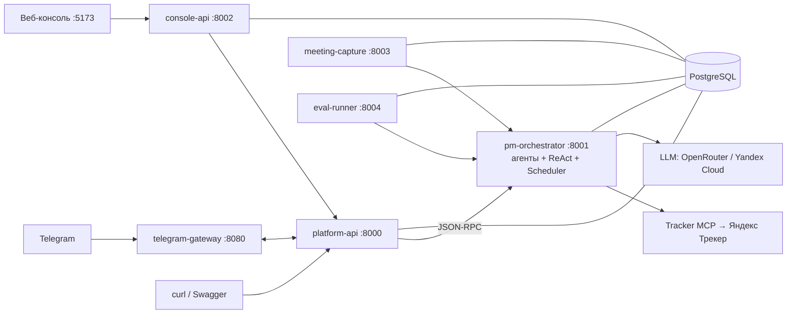
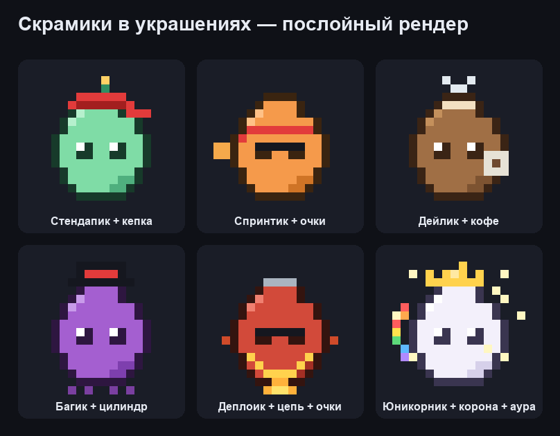

# PM Agent Platform

**Виртуальный проджект-менеджер** поверх Яндекс Трекера. Платформа понимает
запросы на естественном языке (чат, Telegram, веб-консоль), сама ведёт задачи,
спринты и доски, проводит стендапы и дайджесты, записывает встречи, а перед
рискованными действиями спрашивает подтверждение.

<p>
  
  
  
  
</p>

> Это **гайд по установке и запуску с нуля**. Глубокие разделы вынесены в
> [`docs/`](docs/README.md) — по ним расставлены ссылки. Если нужна архитектура
> целиком, начните с [docs/ARCHITECTURE.md](docs/ARCHITECTURE.md).

---

## Содержание

1. [Что умеет](#что-умеет)
2. [Архитектура в двух словах](#архитектура-в-двух-словах)
3. [Запуск с нуля](#запуск-с-нуля)
4. [Сервисы и адреса](#сервисы-и-адреса)
5. [Первые шаги](#первые-шаги)
6. [Запуск без Docker (dev)](#запуск-без-docker-dev)
7. [Подсистемы](#подсистемы)
8. [Разработка](#разработка)
9. [Деплой](#деплой)
10. [Структура проекта](#структура-проекта)
11. [Документация](#документация)

---

## Что умеет

| Возможность | Где |
|-------------|-----|
| PM-агент для Трекера (создание/обновление/комментарии/спринты/эпики, bulk) | `pm_agent`, [SERVICES](docs/SERVICES.md#pm-orchestrator) |
| ReAct-цикл с граф-стадиями и Autonomy Gate (confirm на риск) | [ARCHITECTURE](docs/ARCHITECTURE.md#5-рантайм-агента) |
| Effective Config — промпт и пороги без деплоя | [ARCHITECTURE](docs/ARCHITECTURE.md#53-effective-config-промпт-без-деплоя) |
| Дайджесты, стендап-опросы, напоминания о дедлайнах (cron) | [ARCHITECTURE](docs/ARCHITECTURE.md#8-расписания-scheduler-daemon) |
| Аудит доски с рекомендациями по людям | `audit_agent` |
| Запись и расшифровка встреч Telemost + авто-саммари | [meeting_capture](docs/meeting_capture.md) |
| Telegram: бот в группах + Mini App | [TELEGRAM_SETUP_GUIDE](docs/TELEGRAM_SETUP_GUIDE.md) |
| Веб-консоль (ролевая): доска, команда, конфиг агентов, аудит | [SERVICES](docs/SERVICES.md#web-ui) |
| Геймификация: питомец «Скрамик» + «Битва скрамиков» | [SCRUMIC_DESIGN](docs/SCRUMIC_DESIGN.md) |
| «Штурм» — оценка качества агента (LLM-as-a-judge) | [agent_evaluation](docs/agent_evaluation.md) |
| Observability: Prometheus + Grafana + Loki + Alertmanager | [MONITORING](docs/MONITORING.md) |
| CI/CD → тест-VPS (Docker Compose) | [DEPLOYMENT](docs/DEPLOYMENT.md) |

---

## Архитектура в двух словах



Шесть сервисов + общая библиотека `packages/core` + React-фронтенд. Подробно —
[docs/ARCHITECTURE.md](docs/ARCHITECTURE.md) и [docs/SERVICES.md](docs/SERVICES.md).

---

## Запуск с нуля

### Что нужно

- [uv](https://docs.astral.sh/uv/getting-started/installation/) — менеджер зависимостей Python
- Docker + Docker Compose
- **OpenRouter** API key (LLM агентов — Gemini)
- **Яндекс Трекер**: OAuth-токен + org ID + MCP gateway ([как поднять](docs/TRACKER_MCP_SETUP.md))
- *(опционально)* Yandex Cloud (SpeechKit/S3 для встреч), Telegram-бот

### 1. Клонировать и установить

```bash
git clone https://github.com/Artem216/digital_breakthrough_2026.git
cd digital_breakthrough_2026
git checkout develop
uv sync --all-packages
```

### 2. Настроить переменные

```bash
cp .env.example .env.test
```

Минимум, чтобы агент заработал (полный список — [docs/CONFIGURATION.md](docs/CONFIGURATION.md)):

```env
# БД
DB_USER=pm_agent
DB_PASSWORD=changeme
DB_NAME=pm_agent

# LLM агентов
OPENROUTER_API_KEY=sk-or-v1-...

# Яндекс Трекер
TRACKER_TOKEN=ваш_oauth_token
TRACKER_ORG_ID=ваш_org_id
TRACKER_ORG_TYPE=cloud           # или 360
TRACKER_QUEUE=DARKHORSE
TRACKER_MCP_URL=https://<...>.mcpgw.serverless.yandexcloud.net/sse
TRACKER_MCP_TOKEN=               # пусто для публичного gateway

# Веб-консоль
CONSOLE_LOGIN_CODE_SECRET=замените-на-длинный-случайный-секрет
CONSOLE_ADMIN_EMAIL=admin@example.com
CONSOLE_ADMIN_PASSWORD=admin

ENVIRONMENT=test
LOG_LEVEL=DEBUG
```

> Файлы `.env*` (кроме `.env.example`) в `.gitignore` — секреты не коммитятся.

### 3. Запустить в Docker

```bash
# Приложение + Postgres + веб-консоль
docker compose -f docker-compose.yml -f docker-compose.test.yml \
  --env-file .env.test up --build -d

# То же + мониторинг (Prometheus/Grafana/Loki)
docker compose -f docker-compose.yml -f docker-compose.test.yml \
  -f docker-compose.monitoring.yml --env-file .env.test up --build -d
```

Проверить:

```bash
docker compose ps
curl http://localhost:8000/health      # platform-api
curl http://localhost:8001/health      # pm-orchestrator
```

---

## Сервисы и адреса

| Сервис | URL | Назначение |
|--------|-----|------------|
| Веб-консоль | http://localhost:5173 | Ролевой интерфейс (логин: `admin@example.com` / `admin`) |
| Platform API | http://localhost:8000/docs | HTTP-BFF (Swagger) |
| Console API | http://localhost:8002 | Бэкенд консоли |
| PM Orchestrator | http://localhost:8001/health | Агенты + ReAct + Scheduler |
| Meeting Capture | http://localhost:8003/health | Запись/расшифровка встреч |
| Eval Runner | http://localhost:8004/health | Прогоны «Штурма» |
| Grafana | http://localhost:3000 | Дашборды (с `-f docker-compose.monitoring.yml`) |
| Prometheus | http://localhost:9090 | Метрики |

---

## Первые шаги

### Веб-консоль
Откройте http://localhost:5173, войдите как `admin@example.com` / `admin`.
Доступны: личная доска, питомец, настройка агентов (`/dev`), журнал действий
(`/admin`), песочница (`/playground`), «Штурм» (`/eval`).

### Чат с агентом через API

```bash
curl -X POST http://localhost:8000/chat \
  -H "Content-Type: application/json" \
  -d '{"message": "найди открытые задачи", "session_id": "demo"}'
```

### Создать задачу (вызовет confirm)

```bash
# 1) агент возвращает pending_confirm (risk=medium)
curl -X POST http://localhost:8000/chat -H "Content-Type: application/json" \
  -d '{"message": "заведи задачу: починить логин, приоритет critical", "session_id": "demo"}'
# → {"pending_confirm": {"confirm_id": "abc123", "prompt": "...", ...}}

# 2) подтверждаем
curl -X POST http://localhost:8000/confirm/abc123 \
  -H "Content-Type: application/json" -d '{"approved": true}'
```

### Запланировать напоминание

```bash
curl -X POST http://localhost:8000/chat -H "Content-Type: application/json" \
  -d '{"message": "напоминай каждый понедельник в 9:00 про стендап", "session_id": "s2"}'
```

### Суммаризация встречи

```bash
curl -X POST http://localhost:8000/agents/meeting_summarizer/chat \
  -H "Content-Type: application/json" \
  -d '{"message": "<транскрипт или заметки>", "session_id": "sum-1"}'
```

---

## Запуск без Docker (dev)

```bash
# Терминал 1 — Postgres
docker run -e POSTGRES_PASSWORD=pg -e POSTGRES_DB=pm_agent -p 5432:5432 postgres:16-alpine

# Терминал 2 — оркестратор (:8001)
uv run --package pm-orchestrator uvicorn pm_orchestrator.rpc:app --reload --port 8001

# Терминал 3 — HTTP API (:8000)
uv run --package platform-api uvicorn platform_api.main:app --reload --port 8000

# Терминал 4 — бэкенд консоли (:8002)
uv run --package console-api uvicorn console_api.main:app --reload --port 8002

# Терминал 5 — фронтенд (:5173, прокси /api → :8002)
cd apps/web-ui && npm install && npm run dev
```

В dev `rpc_client` оркестратора вызывается in-process — HTTP между сервисами не
обязателен.

---

## Подсистемы

| Подсистема | Коротко | Документ |
|------------|---------|----------|
| **Telegram** | Бот в группах + Mini App; шлюз на отдельном сервере с TLS | [TELEGRAM_SETUP_GUIDE](docs/TELEGRAM_SETUP_GUIDE.md), [runbook](docs/runbooks/telegram-gateway-runbook.md) |
| **Meeting Capture** | Бот-гость Telemost: запись экрана/звука → STT → саммари | [meeting_capture](docs/meeting_capture.md) |
| **Скрамик** | Питомец-тамагочи + битвы, XP от закрытых задач | [SCRUMIC_DESIGN](docs/SCRUMIC_DESIGN.md) |
| **«Штурм»** | LLM-as-a-judge оценка качества агента | [agent_evaluation](docs/agent_evaluation.md) |

<p></p>

---

## Разработка

### Тесты

```bash
# Unit + сервисные (как в CI)
uv run pytest packages/core/tests/unit services/platform-api/tests services/pm-orchestrator/tests -q

# Smoke (нужны реальные ключи)
cd packages/core && uv run pytest tests/smoke/ -m smoke -v
```

### Линтер

```bash
uvx ruff check .          # проверить
uvx ruff check --fix .    # автофикс
uvx ruff format .         # форматировать
```

### Добавить зависимость

```bash
uv add --package pm-orchestrator croniter
```

### Добавить агента

Создать один файл в `services/pm-orchestrator/src/pm_orchestrator/agents/` —
оркестратор подхватит его при старте:

```python
from core.agent import BaseAgent, LLMSettings

class MyAgent(BaseAgent):
    name = "my_agent"
    description = "Что делает агент"
    prompt = "Ты — агент для ..."
    tools = ["GetIssue", "call_agent"]
    llm_configs = [LLMSettings(model="google/gemini-3.1-flash-lite", provider="openrouter", temperature=0.2)]
```

Полный гайд — [docs/ADDING_AGENTS.md](docs/ADDING_AGENTS.md) и
[docs/agents.md](docs/agents.md).

---

## Деплой

```
feature/* → PR → develop → GitHub Actions → тест-VPS (Docker Compose, автоматически)
```

CI гоняет `ruff` + `pytest`; CD при merge в `develop` раскатывает стек на VPS.
Шлюз Telegram деплоится отдельным ручным workflow. Подробно —
[docs/DEPLOYMENT.md](docs/DEPLOYMENT.md).

---

## Структура проекта

```
digital_breakthrough_2026/
├── packages/core/            # Общая библиотека (агенты, ReAct, LLM, Трекер, eval, ORM)
│   ├── src/core/             #   → docs/CORE_LIBRARY.md
│   └── migrations/           #   Alembic → docs/DATA_MODEL.md
├── services/
│   ├── pm-orchestrator/      # :8001 «мозг»: агенты + ReAct + Scheduler
│   ├── platform-api/         # :8000 HTTP-BFF + Telegram bridge
│   ├── console-api/          # :8002 бэкенд веб-консоли
│   ├── meeting-capture/      # :8003 запись/расшифровка встреч
│   ├── eval-runner/          # :8004 прогоны «Штурма»
│   └── telegram-gateway/     # :8080 standalone-шлюз (отдельный сервер)
├── apps/web-ui/              # React SPA + Telegram Mini App
├── monitoring/               # Prometheus + Grafana + Loki + Alertmanager
├── config/                   # nginx + env шлюза
├── scripts/                  # vps-setup, setup-tunnel-nginx, latency-bench
├── docs/                     # Документация → docs/README.md
├── docker-compose*.yml       # основной / test / monitoring / telegram-gateway
└── .github/workflows/        # CI + CD
```

---

## Документация

Полный индекс — **[docs/README.md](docs/README.md)**. Ключевое:

- [Архитектура](docs/ARCHITECTURE.md) · [Сервисы](docs/SERVICES.md) · [Core-библиотека](docs/CORE_LIBRARY.md) · [Модель данных](docs/DATA_MODEL.md)
- [Конфигурация](docs/CONFIGURATION.md) · [Деплой](docs/DEPLOYMENT.md) · [Мониторинг](docs/MONITORING.md)
- [Создание агентов](docs/ADDING_AGENTS.md) · [Граф стадий pm_agent](docs/pm_agent_stage_graph.md) · [Оценка «Штурм»](docs/agent_evaluation.md)
- [Roadmap / целевая архитектура](docs/TARGET_ARCHITECTURE.md)
