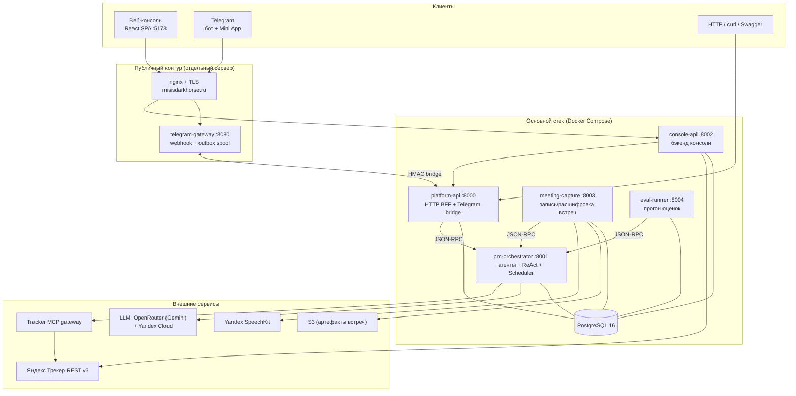
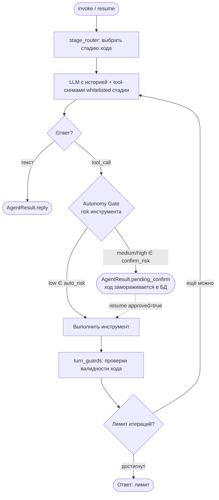
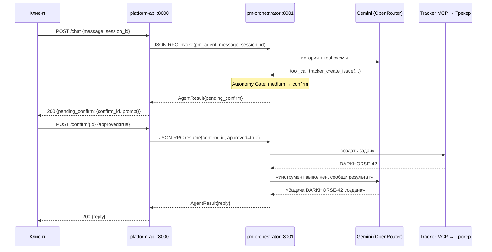
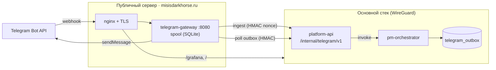
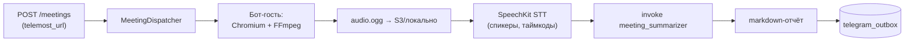
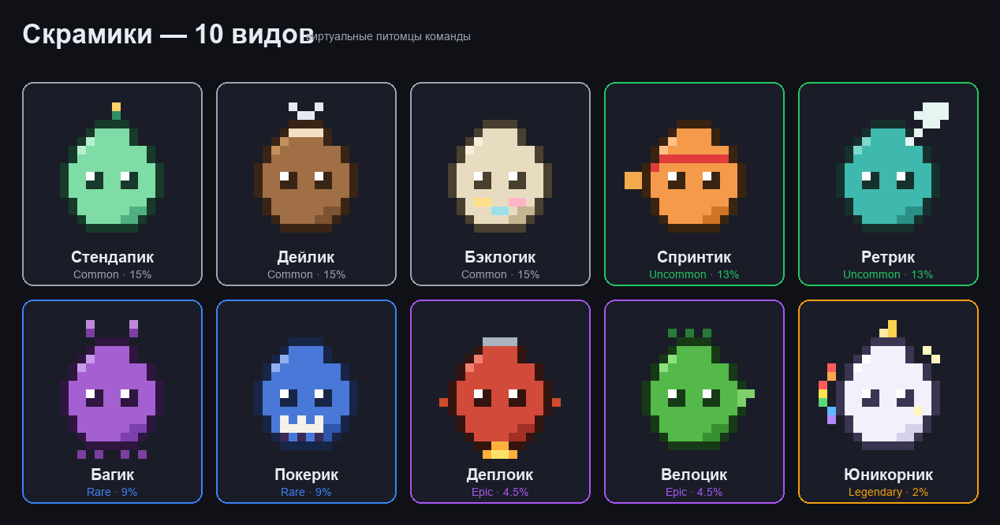

# Архитектура PM Agent Platform

> Полная карта системы: сервисы, потоки данных, рантайм агента, расписания и
> Telegram-контур. Для пошаговой установки см. корневой **[README](../README.md)**,
> для справочников — **[docs/README.md](README.md)**.

---

## 1. Что это

**PM Agent Platform** — мультиагентная платформа-«виртуальный проджект-менеджер»
поверх Яндекс Трекера. Система понимает запросы на естественном языке (через чат,
Telegram или веб-консоль), сама работает с задачами, спринтами и досками Трекера,
а перед рискованными действиями запрашивает подтверждение у человека.

Помимо ядра «агент ↔ Трекер» платформа включает:

- **Telegram-контур** — бот в группах, Mini App, стендап-опросы, дайджесты, напоминания о дедлайнах;
- **Meeting Capture** — запись и расшифровка встреч Telemost с авто-саммари;
- **Геймификацию** — питомец-тамагочи «Скрамик» и «Битва скрамиков»;
- **Веб-консоль** — ролевой интерфейс (доска, команда, настройка агентов, аудит действий);
- **«Штурм»** — фреймворк оценки качества агента (LLM-as-a-judge);
- **Observability** — Prometheus + Grafana + Loki + Alertmanager.

---

## 2. Карта компонентов



Стрелки «`--- PG`» означают общую схему PostgreSQL: все сервисы работают с одной
базой через пакет `core` (см. [Модель данных](DATA_MODEL.md)).

---

## 3. Сервисы одним взглядом

| Сервис | Порт | Роль | Подробно |
|--------|------|------|----------|
| **pm-orchestrator** | 8001 | «Мозг»: автодискавери агентов, ReAct-рантайм, Autonomy Gate, Scheduler daemon, JSON-RPC сервер | [SERVICES](SERVICES.md#pm-orchestrator) |
| **platform-api** | 8000 | Тонкий HTTP-BFF поверх оркестратора + Telegram bridge (ingest/outbox) | [SERVICES](SERVICES.md#platform-api) |
| **console-api** | 8002 | Бэкенд веб-консоли: auth, профили, доска/статистика, питомец, битвы, конфиг агентов, аудит | [SERVICES](SERVICES.md#console-api) |
| **meeting-capture** | 8003 | Бот-участник Telemost: запись экрана/звука, STT через SpeechKit, авто-саммари | [SERVICES](SERVICES.md#meeting-capture) |
| **eval-runner** | 8004 | Фоновый демон прогонов оценки качества агента («Штурм») | [SERVICES](SERVICES.md#eval-runner) |
| **telegram-gateway** | 8080 | Standalone-шлюз на публичном сервере: webhook Telegram ↔ bridge к основному стеку | [SERVICES](SERVICES.md#telegram-gateway) |
| **web-ui** | 5173→80 | React SPA + Telegram Mini App, раздаётся nginx | [SERVICES](SERVICES.md#web-ui) |
| **packages/core** | — | Общая библиотека: агент-фреймворк, ReAct, LLM, Трекер, Scheduler, питомец, eval, ORM | [CORE_LIBRARY](CORE_LIBRARY.md) |

Почему так разбито: оркестратор (тяжёлый LLM-рантайм), транспорт (platform-api) и
консоль (console-api) масштабируются независимо; `telegram-gateway` и
`meeting-capture` вынесены отдельно, потому что у них особые требования к среде
(публичный IP с TLS у шлюза, Chromium/FFmpeg у Meeting Capture).

---

## 4. Стек технологий

| Слой | Технология |
|------|-----------|
| Язык / рантайм | Python 3.12, asyncio |
| HTTP-сервер | FastAPI + Uvicorn |
| Транспорт между сервисами | JSON-RPC 2.0 (HTTP в Docker, in-process в dev/тестах) |
| LLM агентов | OpenRouter (`google/gemini-3.1-flash-lite`, `google/gemini-3.1-pro`); Yandex Cloud Responses API (`gpt-oss-120b`) как альтернативный провайдер |
| Трекер (агент) | Tracker MCP gateway (Model Context Protocol поверх HTTP/SSE) |
| Трекер (сервисы) | Yandex Tracker REST API v3 + httpx (`core.tracker`) |
| STT | Yandex SpeechKit |
| ORM / БД | SQLAlchemy 2.0 async + asyncpg + PostgreSQL 16; миграции — Alembic |
| Конфигурация | Pydantic Settings v2 + `.env`; runtime-overlay из БД без деплоя |
| Фронтенд | React 18 + TypeScript + Vite + Tailwind + TanStack Query |
| Мониторинг | Prometheus, Grafana, Loki, Promtail, Alertmanager, cAdvisor, node-exporter |
| Пакетный менеджер | uv (workspace), линтер ruff |
| CI/CD | GitHub Actions → тест-VPS (Docker Compose) |

---

## 5. Рантайм агента

Главный сервис — **pm-orchestrator**. При старте он сканирует пакет
`agents/`, находит подклассы `BaseAgent` и регистрирует их. Добавить агента =
создать один файл (см. [ADDING_AGENTS](ADDING_AGENTS.md)).

Сейчас зарегистрированы три агента:

| Агент | Модель | Инструменты | Назначение |
|-------|--------|-------------|------------|
| `pm_agent` | gemini-3.1-flash-lite | Tracker MCP (Get/Create/Update/Bulk…), `tracker_*`, `backlog_plan`, `call_agent`, `schedule_task`, `schedule_meeting_bot`, `get_meeting_transcript` | Основной PM-ассистент Трекера |
| `audit_agent` | gemini-3.1-pro | `audit_board_digest` | Аудит доски с рекомендациями по каждому участнику (для тимлидов/админов) |
| `meeting_summarizer` | gemini-3.1-flash-lite | — | Транскрипт встречи → структурированный markdown-отчёт |

### 5.1 ReAct-цикл + Autonomy Gate



- **Стадии** (`stage_graph.py`, `stage_router.py`) — детерминированный граф: один раз
  за ход выбирается стадия (INTAKE / STATUS / BOARD / TRANSITION / QUERY / REORG /
  PROACTIVE / HYGIENE / MEETING_SYNC / DIALOG), внутри неё LLM ходит только по
  whitelist инструментов. Подробно — [pm_agent_stage_graph](pm_agent_stage_graph.md).
- **Autonomy Gate** — у каждого инструмента есть `risk` (`low`/`medium`/`high`).
  `low` выполняются автоматически, `medium`/`high` ставят ход на паузу и возвращают
  `pending_confirm`. Состояние хода персистится в таблицу `traces`, так что
  подтверждение приходит отдельным HTTP-запросом (`resume`).
- **turn_guards** блокируют невалидные ходы (создать комментарий без задачи и т.п.).

| Risk | Поведение | Примеры |
|------|-----------|---------|
| `low` | авто | get/search issue, board snapshot, `call_agent` |
| `medium` | confirm | create/update issue, `schedule_task` |
| `high` | confirm | close/transition, bulk-операции |

Пороги настраиваются per-team через `auto_risk` / `confirm_risk` /
`always_confirm_tools` (см. Effective Config ниже).

### 5.2 Источники инструментов

Инструменты агента приходят из двух мест:

1. **Tracker MCP gateway** — CamelCase-инструменты (`GetIssue`, `CreateComment`,
   `BulkUpdate`, `SearchEntities`…), которые отдаёт serverless MCP-сервер Яндекс
   Трекера. Подключение — `TRACKER_MCP_URL` (см. [TRACKER_MCP_SETUP](TRACKER_MCP_SETUP.md)).
2. **Нативные `@platform_tool`** из `core` и `pm-orchestrator` — `tracker_create_issue`,
   `tracker_board_snapshot`, `backlog_plan`, `audit_board_digest`, `call_agent`,
   `schedule_task`, `schedule_meeting_bot`, `get_meeting_transcript`.

### 5.3 Effective Config (промпт без деплоя)

Промпт и пороги автономии меняются без перезапуска через таблицы `agent_specs` и
`agent_instances.overlay`:

```
class defaults  →  AgentSpec (prompt, model)  →  AgentInstance.overlay (team-specific overrides)
```

`build_effective_config(...)` (`core/effective_config.py`) сводит три слоя в
`EffectiveAgentConfig` (итоговые `prompt`, `llm_configs`, `runtime_config`).
Редактируется из веб-консоли (`/dev`). См. [CORE_LIBRARY](CORE_LIBRARY.md#конфигурация).

---

## 6. Поток HTTP-запроса (чат + confirm)



**JSON-RPC методы оркестратора** (`POST /rpc`): `list_agents`, `invoke`, `resume`,
`agent_tools`, `get_actions`. В dev/тестах `rpc_client` вызывает оркестратор
in-process; в Docker — по HTTP через `ORCHESTRATOR_URL`.

---

## 7. Telegram-контур

Telegram вынесен на отдельный публичный сервер, потому что вебхуку Telegram нужен
доступный TLS-endpoint, а основной стек живёт за приватной сетью.



- **Входящие**: Telegram → webhook → gateway кладёт апдейт в локальный spool →
  отправляет в `platform-api` bridge (`ingest`) с HMAC-подписью и nonce →
  оркестратор отрабатывает ход → ответ кладётся в `telegram_outbox`.
- **Исходящие**: gateway лизит outbox по bridge, шлёт в Telegram, с ретраями,
  дедупликацией и dead-letter (всё через persistent spool, переживает рестарты).
- Тот же nginx проксирует `/grafana` и веб-консоль через WireGuard-туннель.

Подробно: [SERVICES → telegram-gateway](SERVICES.md#telegram-gateway),
[TELEGRAM_SETUP_GUIDE](TELEGRAM_SETUP_GUIDE.md),
[runbook](runbooks/telegram-gateway-runbook.md), [DEPLOYMENT](DEPLOYMENT.md).

---

## 8. Расписания (Scheduler daemon)

`SchedulerDaemon` (asyncio-таск внутри `pm-orchestrator`) каждые ~60 сек выбирает
просроченные `ScheduledJob` через `SELECT … FOR UPDATE SKIP LOCKED` — безопасно
для нескольких реплик. Задачи бывают двух видов:

- **agent-job** — агент сам запланировал cron-задачу инструментом `schedule_task`;
- **системные cron-джобы**, включаемые env-флагами оркестратора:

| Джоба | Cron по умолчанию | Что делает | Код |
|-------|-------------------|------------|-----|
| Daily digest | `0 * * * *` | Часовой дайджест по команде в Telegram | `core/daily_digest.py` |
| Standup poll | `50 * * * *` | Стендап-опрос участников | `core/standup_poll.py` |
| Deadline reminders | `0 * * * *` | Напоминания об овердью/скоро-дедлайнах | `core/deadline_reminders.py` |

Результаты складываются в `telegram_outbox` и доставляются шлюзом. Расписания
редактируются из веб-консоли (`/team`).

---

## 9. Meeting Capture



Сервис не использует официальный bot API Telemost — бот заходит по ссылке как
обычный гость, пишет экран и звук, сохраняет артефакты и (при наличии SpeechKit/S3)
строит транскрипт. Подробно — [meeting_capture](meeting_capture.md).

---

## 10. Геймификация: Скрамик и Битвы

«Скрамик» — командный питомец-тамагочи: уровень растёт от закрытых задач (XP),
есть настроение, 10 видов, 4 характеристики, монеты и магазин косметики. «Битва
скрамиков» — командный royale и дуэли 1-на-1 с генерацией картинки результата
(PIL). Вся математика — чистые детерминированные функции в `core/pet.py` и
`core/pet_battle.py`. Дизайн и ассеты — [SCRUMIC_DESIGN](SCRUMIC_DESIGN.md).



---

## 11. «Штурм» — оценка качества агента

LLM-as-a-judge фреймворк: генерирует сценарии, прогоняет агента в изоляции (на
fake-трекере или реальной доске), судит ответ панелью судей по критериям, считает
метрики и формирует диагностический отчёт. Прогоны запускаются демоном
`eval-runner` и просматриваются в консоли (`/eval`). Дизайн —
[agent_evaluation](agent_evaluation.md), код — [CORE_LIBRARY → eval](CORE_LIBRARY.md#подсистема-оценки-eval).

---

## 12. Что дальше (roadmap)

Стратегический взгляд «где мы и куда идём» — отдельный документ
[TARGET_ARCHITECTURE](TARGET_ARCHITECTURE.md): networked A2A, расширение набора
агентов (correspondence/analytics), масштабирование рантайма.

---

**См. также:** [Сервисы](SERVICES.md) · [Core-библиотека](CORE_LIBRARY.md) ·
[Модель данных](DATA_MODEL.md) · [Конфигурация](CONFIGURATION.md) ·
[Деплой](DEPLOYMENT.md) · [Мониторинг](MONITORING.md)
