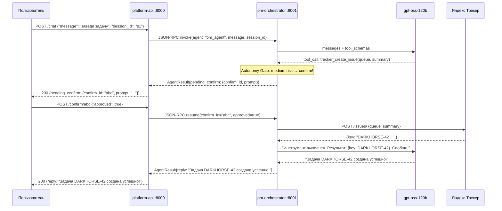
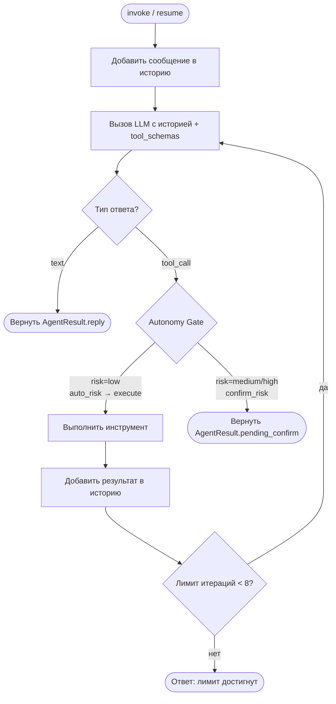

# Архитектура PM Agent Platform

## Обзор

PM Agent Platform — мультиагентная платформа для управления проектами поверх Яндекс Трекера. Агент понимает запросы на естественном языке, вызывает инструменты Трекера и запрашивает подтверждение у пользователя для рискованных операций.

---

## Компоненты системы

```
┌─────────────────────────────────────────────────────────────────┐
│                         Пользователь                            │
│                   (HTTP curl / Swagger UI)                       │
└────────────────────────────┬────────────────────────────────────┘
                             │ HTTP :8000
                             ▼
┌─────────────────────────────────────────────────────────────────┐
│                      platform-api                               │
│              Тонкий HTTP транспортный слой                      │
│   POST /chat   POST /confirm/{id}   GET /actions   GET /metrics │
└────────────────────────────┬────────────────────────────────────┘
                             │ JSON-RPC 2.0 POST /rpc
                             │ (in-process в dev, HTTP в Docker)
                             ▼
┌─────────────────────────────────────────────────────────────────┐
│                     pm-orchestrator :8001                       │
│                        Мозг системы                             │
│                                                                 │
│  ┌─────────────────┐   ┌────────────────────────────────────┐  │
│  │  OrchestratorService  │   │         agents/              │  │
│  │  invoke / resume      │   │   pm_agent.py  ← BaseAgent   │  │
│  │  confirm_index        │   │   my_agent.py  ← BaseAgent   │  │
│  └──────────┬────────────┘   │   (автодискавери при старте) │  │
│             │                └────────────────────────────────┘  │
│             ▼                                                   │
│  ┌─────────────────┐         ┌───────────────────────────────┐  │
│  │   ReActRunner   │         │       ToolRegistry            │  │
│  │  LLM → tool     │ ──────► │  @platform_tool decorator    │  │
│  │  → confirm_wait │         │  tracker_get_issue  (low)     │  │
│  │  → resume       │         │  tracker_create_issue (medium)│  │
│  └─────────────────┘         │  tracker_close_issue (high)   │  │
└────────────────────────────────────────────────────────────────┘
                             │
                             ▼
┌─────────────────────────────────────────────────────────────────┐
│                     Яндекс Трекер API v3                        │
│              REST https://api.tracker.yandex.net/v3/           │
└─────────────────────────────────────────────────────────────────┘
```

---

## Стек технологий

| Слой | Технология |
|------|-----------|
| LLM | gpt-oss-120b (Yandex Cloud OpenAI-совместимый Responses API `/v1/responses`), прямой HTTP |
| HTTP сервер | FastAPI + Uvicorn |
| Транспорт между сервисами | JSON-RPC 2.0 (HTTP в prod, in-process в dev) |
| Трекер | Yandex Tracker REST API v3 + httpx |
| Конфигурация | Pydantic Settings v2 + .env |
| ORM | SQLAlchemy 2.0 async + asyncpg |
| Мониторинг | Prometheus + Grafana + Alertmanager |
| Линтер | ruff |
| Пакетный менеджер | uv (workspace) |

---

## Поток запроса



---

## ReAct цикл



---

## Автодискавери агентов

```mermaid
flowchart LR
    FILE[agents/my_agent.py\nclass MyAgent(BaseAgent):] 
    DISC[OrchestratorService\n.discover_agents()]
    RUN[ReActRunner\nдля MyAgent]
    RPC[JSON-RPC метод\ninvoke(agent='my_agent')]
    HTTP[HTTP маршрут\nPOST /agents/my_agent/chat]

    FILE --> DISC --> RUN --> RPC --> HTTP
```

При старте оркестратор сканирует пакет `agents/`, импортирует все модули, находит подклассы `BaseAgent` и автоматически регистрирует их. Добавление нового агента = создать один файл.

---

## JSON-RPC 2.0 протокол

**Endpoint:** `POST http://pm-orchestrator:8001/rpc`

| Метод | Параметры | Ответ |
|-------|----------|-------|
| `list_agents` | — | `[{name, description}]` |
| `invoke` | `agent, message, session_id` | `AgentResult` |
| `resume` | `confirm_id, approved` | `AgentResult` |
| `get_actions` | `session_id?, limit?` | `[action]` |

```json
// Запрос
{
  "jsonrpc": "2.0",
  "method": "invoke",
  "params": {"agent": "pm_agent", "message": "найди задачи", "session_id": "s1"},
  "id": 1
}

// Ответ
{
  "jsonrpc": "2.0",
  "result": {"reply": "Найдено 3 задачи...", "session_id": "s1", "steps": [...]},
  "id": 1
}
```

**Режимы работы `rpc_client.py`:**
- `dev / тесты` — прямой Python-вызов (in-process, без HTTP)
- `Docker` — HTTP при наличии переменной `ORCHESTRATOR_URL`

---

## Autonomy Gate

Каждый инструмент имеет уровень риска. Перед выполнением оркестратор проверяет:

| Риск | Поведение | Примеры |
|------|----------|---------|
| `low` | Авто-выполнение | get_issue, search_issues, comment |
| `medium` | Пауза → confirm | create_issue, update_issue |
| `high` | Пауза → confirm | close_issue |

Настраивается через `RuntimeConfig(auto_risk=["low"], confirm_risk=["medium", "high"])`.  
Конкретные инструменты можно всегда требовать confirm через `always_confirm_tools`.

---

## Структура монорепо

```
digital_breakthrough_2026/
├── packages/
│   └── core/                    # Общая библиотека
│       └── src/core/
│           ├── agent.py         # BaseAgent, LLMSettings
│           ├── react.py         # ReActRunner, AgentResult
│           ├── llm.py           # LLMClient → Responses API (gpt-oss-120b)
│           ├── tools.py         # @platform_tool, ToolRegistry
│           ├── tracker.py       # TrackerClient
│           ├── tracker_tools.py # tracker_* @platform_tool
│           ├── config.py        # Pydantic settings
│           └── models.py        # SQLAlchemy ORM (11 таблиц)
│
├── services/
│   ├── pm-orchestrator/         # Мозг (порт 8001)
│   │   └── src/pm_orchestrator/
│   │       ├── agents/
│   │       │   └── pm_agent.py  # ← Добавить нового агента сюда
│   │       ├── orchestrator.py  # OrchestratorService
│   │       └── rpc.py           # JSON-RPC сервер
│   │
│   └── platform-api/            # HTTP транспорт (порт 8000)
│       └── src/platform_api/
│           ├── main.py          # FastAPI роуты
│           └── rpc_client.py    # JSON-RPC клиент
│
├── monitoring/                  # Prometheus + Grafana + Alertmanager
├── docker-compose.yml
└── .github/workflows/           # CI (lint + test) + CD (deploy to VPS)
```

---

## Мониторинг

- **Prometheus** — scrape с platform-api `/metrics` и pm-orchestrator `/metrics`
- **Grafana** — 3 дашборда: хост, контейнеры, приложение (LLM/tool метрики)
- **Alertmanager** → Telegram: контейнер упал, диск >80%, LLM latency p95 >15s

---

## Что отложено

- Networked A2A (агент→агент через сеть)
- Telegram-бот (следующий шаг)
- Meeting Capture агент
- Correspondence/Analytics агенты
- Полноценный UI
