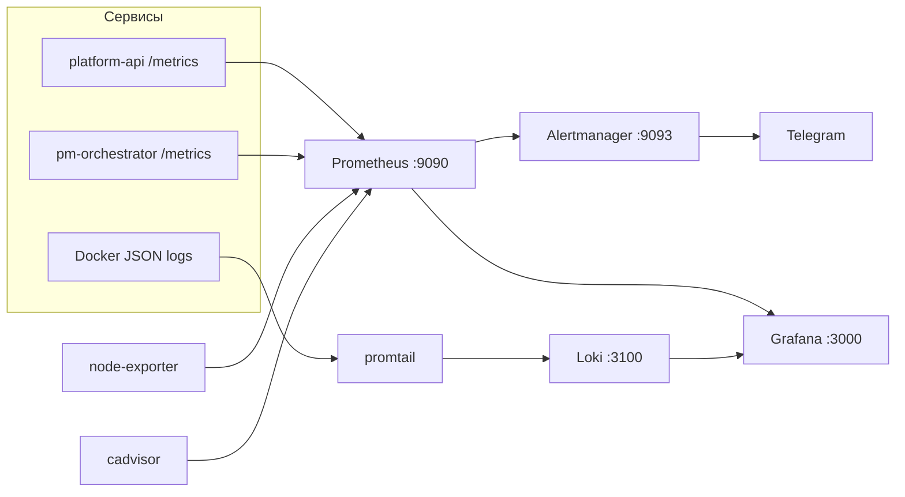

# Мониторинг и наблюдаемость

> Стек Prometheus + Grafana + Loki + Alertmanager. Поднимается через
> `docker-compose.monitoring.yml`. Конфиги — в `monitoring/`.



---

## Компоненты

| Компонент | Порт | Роль |
|-----------|------|------|
| Prometheus | 9090 | Сбор и хранение метрик (scrape 15s) |
| Alertmanager | 9093 | Маршрутизация алертов → Telegram |
| Grafana | 3000 | Дашборды (5 шт.) |
| Loki | 3100 | Хранилище структурированных логов (7 дней) |
| Promtail | — | Сбор Docker-логов → Loki |
| cAdvisor | 8080 | Метрики контейнеров |
| node-exporter | 9100 | Метрики хоста |

## Что собирается

- **Prometheus** (`monitoring/prometheus.yml`) скрейпит `platform-api:8000/metrics`,
  `pm-orchestrator:8001/metrics`, `cadvisor`, `node-exporter`, себя.
  Метрики приложения определены в `core/metrics.py`: запросы/латентность/токены
  LLM, исполнения и латентность инструментов, внешние запросы, трейсы,
  pending-confirm, посещения стадий.
- **Promtail** (`monitoring/promtail.yml`) забирает Docker JSON-логи, фильтрует
  события `agent_step` и раскладывает по лейблам (`agent_name`, `session_id`,
  `stage`, `tool_name`, `state`, `duration_s`…) для отладочного дашборда.

## Алерты (`monitoring/alerts.yml`)

| Группа | Алерт | Условие |
|--------|-------|---------|
| infrastructure | `ContainerDown` (critical) | контейнер `pm-agent.*` пропал |
| infrastructure | `ContainerHighCPU` / `ContainerHighMemory` | >80% CPU / >85% памяти 5м |
| host | `DiskUsageHigh` / `DiskUsageCritical` | диск >80% / >92% |
| host | `HighMemoryUsage` | память хоста >90% |
| application | `LLMHighErrorRate` | ошибки LLM >10% |
| application | `LLMHighLatency` | p95 латентности LLM >15s |
| application | `ConfirmsPending` | >20 неотвеченных confirm 30м |

Маршрутизация — `monitoring/alertmanager.yml` (получатель `telegram`, HTML с
эмодзи 🔴/✅, инхибиция warning при critical).

## Дашборды Grafana (`monitoring/grafana/dashboards/`)

| Дашборд | Что показывает |
|---------|----------------|
| `01_host.json` | CPU/память/диск/сеть/LA хоста |
| `02_containers.json` | Ресурсы по контейнерам, рестарты, I/O |
| `03_app.json` | LLM rps/латентность, pending-confirm, посещения стадий, исполнения инструментов, пул БД |
| `04_telegram.json` | Шлюз: webhook rate, глубина spool; bridge: ingest latency, возраст outbox, dead-letter |
| `05_agent_debug.json` | Сквозная отладка: Gantt/waterfall шагов трейса, лог инструментов, ошибки по инструментам (Loki + Prometheus) |

### Отладка поведения агента

Откройте Grafana → **PM Agent / Agent Debug**:
- **Trace Finder** — поиск трейса по исходному сообщению пользователя.
- **Gantt** — таймлайн: бар = шаг (stage / вызов инструмента / результат), цвет =
  статус, ширина = время до следующего шага.
- **Step Details** — потактовый тайминг шагов.
- **E2E Response Time** — число запросов, среднее, p50/p95/p99 за таймрейндж.

Gantt/waterfall рисуются плагинами `marcusolsson-gantt-panel` и
`auxmoney-waterfall-panel`, которые ставятся через `GF_INSTALL_PLUGINS`
(см. `docker-compose.monitoring.yml`).

---

## Запуск

```bash
docker compose -f docker-compose.yml -f docker-compose.test.yml \
  -f docker-compose.monitoring.yml --env-file .env.test up --build -d
```

| Сервис | URL |
|--------|-----|
| Grafana | http://localhost:3000 |
| Prometheus | http://localhost:9090 |
| Alertmanager | http://localhost:9093 |

---

**См. также:** [DEPLOYMENT](DEPLOYMENT.md) · [ARCHITECTURE](ARCHITECTURE.md)
