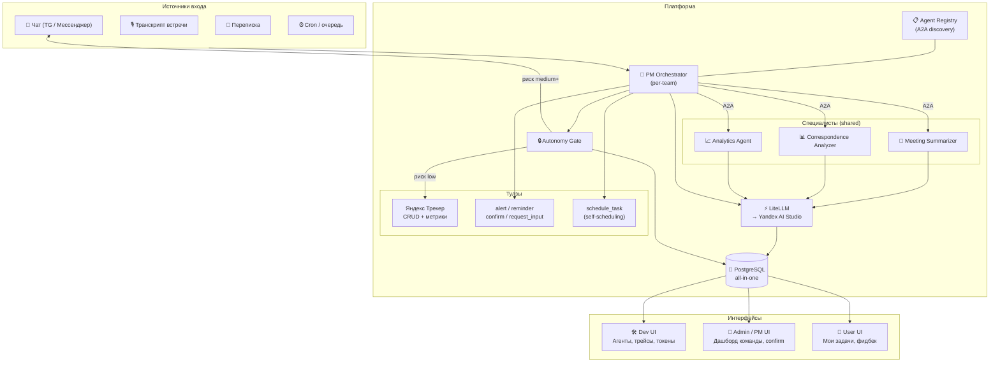
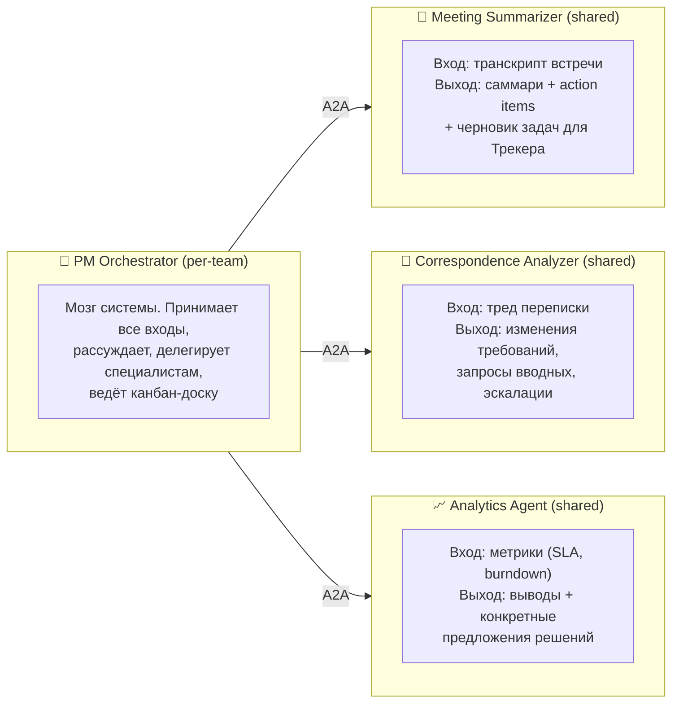
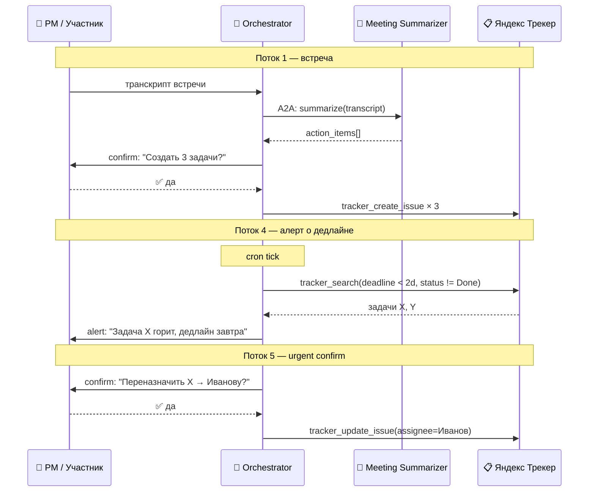
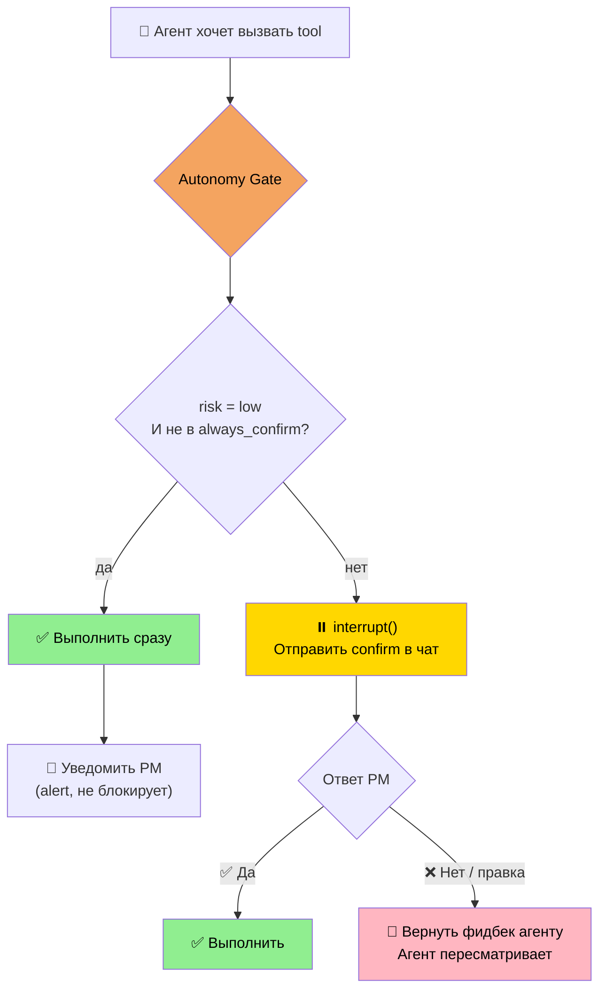
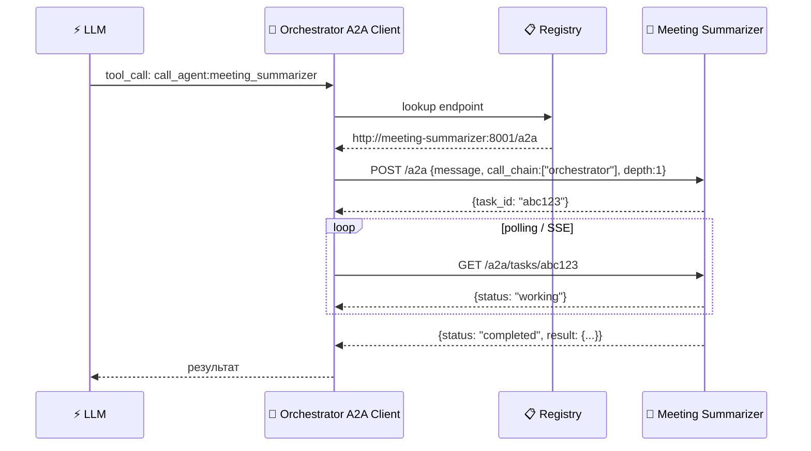
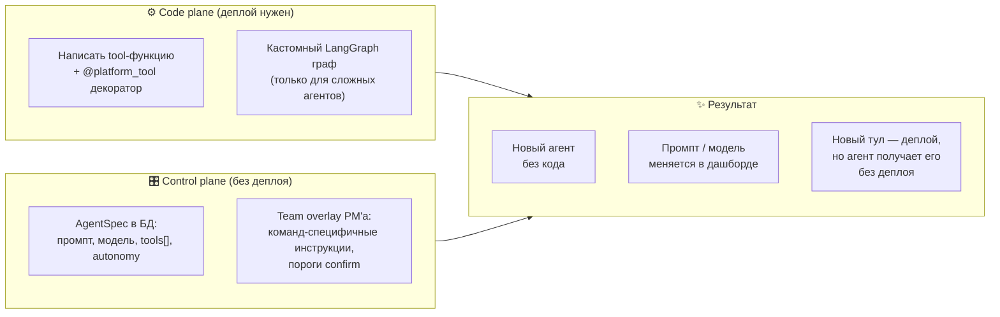
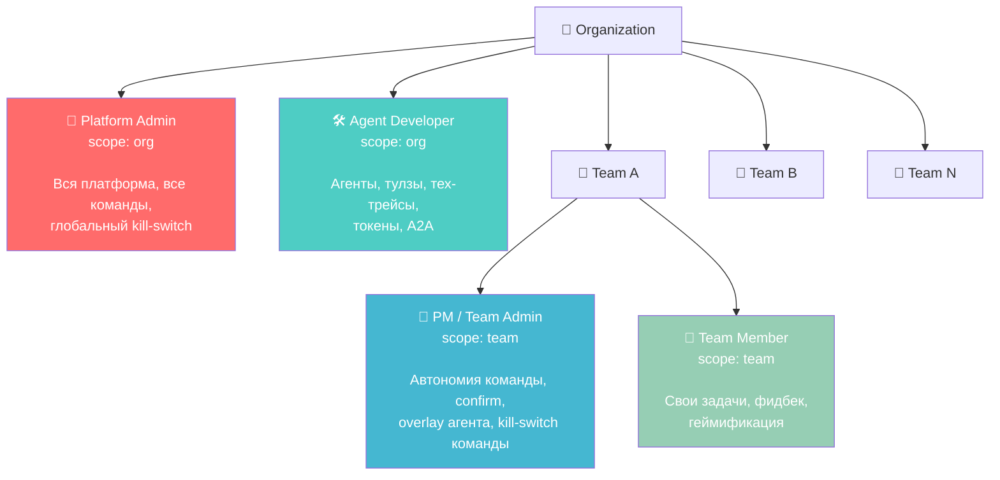
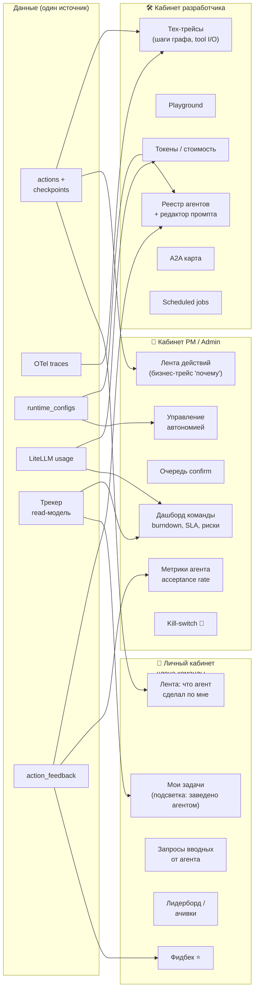
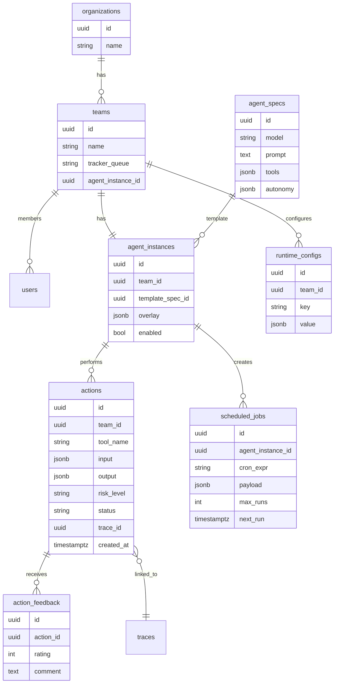
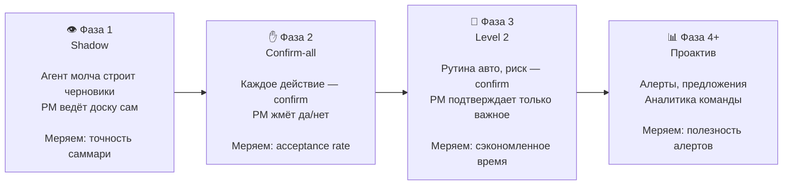

# PM Agent Platform — Полное описание платформы

> Мульти-агентная платформа для автоматизации работы Project Manager.
> Агенты ведут канбан-доску, делают саммари встреч, анализируют переписку,
> присылают алерты — и всё это с контролируемым уровнем автономии.

---

## Содержание

1. [Зачем это нужно](#зачем-это-нужно)
2. [Как устроена платформа](#как-устроена-платформа)
3. [Агенты и тулзы](#агенты-и-тулзы)
4. [Как агент принимает решения — Autonomy Gate](#как-агент-принимает-решения--autonomy-gate)
5. [A2A — как агенты общаются между собой](#a2a--как-агенты-общаются-между-собой)
6. [Создание агентов — Code plane vs Control plane](#создание-агентов--code-plane-vs-control-plane)
7. [Роли и права](#роли-и-права)
8. [Интерфейсы — три личных кабинета](#интерфейсы--три-личных-кабинета)
9. [Данные и модель хранения](#данные-и-модель-хранения)
10. [Roadmap — фазы разработки](#roadmap--фазы-разработки)
11. [Тестирование на команде](#тестирование-на-команде)

**Смежные документы:**
- [Meeting Capture — как добываются транскрипты встреч](meeting_capture.md)
- [Оценка качества агента — как получать цифры для сравнения подходов](agent_evaluation.md)

---

## Зачем это нужно

PM тратит значительную часть времени на рутину: обновить доску после встречи, разнести action items, напомнить о дедлайне, запросить статус у разработчика. Всё это — детерминированные или полудетерминированные задачи, которые можно автоматизировать.

**Что делает агент:**
- Ходит на встречи (транскрипт) → делает саммари → заводит задачи в Трекере
- Читает переписку → находит изменения требований, запрашивает вводные
- Ведёт канбан-доску: создаёт, двигает, комментирует задачи
- Присылает алерты: застрявшая задача, приближающийся дедлайн, SLA под угрозой
- Перед рискованными действиями — **спрашивает подтверждение у PM**

**Чего агент не делает без PM:**
- Не удаляет задачи без подтверждения
- Не переназначает ресурсы сам
- Не эскалирует вовне без согласования

Уровень автономии настраивается per-команда и меняется без деплоя.

---

## Как устроена платформа

### Общая архитектура



### Технический стек

| Слой | Выбор | Почему |
|---|---|---|
| **Агенты** | LangGraph (ReAct + StateGraph) | Встроенный checkpointer, `interrupt()` для human-in-loop, граф состояний |
| **A2A** | a2a-sdk (JSON-RPC, SSE) | Открытый стандарт, агенты общаются как сервисы |
| **LLM** | LiteLLM → Yandex AI Studio | Один интерфейс ко всем провайдерам, fallback-цепочки, retry, бюджеты |
| **API** | FastAPI + uvicorn | Async, webhook'и, OpenAPI из коробки |
| **Cron** | APScheduler (in-process) | Persistent jobs в Postgres без отдельного брокера |
| **Очередь** | Postgres `FOR UPDATE SKIP LOCKED` | Worker-pool без Redis/RabbitMQ на старте |
| **БД** | PostgreSQL | Одна БД на всё: задачи, трейсы, чекпоинты, конфиги, метрики |
| **Монорепо** | uv workspaces | `packages/core` + `services/*`, общие зависимости |
| **Деплой** | Docker Compose | Каждый агент — свой образ |

### Структура монорепо

```
agent-platform/
├── packages/
│   └── core/                    # Общая библиотека
│       └── src/core/
│           ├── agent/           # BaseAgent, ReAct presets
│           ├── a2a/             # server, client, remote-tool
│           ├── llm.py           # LiteLLM wrapper + fallbacks
│           ├── db.py            # asyncpg pool + checkpointer
│           └── config.py        # Pydantic Settings + runtime_configs
│
├── services/
│   ├── platform-api/            # FastAPI: REST + A2A endpoint, Registry
│   ├── pm-orchestrator/         # PM Orchestrator (per-team brain)
│   ├── meeting-summarizer/      # Транскрипт → action items
│   ├── correspondence-analyzer/ # Переписка → изменения/вводные
│   └── analytics-agent/         # Метрики → выводы + предложения
│
├── migrations/                  # Alembic, одна БД
└── docker-compose.yml
```

Сервисы импортируют `core`, но **не друг друга** — только через A2A по сети.

---

## Агенты и тулзы

### Четыре агента



Все четыре агента — **чистый конфиг**, без кастомного кода. Поведение меняется правкой промпта в дашборде без деплоя.

> Транскрипт для Meeting Summarizer добывает отдельная детерминированная подсистема (бот заходит на встречу, пишет аудио, расшифровывает) — см. [Meeting Capture](meeting_capture.md).

### Тулзы

**Яндекс Трекер** — CRUD-интеграция:

| Тул | Что делает | Риск |
|---|---|---|
| `tracker_create_issue` | Создать задачу в очереди | medium |
| `tracker_update_issue` | Обновить поля задачи | low |
| `tracker_move_issue` | Перевести по статусу (In Progress → Done) | low |
| `tracker_comment` | Добавить комментарий | low |
| `tracker_link_issues` | Связать задачи (блокирует/дублирует) | low |
| `tracker_get_issue` | Прочитать задачу | — |
| `tracker_search` | Поиск по фильтрам | — |
| `tracker_get_sprint` | Данные спринта | — |
| `tracker_get_metrics` | Story points, burndown, SLA | — |

**Коммуникация:**

| Тул | Что делает |
|---|---|
| `alert` | Уведомление в чат (не требует ответа) |
| `reminder` | Отложенное напоминание |
| `confirm` | Запрос подтверждения (interrupt — ждёт ответа PM) |
| `request_input` | Запрос вводных у члена команды |

**Платформенные:**

| Тул | Что делает |
|---|---|
| `call_agent:X` | Вызов другого агента по A2A (авто-генерится из Registry) |
| `schedule_task` | Агент сам ставит cron/one-off задачи |

### Как 5 ключевых потоков ложатся на агентов



---

## Как агент принимает решения — Autonomy Gate

Платформа реализует **автономию уровня 2**: рутина выполняется автоматически, рискованные действия идут на подтверждение к PM.



**Уровни риска тулов:**

| Риск | Примеры | Поведение по умолчанию |
|---|---|---|
| `low` | update_issue, comment, get_* | Авто, уведомление |
| `medium` | create_issue, move_issue | Confirm |
| `high` | delete_issue, reassign, массовые операции | Всегда confirm |

**Конфигурация в `runtime_configs`** — меняется без деплоя, per-команда:
```yaml
# Тестовая команда (всё через confirm пока не доверяем)
autonomy:
  auto_risk: []
  confirm_risk: [low, medium, high]

# Зрелая команда
autonomy:
  auto_risk: [low]
  confirm_risk: [medium, high]
  always_confirm_tools: [tracker_delete_issue, tracker_reassign]
```

---

## A2A — как агенты общаются между собой

A2A (Agent-to-Agent) — открытый протокол для взаимодействия агентов как сервисов.

### Принцип: удалённый агент = tool

Orchestrator видит `call_agent:meeting_summarizer` в списке инструментов и не знает, что под капотом — HTTP-вызов. Это позволяет начать с in-process вызовов и вынести агента в отдельный сервис без изменения кода вызывающего.



### Защиты от проблем

| Проблема | Решение |
|---|---|
| Цикл A → B → A | `call_chain` + `max_depth` в каждом запросе |
| Долгие задачи | task-модель (submitted/working/completed), не синхронный HTTP |
| B недоступен | timeout на tool + понятная ошибка агенту A |
| Auth | service-token (JWT) + ACL в Agent Card |
| Наблюдаемость | сквозной `trace_id` через весь call_chain |

### Agent Card — визитка агента

Каждый агент публикует `/.well-known/agent-card.json`:
```json
{
  "id": "meeting_summarizer",
  "name": "Meeting Summarizer",
  "endpoint": "http://meeting-summarizer:8001/a2a",
  "capabilities": ["summarize_meeting", "extract_action_items"],
  "acl": ["orchestrator"]
}
```

---

## Создание агентов — Code plane vs Control plane



### Пример: объявление тула

```python
@platform_tool(name="tracker_create_issue", scopes=["tracker:write"], risk="medium")
async def tracker_create_issue(
    queue: str,
    summary: str,
    description: str = "",
    assignee: str | None = None,
) -> dict:
    """Создать задачу в Яндекс Трекере."""
    return await tracker_client.create(queue=queue, summary=summary, ...)
```

При импорте — автоматически в `ToolRegistry`. Агентам добавляется через конфиг в дашборде.

### Пример: объявление агента (конфиг, без кода)

```yaml
id: pm_orchestrator
model: yandexgpt-pro
prompt: |
  Ты PM-ассистент команды. Ведёшь доску в Яндекс Трекере.
  Очередь команды: MYTEAM. Спринты — 2 недели.
  Перед созданием задач — уточни приоритет у PM.
tools:
  - tracker_create_issue
  - tracker_update_issue
  - tracker_move_issue
  - tracker_comment
  - tracker_search
  - alert
  - confirm
  - call_agent:meeting_summarizer
  - call_agent:analytics_agent
autonomy:
  auto_risk: [low]
  confirm_risk: [medium, high]
  always_confirm_tools: [tracker_delete_issue]
```

---

## Роли и права



### RBAC-матрица

| Возможность | Member | PM | Developer | Platform Admin |
|---|---|---|---|---|
| Свои задачи + фидбек | ✅ | ✅ | ✅ | ✅ |
| Дашборд команды / бизнес-трейсы | своя | свои | — | все |
| Подтверждение urgent-действий | — | свои | — | все |
| Настройка автономии (runtime_configs) | — | свои | ✅ | ✅ |
| Overlay агента (team-инструкции) | — | свои | ✅ | ✅ |
| AgentSpec: промпт, модель, tools | — | — | ✅ | ✅ |
| Тех-трейсы, токены, ошибки | — | агрегат | ✅ | ✅ |
| Управление тулзами (code) | — | — | ✅ | ✅ |
| Создание/удаление команд | — | — | — | ✅ |
| Глобальный kill-switch | — | команда | — | ✅ |

### Layered config — PM не сломает агента

```
AgentSpec (template)     ← Developer: базовый промпт, список tools, модель, guardrails
         +
Team overlay             ← PM: «у нас спринты 2 недели», пороги confirm
         =
Effective config         ← то, с чем работает инстанс команды
```

PM настраивает поведение **в рамках разрешённого** — не трогает архитектуру.

---

## Интерфейсы — три личных кабинета



---

## Данные и модель хранения

Одна PostgreSQL на всё — без лишних сервисов на старте.



---

## Roadmap — фазы разработки

```mermaid
gantt
    title Roadmap PM Agent Platform
    dateFormat  YYYY-MM-DD
    axisFormat  %b %Y

    section Фаза 0 — Скелет
    platform_core + Tracker client       :done, p0a, 2026-06-01, 14d
    1 агент отвечает по HTTP              :done, p0b, after p0a, 7d

    section Фаза 1 — Shadow
    Meeting Summarizer (read-only)        :p1a, after p0b, 14d
    Черновики задач без записи в доску    :p1b, after p1a, 7d

    section Фаза 2 — Confirm-all
    Запись в Трекер через confirm         :p2a, after p1b, 14d
    Correspondence Analyzer               :p2b, after p2a, 14d

    section Фаза 3 — Autonomy L2
    Autonomy Gate: рутина авто            :p3a, after p2b, 14d
    runtime_configs per-team              :p3b, after p3a, 7d

    section Фаза 4 — Алерты
    Cron: дедлайны, SLA                   :p4a, after p3b, 14d
    Analytics Agent                       :p4b, after p4a, 14d

    section Фаза 5 — Дашборд
    Dev UI: агенты, трейсы                :p5a, after p4b, 21d
    Admin UI: дашборд, confirm, kill      :p5b, after p5a, 14d
    User UI: задачи, фидбек               :p5c, after p5b, 14d
```

| Фаза | Что делаем | Критерий готовности |
|---|---|---|
| **0. Скелет** | `platform_core` + Tracker-client + 1 агент + docker-compose | Агент отвечает «что в задаче X» по HTTP |
| **1. Shadow** | Meeting Summarizer, агент строит черновик — НЕ пишет в доску | PM оценил качество саммари/action items |
| **2. Confirm-all** | Запись в Трекер, каждое действие через confirm + Correspondence Analyzer | Агент реально ведёт доску, PM подтверждает каждый шаг |
| **3. Level 2** | Autonomy Gate: рутина авто, риск через confirm, `runtime_configs` | PM подтверждает только важное |
| **4. Алерты** | Cron: дедлайны, застрявшие задачи, SLA + Analytics Agent | Проактивные алерты, предложения решений |
| **5. Дашборд** | Три UI: Dev + Admin + User | PM/команда видят, оценивают, управляют |

---

## Тестирование на команде

### Принцип: от наблюдения к автономии



### Ключевые метрики

| Метрика | Описание | Где смотреть |
|---|---|---|
| **Acceptance rate** | % принятых confirm-запросов | Admin UI → метрики агента |
| **Точность action items** | % корректных задач со встречи (shadow) | Ручная оценка PM |
| **Время от события до доски** | Встреча → задача в Трекере | actions.created_at |
| **Доля авто-действий** | % low-risk без confirm | runtime_configs stats |
| **Средняя оценка** | Фидбек ⭐ от команды | action_feedback |
| **Token cost / задача** | Стоимость LLM на одно действие | LiteLLM usage |

### Безопасность на тестовой команде

- **Отдельная очередь в Трекере** — не прод-доска
- **Kill-switch:** `agent.enabled = false` выключает агента мгновенно
- **Низкие пороги автономии** на старте — почти всё через confirm
- **Все действия логируются** с `trace_id` → разбор в дашборде

### Цикл улучшения

```
Низкая оценка фидбека / отказ на confirm
          ↓
Смотрим trace в Dev UI (шаги графа, промпт, решение LLM)
          ↓
Правим промпт в AgentSpec (без деплоя)
          ↓
Проверяем acceptance rate на следующей неделе
```
