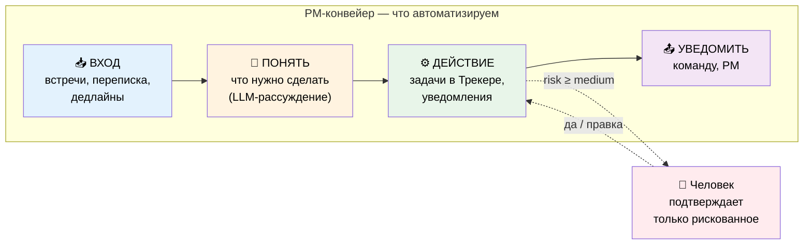
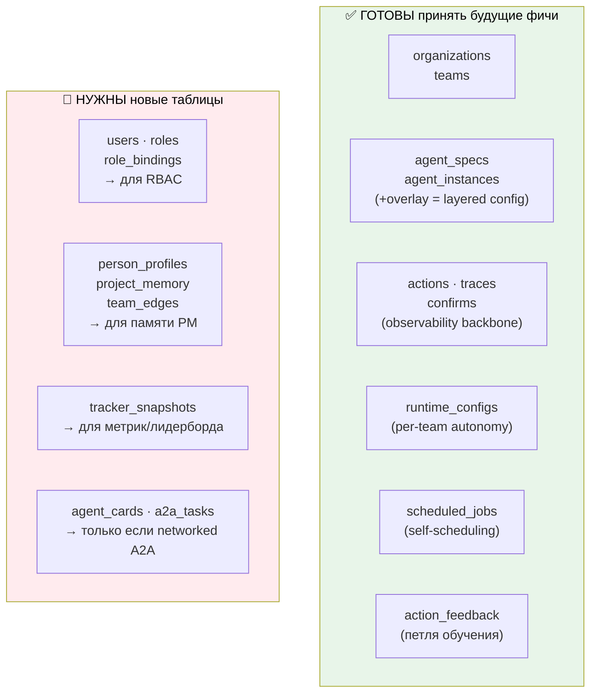
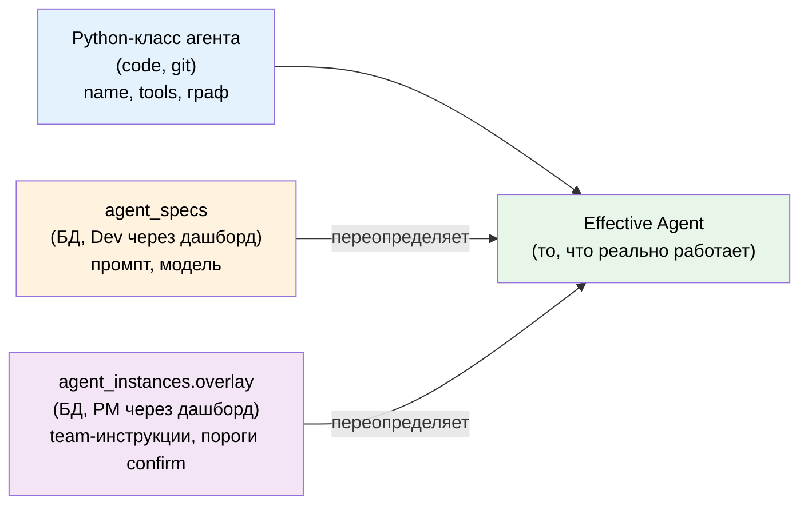
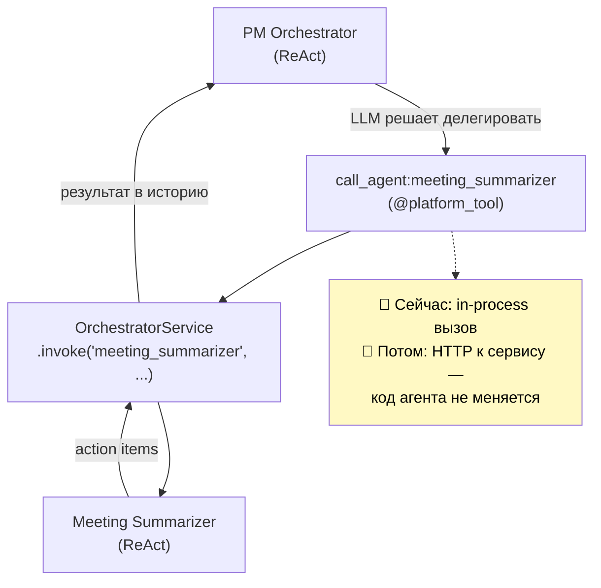
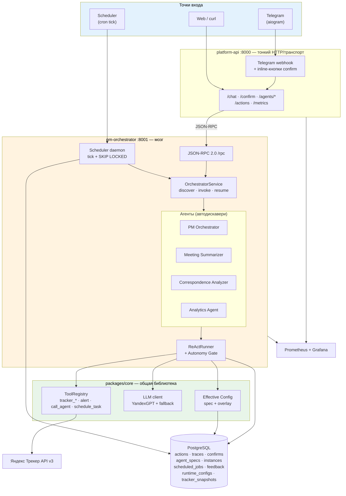
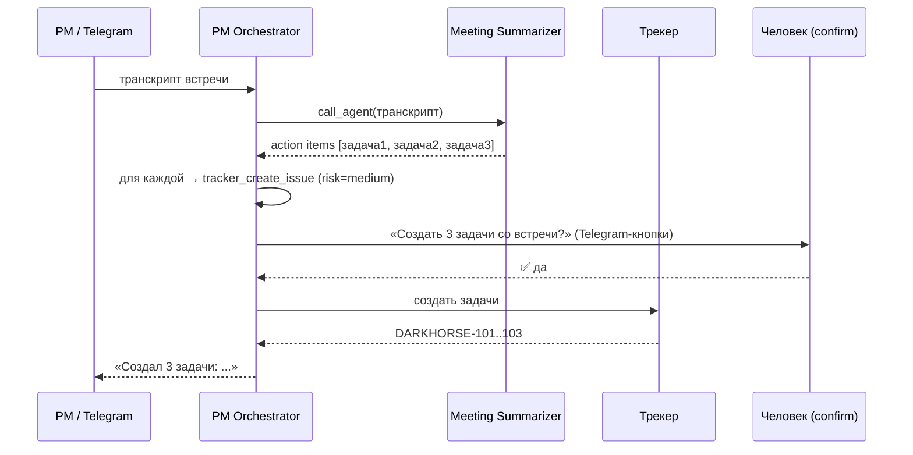
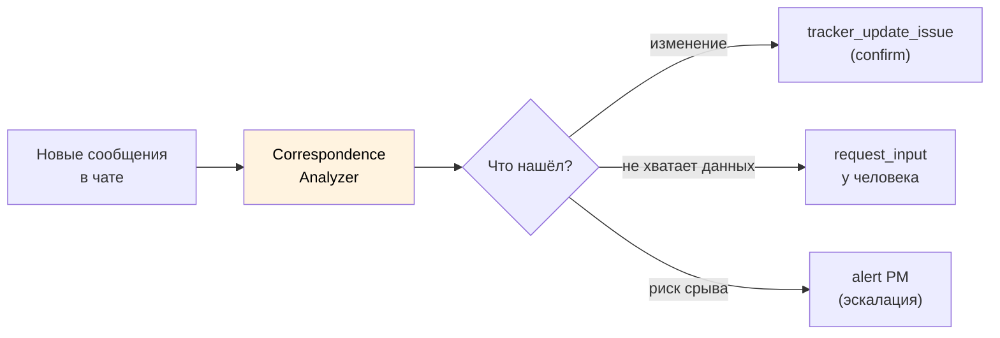
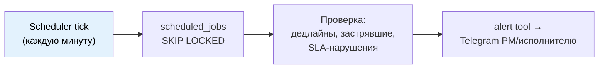
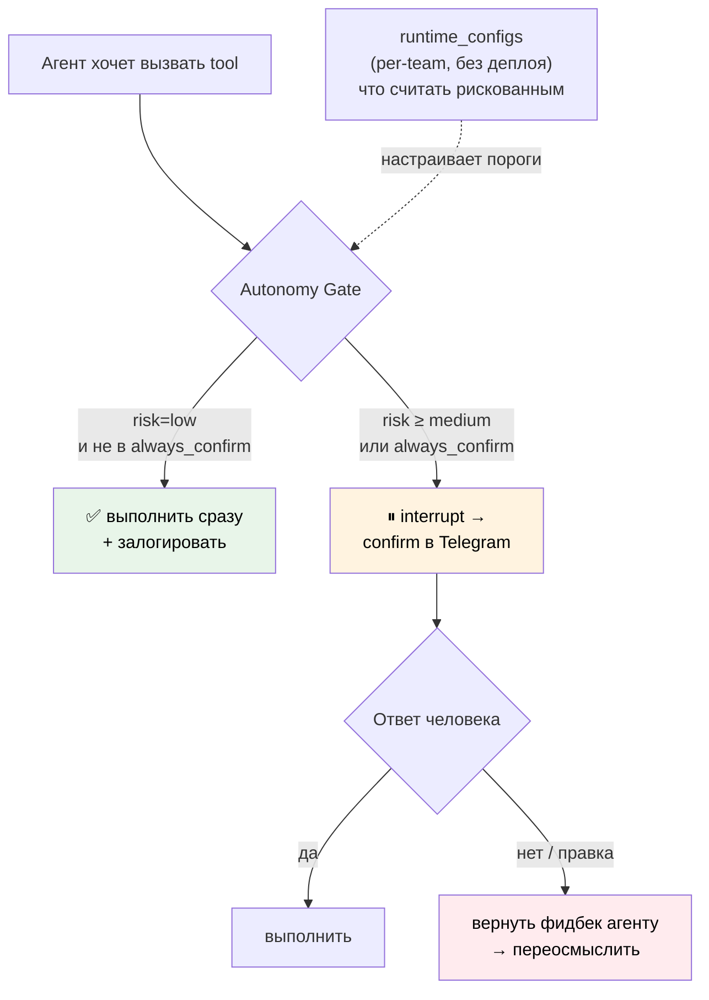

# Целевая архитектура PM Agent Platform

> Стратегический документ: где мы сейчас, куда движемся, и почему.
> Объединяет видение из `discovery/` с реальным состоянием кода на 2026-06-03.

---

## 1. Что это и зачем (ценность)

**Проблема.** Работа Project Manager — это конвейер рутины: послушал встречу → завёл задачи, прочитал переписку → обновил доску, проверил дедлайны → напомнил. 60-70% этого — механическая работа, которая съедает время, но не требует уникального человеческого суждения.

**Решение.** Агент берёт на себя черновую работу конвейера. Человек остаётся в петле только для рискованного — через подтверждение (autonomy уровня 2). PM **не меняет свой workflow**: агент подключается к тем же инструментам (тот же Трекер, те же чаты).

**Метрика успеха (главная):** *Acceptance rate* — доля действий агента, которые человек принимает без правок. Растёт со временем → агент учится команде → больше автономии → больше сэкономленного времени PM.

---

## 2. Где мы сейчас vs целевое видение

Видение (`discovery/`) описывает зрелую платформу. Реальность — пройдены фундамент и часть ядра. Таблица показывает честную картину:

| Возможность (видение) | Статус | Комментарий |
|----------------------|:------:|-------------|
| Ядро платформы (config, db, llm, tools) | ✅ Готово | YandexGPT напрямую (не LiteLLM — проще, работает) |
| ReAct-цикл + Autonomy Gate (L2) | ✅ Готово | `core/react.py` — авто-low, confirm medium/high, resume |
| Tracker-интеграция (6 тулзов) | ✅ Готово | полный CRUD + поиск + переходы |
| Code-first агенты + автодискавери | ✅ Готово | агент = класс в `agents/`, без деплоя БД |
| JSON-RPC оркестратор (in-process) | ✅ Готово | multi-agent в одном процессе |
| Observability backbone (Action/Trace/Confirm) | ✅ Схема + запись | таблицы есть, ReActRunner пишет |
| Мониторинг (Prometheus/Grafana) | ✅ Готово | инфра-метрики + app-метрики |
| CI/CD на тест-VPS | ✅ Готово | push develop → авто-деплой |
| **Telegram-адаптер** | 🔴 Нет | следующий шаг, нужен для confirm/демо |
| **Control plane (агенты из БД)** | 🟡 Схема-only | `AgentSpec`/`AgentInstance` есть, оркестратор их не читает |
| **Scheduler / cron** | 🟡 Схема-only | `ScheduledJob` есть, нет демона-исполнителя |
| **call_agent (делегирование)** | 🔴 Нет | оркестратор не умеет агент→агент |
| **Meeting Summarizer** | 🔴 Нет | агент #1 из must-have |
| **Correspondence Analyzer** | 🔴 Нет | агент #2 |
| **Analytics Agent + метрики** | 🔴 Нет | флаг есть, реализации нет |
| **Алерты (дедлайны/SLA)** | 🔴 Нет | флаг `enable_alerts`, нет системы |
| **Дашборд (3 UI)** | 🔴 Нет | весь observability-слой есть в данных |
| **RBAC (User/Role)** | 🔴 Нет схемы | нужны новые таблицы |
| **Слой памяти (профили/проект/граф)** | 🔴 Нет схемы | future, нужны новые таблицы |
| **Networked A2A (agent cards/registry)** | 🔴 Нет | сознательно отложено (см. §5) |

**Вывод:** фундамент и механизм автономии готовы (это самое сложное). Не хватает **наполнения** (агенты, адаптеры, фоновые процессы) и **поверхности** (Telegram, дашборд).

---

## 3. Покрывает ли текущая база БД дальнейшие шаги?

Прямой ответ на ключевой вопрос. Разбор по таблицам — **что уже готово принять будущую функциональность, а где нужны новые схемы.**

### Детально

| Будущий шаг | Покрытие БД | Что нужно |
|-------------|:-----------:|-----------|
| Telegram-адаптер | ✅ полное | ничего — сессии в `traces`, действия в `actions` |
| Control plane (агенты из БД) | ✅ полное | `agent_specs` + `agent_instances.overlay` готовы; нужен **код** (оркестратор должен читать БД, а не только классы) |
| Scheduler / алерты | ✅ полное | `scheduled_jobs` готова; нужен **демон** (tick + SKIP LOCKED) |
| call_agent / multi-agent | ✅ полное | `traces` хранит шаги; делегирование — **код**, не схема |
| Meeting/Correspondence/Analytics агенты | ✅ полное | агенты = код, конфиг в `agent_specs`; схема готова |
| Фидбек-петля | ✅ полное | `action_feedback` готова, нужен дашборд для сбора |
| Метрики/лидерборд | 🟡 частично | нужна таблица `tracker_snapshots` (read-модель Трекера) |
| RBAC / multi-PM | 🔴 нет | нужны `users`, `roles`, `role_bindings` |
| Память PM (профили/проект/граф) | 🔴 нет | нужны `person_profiles`, `project_memory`, `team_edges` |
| Networked A2A | 🔴 нет | нужны `agent_cards`, `a2a_tasks` — **но это отложено** |

**Итог:** **~70% будущих шагов покрыты текущей схемой.** Фаза 0-5 (до дашборда) требует только **2 новых таблицы** (`tracker_snapshots` для метрик, опционально). RBAC и память — отдельные блоки схемы, нужны только при масштабировании за пределы одной команды и в «будущем» соответственно. Критично: **layered config заложен правильно** (`agent_instances.overlay`) — это самое больное для ретрофита, и оно уже есть.

Одна техническая чистка: таблица `langchain_checkpoints` в миграции **не используется** (мы не на LangGraph) — её можно удалить при следующей миграции.

---

## 4. Стратегические принципы: что оставляем, что добавляем, что откладываем

Видение из discovery описывает «тяжёлый» стек (networked A2A через a2a-sdk, LangGraph, LiteLLM, control-plane агенты в БД). Реальная реализация пошла «легче» и в ряде мест — **лучше для текущего масштаба**. Зафиксируем осознанные решения:

| Аспект | Видение discovery | Реализовано | Решение |
|--------|-------------------|-------------|---------|
| LLM-слой | LiteLLM | Прямой YandexGPT + fallback в `LLMSettings` | ✅ **Оставляем** — проще, меньше зависимостей, fallback уже есть |
| Движок агента | LangGraph | Кастомный `ReActRunner` | ✅ **Оставляем** — полный контроль, нет тяжёлой зависимости |
| Мультиагентность | Networked A2A (сервис на агента) | In-process оркестратор | ✅ **Оставляем in-process**, добавим `call_agent` (см. §5) |
| Определение агента | AgentSpec в БД (control plane) | Python-класс (code-first) | 🔀 **Гибрид** (см. ниже) |

### Развилка: code-first vs control-plane агенты

Сейчас агент — это Python-класс (`agents/pm_agent.py`), который автодискаверится. Видение говорит про `AgentSpec` в БД (менять промпт без деплоя). **Рекомендация — гибрид:**

- **Структура агента** (какие тулзы, какой граф) — остаётся в коде (code-first, безопасно, версионируется в git).
- **Параметры** (промпт, модель, пороги автономии, on/off) — читаются из `agent_specs` + `agent_instances.overlay`, с фолбэком на значения класса.

Это даёт лучшее из двух миров: разработчик задаёт каркас и tools (граница безопасности), PM/Dev правит промпт и пороги через дашборд без деплоя. Схема под это **уже готова** — нужно только научить `OrchestratorService` читать БД-оверлей поверх класса.

---

## 5. call_agent: мультиагентность без networked A2A

Видение требует делегирования агент→агент (Orchestrator зовёт Meeting Summarizer). Discovery предлагает networked A2A (каждый агент — отдельный сервис, agent cards, registry). **Это избыточно** для одной команды и нескольких агентов в одном процессе.

**Решение — следовать собственному принципу discovery: «начать in-process, вынести в сервис потом, не меняя код вызывающего».**

`call_agent` — это обычный `@platform_tool`, который под капотом зовёт другой агент через `OrchestratorService`. Сейчас — в том же процессе. Позже, если понадобится независимое масштабирование — тот же tool начинает делать HTTP-вызов к отдельному сервису. Код агента-вызывателя не меняется.

Networked A2A (agent cards, registry, `/a2a` endpoint, call_chain, loop-prevention) добавляется **только** когда появится реальная потребность: разные команды/орги с изоляцией, внешние агенты, независимый деплой/скейл специалистов. До тех пор — лишняя сложность.

---

## 6. Целевая архитектура (компоненты)

Жирным выделены **новые** компоненты относительно текущего состояния: Telegram-адаптер, агенты MS/CA/AN, Scheduler daemon, новые тулзы (`alert`, `call_agent`, `schedule_task`), `tracker_snapshots`, Effective Config (spec+overlay).

---

## 7. Бизнес-логика: 5 must-have потоков

Исходная доска требований раскладывается на потоки. Каждый — ценность + техническая реализация.

### Поток 1 — Встречи → задачи (ядро ценности)

**Ценность:** PM не тратит 20-30 мин после каждой встречи на занесение задач. Самый частый и нелюбимый кусок рутины.

### Поток 2 — Переписка → изменения/вводные

**Ценность:** ничего не теряется в чатах. Решения из переписки автоматически отражаются на доске.

### Поток 3 — Алерты (проактивность)

**Ценность:** проблемы всплывают до того, как стали пожаром. PM не держит всё в голове.

### Поток 4 — Канбан (детерминированные тулзы)

Ведение доски — это не отдельный агент, а **набор тулзов** (`tracker_*`), которые Orchestrator вызывает по результатам потоков 1-2. Уже реализовано.

### Поток 5 — Urgent confirm (человек в петле)

Реализовано через Autonomy Gate (см. §8). Самый важный механизм доверия.

---

## 8. Autonomy Gate — механизм доверия (реализован)

**Ценность:** доверие выстраивается постепенно. Тестовая команда — confirm почти на всё; по мере роста acceptance rate пороги поднимаются → больше автономии. Kill-switch (`agent_instances.enabled=false`) выключает агента мгновенно.

---

## 9. Глобальный roadmap (приоритизированный)

Текущее состояние: **Фаза 0 завершена + механизм Фазы 3 (Autonomy Gate) готов досрочно.** Реалистичный порядок дальше — по убыванию отношения ценность/усилие:

```mermaid
flowchart LR
    subgraph now["✅ Сделано"]
        N["Ядро · ReAct · Autonomy Gate<br/>Tracker · Оркестратор · CI/CD"]
    end

    subgraph s1["Шаг 1 — Замкнуть демо"]
        A["Telegram-адаптер<br/>+ DB-персист в проде<br/>+ call_agent tool"]
    end

    subgraph s2["Шаг 2 — Ценность встреч"]
        B["Meeting Summarizer<br/>встреча → задачи<br/>(главный поток)"]
    end

    subgraph s3["Шаг 3 — Проактивность"]
        C["Scheduler daemon<br/>+ alert tool<br/>дедлайны/SLA"]
    end

    subgraph s4["Шаг 4 — Прозрачность"]
        D["Дашборд (dev+admin минимум)<br/>+ Effective Config (spec/overlay)<br/>+ фидбек-петля"]
    end

    subgraph s5["Шаг 5 — Расширение"]
        E["Correspondence + Analytics<br/>+ tracker_snapshots<br/>+ метрики/лидерборд"]
    end

    subgraph fut["Будущее"]
        F["RBAC (multi-team)<br/>Память (профили/проект/граф)<br/>Networked A2A"]
    end

    now --> s1 --> s2 --> s3 --> s4 --> s5 --> fut

    style now fill:#e8f5e9,color:#000
    style s1 fill:#fff3e0,color:#000
    style fut fill:#eceff1,color:#000
```

### Матрица ценность / усилие

| Шаг | Ценность | Усилие | DB-изменения |
|-----|:--------:|:------:|--------------|
| 1. Telegram + персист + call_agent | 🔥 высокая (демо, мультиагент) | средне | нет |
| 2. Meeting Summarizer | 🔥 высокая (ядро продукта) | средне | нет |
| 3. Scheduler + алерты | высокая (проактивность) | средне | нет (`scheduled_jobs` есть) |
| 4. Дашборд + Effective Config | высокая (доверие, тюнинг) | высокое | нет |
| 5. Correspondence/Analytics/метрики | средняя | высокое | +`tracker_snapshots` |
| Будущее: RBAC | низкая пока 1 команда | высокое | +`users/roles/bindings` |
| Будущее: память | высокая, но рано | очень высокое | +`profiles/project/edges` |
| Будущее: networked A2A | низкая пока 1 процесс | высокое | +`agent_cards/a2a_tasks` |

---

## 10. Технические аспекты по шагам

### Шаг 1 — Замкнуть демо
- **Telegram-адаптер** (`platform-api`, aiogram): webhook → `/chat`, inline-кнопки ✅/❌ → `/confirm/{id}`. Сессия = chat_id.
- **DB-персист в оркестраторе**: сейчас `OrchestratorService` хранит сессии in-memory; передать `db_session` в `ReActRunner` (он уже умеет писать в `traces/actions/confirms`).
- **`call_agent` tool**: `@platform_tool`, вызывает `OrchestratorService.invoke(target_agent, ...)`. Регистрируется автоматически для каждого агента.

### Шаг 2 — Meeting Summarizer
- Новый файл `agents/meeting_summarizer.py` (BaseAgent, без тулзов Трекера — только рассуждение).
- Вход: транскрипт (пока — ручная вставка в чат; источник транскриптов — открытая развилка).
- PM Orchestrator получает `call_agent:meeting_summarizer` автоматически.

### Шаг 3 — Scheduler
- Демон в `pm-orchestrator`: `asyncio` loop `* * * * *`, `SELECT ... FOR UPDATE SKIP LOCKED` по `scheduled_jobs.next_run <= now()`.
- `schedule_task` tool — агент сам ставит задачи. Guardrails: квота, TTL, max_runs, confirm на recurring.
- `alert` tool — уведомление в Telegram.

### Шаг 4 — Дашборд + Effective Config
- Минимум: dev-UI (реестр агентов, редактор промпта, просмотр трейсов) + admin-минимум (лента действий, kill-switch, пороги).
- **Effective Config**: `OrchestratorService` при старте/запросе мёржит `agent_specs` + `agent_instances.overlay` поверх значений класса.
- Фидбек: сбор `action_feedback` через UI → сигнал для тюнинга промптов.

### Шаг 5 — Расширение
- `Correspondence Analyzer`, `Analytics Agent` — новые классы агентов.
- `tracker_snapshots` — read-модель: cron тянет story points / счётчики из Трекера → метрики, лидерборд, burndown.

### Будущее
- **RBAC**: `users`, `roles`, `role_bindings` (user_id, role, scope_type, scope_id). 4 роли из `06_org_roles.md`.
- **Память**: `person_profiles`, `project_memory`, `team_edges` + tool `get_context()` + RAG. Архитектура не меняется — это ещё один tool.
- **Networked A2A**: `agent_cards`, `a2a_tasks`, `/a2a` endpoint, call_chain/max_depth. Только при реальной потребности изоляции/скейла.

---

## 11. Открытые развилки (требуют решения)

1. **Источник транскриптов встреч** — Telemost API / запись + Whisper / ручная вставка. Определяет триггер Meeting Summarizer. *Рекомендация для старта: ручная вставка.*
2. **Code-first vs control-plane** — рекомендован гибрид (§4). Подтвердить.
3. **Когда вводить RBAC** — рекомендация: только при выходе за пределы одной тестовой команды.
4. **Чистка `langchain_checkpoints`** — таблица не используется, удалить в следующей миграции.

---

## 12. Сводка одним абзацем

Фундамент платформы и самый сложный механизм (автономия уровня 2 с human-in-the-loop) **готовы и работают**. Текущая БД-схема покрывает **~70% будущих шагов** без изменений — критичный layered config уже заложен правильно. Ближайшая ценность — **замкнуть демо через Telegram и добавить Meeting Summarizer** (ядро продукта), затем проактивные алерты и дашборд. Тяжёлые элементы видения (networked A2A, LangGraph, LiteLLM) сознательно заменены на более лёгкие эквиваленты — и это правильно для текущего масштаба; они добавляются только при реальной потребности. Новые таблицы нужны лишь для RBAC и памяти — а это «будущее», не ближайшие шаги.
