# Целевая архитектура PM Agent Platform

> Стратегический документ: где мы сейчас, куда движемся, и почему.
> Объединяет видение из `discovery/` с реальным состоянием кода на 2026-06-03.

---

## 1. Что это и зачем (ценность)

**Проблема.** Работа Project Manager — это конвейер рутины: послушал встречу → завёл задачи, прочитал переписку → обновил доску, проверил дедлайны → напомнил. 60-70% этого — механическая работа, которая съедает время, но не требует уникального человеческого суждения.

**Решение.** Агент берёт на себя черновую работу конвейера. Человек остаётся в петле только для рискованного — через подтверждение (autonomy уровня 2). PM **не меняет свой workflow**: агент подключается к тем же инструментам (тот же Трекер, те же чаты).

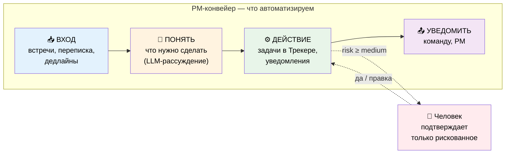

**Метрика успеха (главная):** *Acceptance rate* — доля действий агента, которые человек принимает без правок. Растёт со временем → агент учится команде → больше автономии → больше сэкономленного времени PM.

---

## 2. Где мы сейчас vs целевое видение

Видение (`discovery/`) описывает зрелую платформу. Реальность — пройдены фундамент и часть ядра. Таблица показывает честную картину:

| Возможность (видение) | Статус | Комментарий |
|----------------------|:------:|-------------|
| Ядро платформы (config, db, llm, tools) | ✅ Готово | YandexGPT напрямую (не LiteLLM — проще, работает) |
| ReAct-цикл + Autonomy Gate (L2) | ✅ Готово | `core/react.py` — авто-low, confirm medium/high, resume |
| Tracker-интеграция (6 тулзов) | ✅ Готово | полный CRUD + поиск + переходы |
| Code-first агенты + автодискавери | ✅ Готово | агент = класс в `agents/`, без деплоя БД |
| JSON-RPC оркестратор (in-process) | ✅ Готово | multi-agent в одном процессе |
| Observability backbone (Action/Trace/Confirm) | ✅ Схема + запись | таблицы есть, ReActRunner пишет |
| Мониторинг (Prometheus/Grafana) | ✅ Готово | инфра-метрики + app-метрики |
| CI/CD на тест-VPS | ✅ Готово | push develop → авто-деплой |
| **Telegram-адаптер** | 🔴 Нет | следующий шаг, нужен для confirm/демо |
| **Control plane (агенты из БД)** | 🟡 Схема-only | `AgentSpec`/`AgentInstance` есть, оркестратор их не читает |
| **Scheduler / cron** | 🟡 Схема-only | `ScheduledJob` есть, нет демона-исполнителя |
| **call_agent (делегирование)** | 🔴 Нет | оркестратор не умеет агент→агент |
| **Meeting Summarizer** | 🔴 Нет | агент #1 из must-have |
| **Meeting Capture (Telemost запись/STT)** | 🔴 Нет | дизайн готов (`meeting_capture.md`), отдельный тяжёлый сервис |
| **Correspondence Analyzer** | 🔴 Нет | агент #2 |
| **Analytics Agent + метрики** | 🔴 Нет | флаг есть, реализации нет |
| **Алерты (дедлайны/SLA)** | 🔴 Нет | флаг `enable_alerts`, нет системы |
| **GUI: 3 кабинета (user/admin/dev)** | 🔴 Нет | отдельная плоскость: `web-ui` + `console-api` (см. §6.1) |
| **RBAC (User/Role)** | 🔴 Нет схемы | нужны новые таблицы |
| **Слой памяти (профили/проект/граф)** | 🔴 Нет схемы | future, нужны новые таблицы |
| **Networked A2A (agent cards/registry)** | 🔴 Нет | сознательно отложено (см. §5) |

**Вывод:** фундамент и механизм автономии готовы (это самое сложное). Не хватает **наполнения** (агенты, адаптеры, фоновые процессы) и **поверхности** (Telegram, дашборд).

---

## 3. Покрывает ли текущая база БД дальнейшие шаги?

Прямой ответ на ключевой вопрос. Разбор по таблицам — **что уже готово принять будущую функциональность, а где нужны новые схемы.**

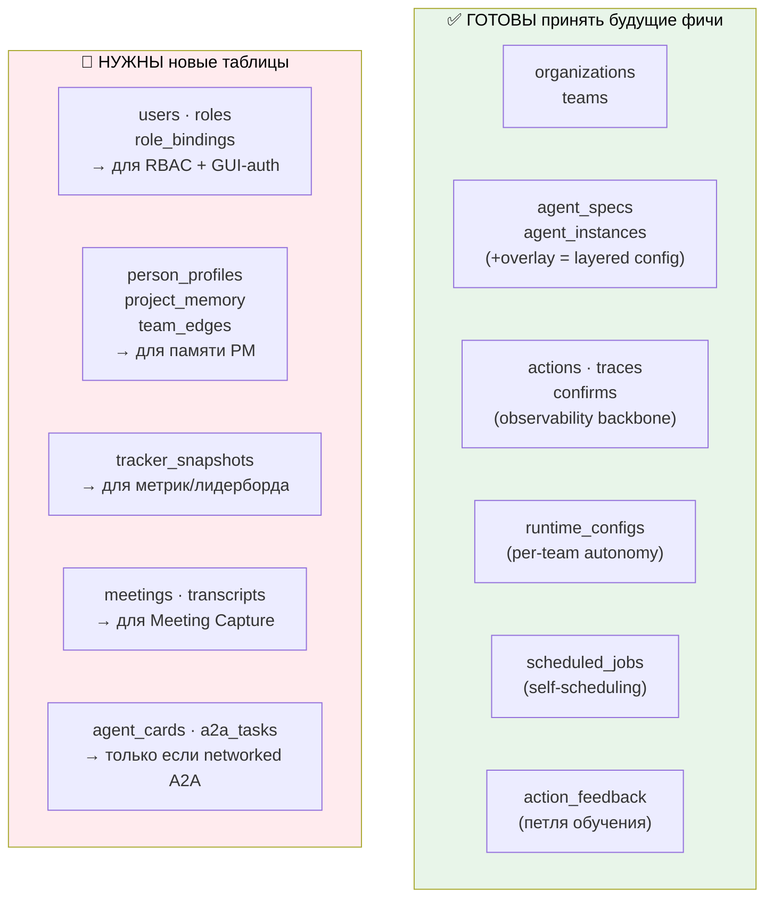

### Детально

| Будущий шаг | Покрытие БД | Что нужно |
|-------------|:-----------:|-----------|
| Telegram-адаптер | ✅ полное | ничего — сессии в `traces`, действия в `actions` |
| Control plane (агенты из БД) | ✅ полное | `agent_specs` + `agent_instances.overlay` готовы; нужен **код** (оркестратор должен читать БД, а не только классы) |
| Scheduler / алерты | ✅ полное | `scheduled_jobs` готова; нужен **демон** (tick + SKIP LOCKED) |
| call_agent / multi-agent | ✅ полное | `traces` хранит шаги; делегирование — **код**, не схема |
| Meeting/Correspondence/Analytics агенты | ✅ полное | агенты = код, конфиг в `agent_specs`; схема готова |
| Фидбек-петля | ✅ полное | `action_feedback` готова, нужен дашборд для сбора |
| Метрики/лидерборд | 🟡 частично | нужна таблица `tracker_snapshots` (read-модель Трекера) |
| **GUI (3 кабинета)** | 🟡 частично | данные есть (`actions/traces/configs/feedback`); нужны `users`+сессии для auth |
| **Meeting Capture** | 🔴 нет | нужны `meetings`, `transcripts` (+ object storage для аудио) |
| RBAC / multi-PM | 🔴 нет | нужны `users`, `roles`, `role_bindings` |
| Память PM (профили/проект/граф) | 🔴 нет | нужны `person_profiles`, `project_memory`, `team_edges` |
| Networked A2A | 🔴 нет | нужны `agent_cards`, `a2a_tasks` — **но это отложено** |

**Итог:** **~70% будущих шагов покрыты текущей схемой.** Ядро (оркестрация, автономия, observability, scheduling, фидбек, layered config) не требует изменений схемы. Новые таблицы нужны только для **изолированных подсистем**: GUI-auth (`users`+сессии), Meeting Capture (`meetings`, `transcripts`), метрики (`tracker_snapshots`), RBAC и память — по мере роста. Критично: **layered config заложен правильно** (`agent_instances.overlay`) — это самое больное для ретрофита, и оно уже есть.

Одна техническая чистка: таблица `langchain_checkpoints` в миграции **не используется** (мы не на LangGraph) — её можно удалить при следующей миграции.

---

## 4. Стратегические принципы: что оставляем, что добавляем, что откладываем

Видение из discovery описывает «тяжёлый» стек (networked A2A через a2a-sdk, LangGraph, LiteLLM, control-plane агенты в БД). Реальная реализация пошла «легче» и в ряде мест — **лучше для текущего масштаба**. Зафиксируем осознанные решения:

| Аспект | Видение discovery | Реализовано | Решение |
|--------|-------------------|-------------|---------|
| LLM-слой | LiteLLM | Прямой YandexGPT + fallback в `LLMSettings` | ✅ **Оставляем** — проще, меньше зависимостей, fallback уже есть |
| Движок агента | LangGraph | Кастомный `ReActRunner` | ✅ **Оставляем** — полный контроль, нет тяжёлой зависимости |
| Мультиагентность | Networked A2A (сервис на агента) | In-process оркестратор | ✅ **Оставляем in-process**, добавим `call_agent` (см. §5) |
| Определение агента | AgentSpec в БД (control plane) | Python-класс (code-first) | 🔀 **Гибрид** (см. ниже) |

### Развилка: code-first vs control-plane агенты

Сейчас агент — это Python-класс (`agents/pm_agent.py`), который автодискаверится. Видение говорит про `AgentSpec` в БД (менять промпт без деплоя). **Рекомендация — гибрид:**

- **Структура агента** (какие тулзы, какой граф) — остаётся в коде (code-first, безопасно, версионируется в git).
- **Параметры** (промпт, модель, пороги автономии, on/off) — читаются из `agent_specs` + `agent_instances.overlay`, с фолбэком на значения класса.

Это даёт лучшее из двух миров: разработчик задаёт каркас и tools (граница безопасности), PM/Dev правит промпт и пороги через дашборд без деплоя. Схема под это **уже готова** — нужно только научить `OrchestratorService` читать БД-оверлей поверх класса.

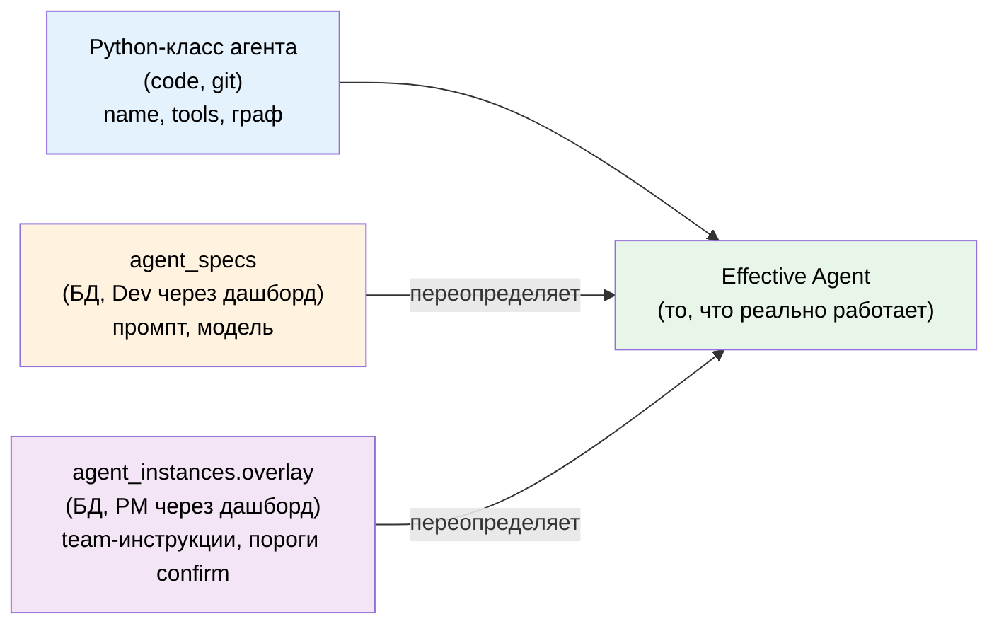

---

## 5. call_agent: мультиагентность без networked A2A

Видение требует делегирования агент→агент (Orchestrator зовёт Meeting Summarizer). Discovery предлагает networked A2A (каждый агент — отдельный сервис, agent cards, registry). **Это избыточно** для одной команды и нескольких агентов в одном процессе.

**Решение — следовать собственному принципу discovery: «начать in-process, вынести в сервис потом, не меняя код вызывающего».**

`call_agent` — это обычный `@platform_tool`, который под капотом зовёт другой агент через `OrchestratorService`. Сейчас — в том же процессе. Позже, если понадобится независимое масштабирование — тот же tool начинает делать HTTP-вызов к отдельному сервису. Код агента-вызывателя не меняется.

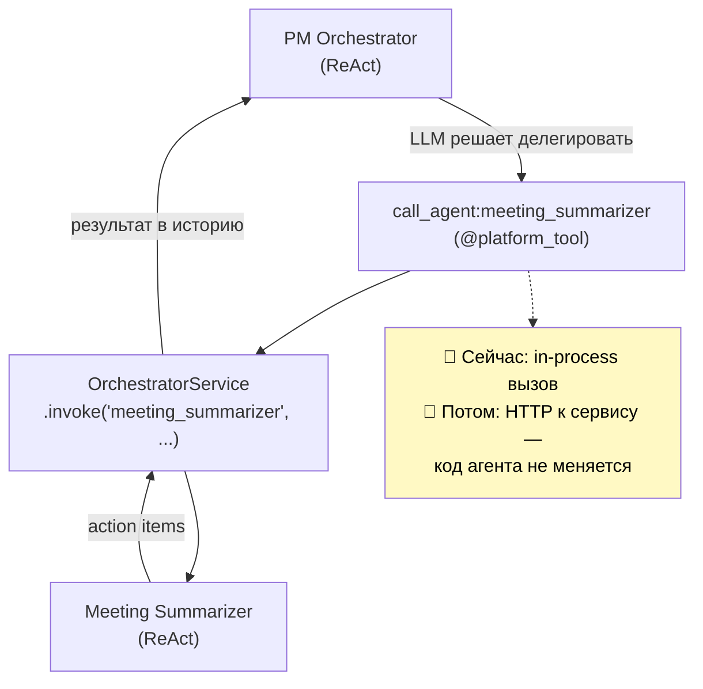

Networked A2A (agent cards, registry, `/a2a` endpoint, call_chain, loop-prevention) добавляется **только** когда появится реальная потребность: разные команды/орги с изоляцией, внешние агенты, независимый деплой/скейл специалистов. До тех пор — лишняя сложность.

---

## 6. Целевая архитектура (компоненты)

Три **плоскости** с разными задачами, безопасностью и темпом релизов. Они общаются через общий `core` и одну БД, но деплоятся независимо.

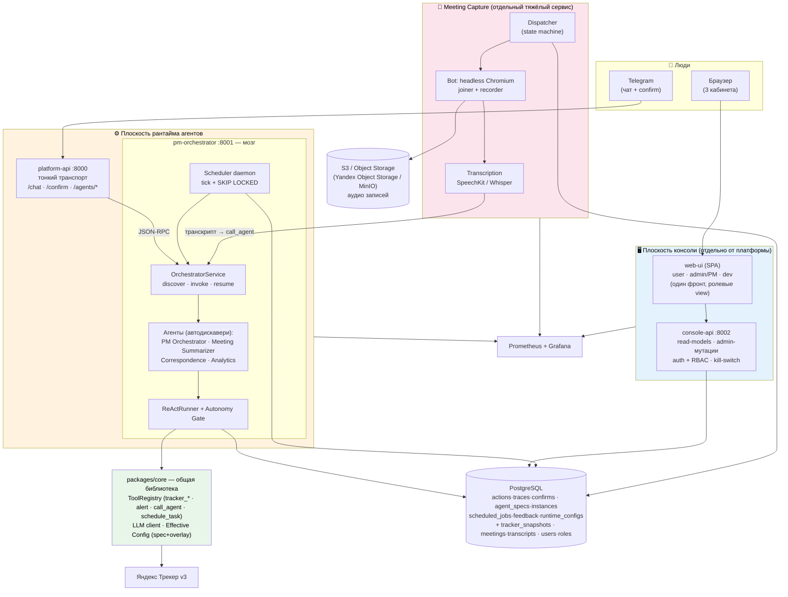

**Почему три плоскости, а не один монолит:** разные требования к безопасности (консоль = auth/RBAC/мутации, рантайм = горячий путь без auth), разный темп релизов (фронт меняется часто, ядро редко), разный профиль нагрузки (Meeting Capture = тяжёлый Chromium-воркер, остальное — лёгкое async). Общее — библиотека `core` и одна БД.

---

## 6.1. GUI — отдельная плоскость (почему не в платформе)

**Вопрос: почему 3 кабинета не были в первой версии и стоит ли их отделять?** Да, стоит — и вот почему GUI это **отдельная плоскость, а не часть `platform-api`**:

| Аспект | Рантайм (`platform-api`) | Консоль (`console-api` + `web-ui`) |
|--------|--------------------------|-------------------------------------|
| Назначение | приём сообщений агенту, confirm | наблюдение, управление, настройка |
| Путь | горячий, тонкий, без auth | human-facing, нужен auth + RBAC |
| Данные | проксирует в оркестратор (RPC) | читает read-модели напрямую из БД |
| Мутации | нет (только запуск агента) | да (kill-switch, пороги, правка промпта) |
| Темп релизов | редко (ядро стабильно) | часто (UI/UX итерации) |
| Технология | Python/FastAPI | SPA (React/Vue) + Python BFF |

Смешивать их в одном сервисе — значит тащить auth/RBAC и тяжёлые аналитические запросы в горячий путь агента. Поэтому:

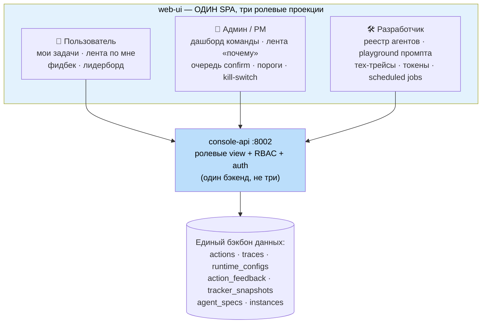

**Ключевая идея (из `discovery/05_ui.md`):** в основе — одно «действие агента» (`Action` + `trace_id`), три роли смотрят на него под разным углом. Поэтому **один `console-api` с ролевыми view + RBAC, а не три бэкенда** и **один `web-ui` с тремя режимами, а не три фронта**.

**Приоритет (из discovery):** dev-кабинет (реестр агентов + редактор промпта + трейсы) нужен **рано** — без него неудобно отлаживать агентов, это инструмент разработки, а не «если успеем». Admin-минимум (лента + kill-switch + пороги) — для безопасного теста на команде. Геймификация и детальная стоимость — позже.

---

## 6.2. Meeting Capture — отдельный сервис (Telemost → транскрипт)

Подсистема «бот ходит на встречи, пишет и транскрибирует». Подробный дизайн — в [`meeting_capture.md`](meeting_capture.md); здесь — место в целевой архитектуре.

**Почему отдельный сервис, а не агент/тулза в оркестраторе:**
- Это **самый тяжёлый воркер** платформы: реальный Chromium + виртуальное аудио-устройство для захвата звука. CPU/RAM-ёмкий, 1 инстанс ≈ 1 встреча.
- Совершенно другой профиль нагрузки и масштабирования (пул воркеров по числу одновременных встреч) — нельзя ставить рядом с лёгкими async-агентами на тест-VPS.
- **Без LLM** — это детерминированный конвейер (join → record → STT). LLM включается только дальше, в Meeting Summarizer.

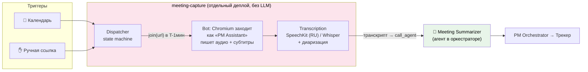

**Связь с платформой — через тулзы и call_agent:**
- PM Orchestrator управляет захватом детерминированными тулзами: `schedule_meeting_bot(url)`, `get_meeting_transcript(meeting_id)`.
- Готовый транскрипт идёт в Meeting Summarizer (тот же `call_agent`-механизм, что и для остальных агентов).
- Оркестратор остаётся «мозгом» — захват спрятан за инструментами.

**Стратегия снижения риска (Telemost не имеет бот-API):**
1. **MVP / Shadow:** ручная загрузка аудио или транскрипта → проверяем Meeting Summarizer, не дожидаясь бота.
2. **Далее:** бот-участник через браузерную автоматизацию (Playwright), адаптер на Телемост; субтитры платформы как дешёвый источник, свой STT (SpeechKit) как fallback с диаризацией.
3. Адаптеры на Zoom/Meet — той же абстракцией позже.

**Новые таблицы:** `meetings` (id, team_id, link, scheduled_at, status, ...), `transcripts` (meeting_id, text, segments с таймкодами/спикерами). Аудио — в **S3** (Yandex Object Storage / MinIO), в БД только ключ объекта; политика TTL на аудио под 152-ФЗ (см. §10 «Хранилище файлов»).

---

## 7. Бизнес-логика: 5 must-have потоков

Исходная доска требований раскладывается на потоки. Каждый — ценность + техническая реализация.

### Поток 1 — Встречи → задачи (ядро ценности)

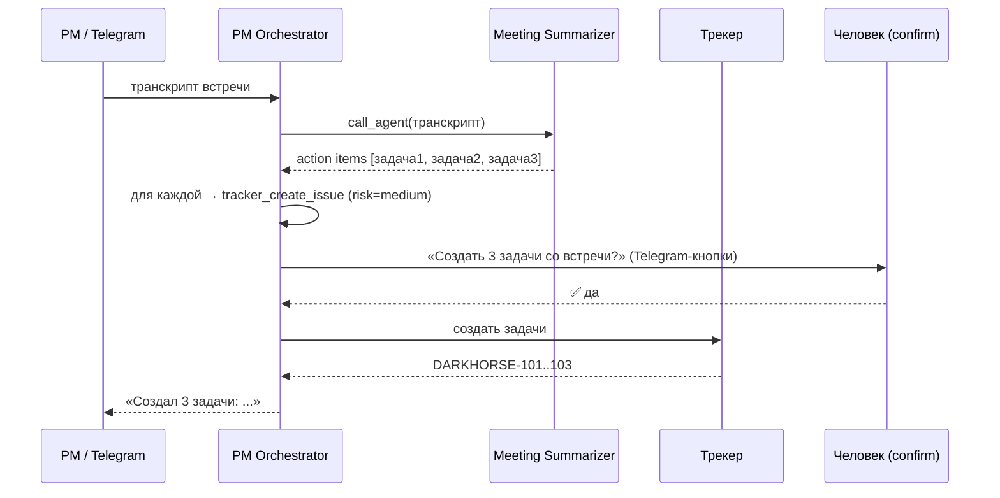

**Ценность:** PM не тратит 20-30 мин после каждой встречи на занесение задач. Самый частый и нелюбимый кусок рутины.

### Поток 2 — Переписка → изменения/вводные

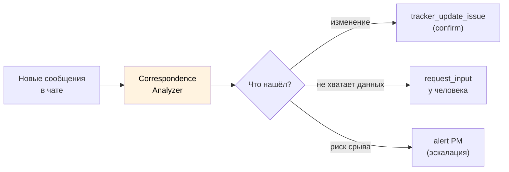

**Ценность:** ничего не теряется в чатах. Решения из переписки автоматически отражаются на доске.

### Поток 3 — Алерты (проактивность)

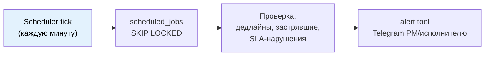

**Ценность:** проблемы всплывают до того, как стали пожаром. PM не держит всё в голове.

### Поток 4 — Канбан (детерминированные тулзы)

Ведение доски — это не отдельный агент, а **набор тулзов** (`tracker_*`), которые Orchestrator вызывает по результатам потоков 1-2. Уже реализовано.

### Поток 5 — Urgent confirm (человек в петле)

Реализовано через Autonomy Gate (см. §8). Самый важный механизм доверия.

---

## 8. Autonomy Gate — механизм доверия (реализован)

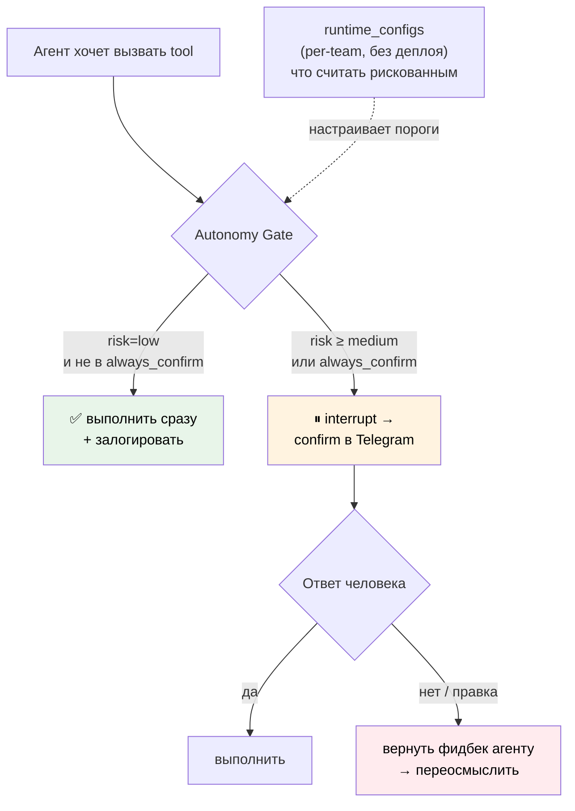

**Ценность:** доверие выстраивается постепенно. Тестовая команда — confirm почти на всё; по мере роста acceptance rate пороги поднимаются → больше автономии. Kill-switch (`agent_instances.enabled=false`) выключает агента мгновенно.

---

## 9. Глобальный roadmap (приоритизированный)

Текущее состояние: **Фаза 0 завершена + механизм Фазы 3 (Autonomy Gate) готов досрочно.** Реалистичный порядок дальше — по убыванию отношения ценность/усилие:

```mermaid
flowchart LR
    subgraph now["✅ Сделано"]
        N["Ядро · ReAct · Autonomy Gate<br/>Tracker · Оркестратор · CI/CD"]
    end

    subgraph s1["Шаг 1 — Замкнуть демо"]
        A["Telegram-адаптер<br/>+ DB-персист в проде<br/>+ call_agent tool"]
    end

    subgraph s2["Шаг 2 — Ценность встреч"]
        B["Meeting Summarizer<br/>встреча → задачи<br/>(главный поток)"]
    end

    subgraph s3["Шаг 3 — Проактивность"]
        C["Scheduler daemon<br/>+ alert tool<br/>дедлайны/SLA"]
    end

    subgraph s4["Шаг 4 — Консоль (GUI)"]
        D["console-api + web-ui<br/>dev-кабинет + admin-минимум<br/>+ Effective Config + фидбек"]
    end

    subgraph s5["Шаг 5 — Захват встреч"]
        E["meeting-capture сервис<br/>Telemost-бот + STT<br/>(отдельный тяжёлый деплой)"]
    end

    subgraph s6["Шаг 6 — Расширение"]
        G["Correspondence + Analytics<br/>+ tracker_snapshots + метрики"]
    end

    subgraph fut["Будущее"]
        F["RBAC (multi-team)<br/>Память (профили/проект/граф)<br/>Networked A2A"]
    end

    now --> s1 --> s2 --> s3 --> s4 --> s5 --> s6 --> fut

    style now fill:#e8f5e9,color:#000
    style s1 fill:#fff3e0,color:#000
    style fut fill:#eceff1,color:#000
```

> Шаг 2 запускает Meeting Summarizer на **ручной загрузке транскрипта** — это даёт ценность сразу. Тяжёлый Telemost-бот (Шаг 5) автоматизирует вход, но не блокирует продукт.

### Матрица ценность / усилие

| Шаг | Ценность | Усилие | DB-изменения |
|-----|:--------:|:------:|--------------|
| 1. Telegram + персист + call_agent | 🔥 высокая (демо, мультиагент) | средне | нет |
| 2. Meeting Summarizer (ручной транскрипт) | 🔥 высокая (ядро продукта) | средне | нет |
| 3. Scheduler + алерты | высокая (проактивность) | средне | нет (`scheduled_jobs` есть) |
| 4. Консоль: dev+admin минимум + Effective Config | высокая (отладка, доверие, тюнинг) | высокое | +`users`+сессии (auth) |
| 5. Meeting Capture (Telemost-бот) | высокая (полная автоматизация встреч) | очень высокое | +`meetings/transcripts` + object storage |
| 6. Correspondence/Analytics/метрики | средняя | высокое | +`tracker_snapshots` |
| Будущее: RBAC | низкая пока 1 команда | высокое | +`roles/role_bindings` |
| Будущее: память | высокая, но рано | очень высокое | +`profiles/project/edges` |
| Будущее: networked A2A | низкая пока 1 процесс | высокое | +`agent_cards/a2a_tasks` |

> Meeting Capture стоит в Шаге 5, а не выше, потому что усилие/инфра очень высокие (Chromium-пул, STT, хрупкость UI-автоматизации), а ценность Meeting Summarizer уже снята в Шаге 2 ручной загрузкой. Dev-кабинет (Шаг 4) по discovery нужен рано для отладки — при наличии ресурсов его можно частично двигать параллельно Шагам 2-3.

---

## 10. Технические аспекты по шагам

### Шаг 1 — Замкнуть демо
- **Telegram-адаптер** (`platform-api`, aiogram): webhook → `/chat`, inline-кнопки ✅/❌ → `/confirm/{id}`. Сессия = chat_id.
- **DB-персист в оркестраторе**: сейчас `OrchestratorService` хранит сессии in-memory; передать `db_session` в `ReActRunner` (он уже умеет писать в `traces/actions/confirms`).
- **`call_agent` tool**: `@platform_tool`, вызывает `OrchestratorService.invoke(target_agent, ...)`. Регистрируется автоматически для каждого агента.

### Шаг 2 — Meeting Summarizer
- Новый файл `agents/meeting_summarizer.py` (BaseAgent, без тулзов Трекера — только рассуждение).
- Вход: транскрипт (пока — ручная вставка в чат; источник транскриптов — открытая развилка).
- PM Orchestrator получает `call_agent:meeting_summarizer` автоматически.

### Шаг 3 — Scheduler
- Демон в `pm-orchestrator`: `asyncio` loop `* * * * *`, `SELECT ... FOR UPDATE SKIP LOCKED` по `scheduled_jobs.next_run <= now()`.
- `schedule_task` tool — агент сам ставит задачи. Guardrails: квота, TTL, max_runs, confirm на recurring.
- `alert` tool — уведомление в Telegram.

### Шаг 4 — Консоль (GUI) + Effective Config
- **`web-ui`** — отдельный SPA (React/Vue), статический деплой (nginx). Три ролевых режима в одном приложении.
- **`console-api`** — новый сервис (`services/console-api`, FastAPI, порт 8002): ролевые view + auth (сессии) + RBAC. Читает read-модели из БД напрямую (`actions/traces/runtime_configs/action_feedback/tracker_snapshots`), мутации (kill-switch, пороги, правка `agent_specs`/overlay).
- Приоритет: dev-кабинет (реестр агентов, playground промпта, трейсы) — рано; admin-минимум (лента, kill-switch, пороги) — для безопасного теста.
- **Effective Config**: `OrchestratorService` мёржит `agent_specs` + `agent_instances.overlay` поверх значений класса → правка промпта без деплоя.
- Auth: `users` + сессии (JWT/cookie). Полный RBAC — позже (Будущее).

### Шаг 5 — Meeting Capture (отдельный сервис)
- **`services/meeting-capture`** — отдельный деплой-юнит, **не на тест-VPS с лёгкими агентами** (Chromium + аудио-захват, CPU/RAM-ёмкий, пул воркеров).
- Dispatcher (state machine) → Bot (Playwright/Chromium join+record) → Transcription (SpeechKit RU / Whisper + диаризация).
- Тулзы для оркестратора: `schedule_meeting_bot(url)`, `get_meeting_transcript(meeting_id)`; транскрипт → `call_agent:meeting_summarizer`.
- Новые таблицы: `meetings`, `transcripts`. Аудио — в **S3** (см. ниже).
- MVP-страховка: ручная загрузка аудио/транскрипта работает уже с Шага 2.

### Шаг 6 — Расширение
- `Correspondence Analyzer`, `Analytics Agent` — новые классы агентов.
- `tracker_snapshots` — read-модель: cron тянет story points / счётчики из Трекера → метрики, лидерборд, burndown.

### Хранилище файлов (S3) — для Meeting Capture и вложений
Появляется на Шаге 5 (раньше файлы не нужны — всё в Postgres JSONB).
- **Что хранить:** аудиозаписи встреч (тяжёлые, бинарные), при необходимости — экспортируемые отчёты/вложения.
- **Где:** **Yandex Object Storage** (S3-совместимый, родной для стека) или MinIO для локалки/on-prem (152-ФЗ).
- **Как:** клиент в `core/storage.py` (boto3/aioboto3, S3-совместимый API). В БД (`recordings`/`transcripts`) хранится только **ключ объекта**, не сам файл.
- **Доступ:** pre-signed URL для проигрывания записи в консоли (не отдаём напрямую).
- **Политика хранения (152-ФЗ):** TTL на аудио — например, удалять после успешной транскрибации или через N дней; конфигурируется per-team.
- **Конфиг:** `S3_ENDPOINT`, `S3_BUCKET`, `S3_ACCESS_KEY`, `S3_SECRET_KEY` в `.env` (отдельная секция в `config.py`).

### Будущее
- **RBAC**: `users`, `roles`, `role_bindings` (user_id, role, scope_type, scope_id). 4 роли из `06_org_roles.md`.
- **Память**: `person_profiles`, `project_memory`, `team_edges` + tool `get_context()` + RAG. Архитектура не меняется — это ещё один tool.
- **Networked A2A**: `agent_cards`, `a2a_tasks`, `/a2a` endpoint, call_chain/max_depth. Только при реальной потребности изоляции/скейла.

---

## 11. Открытые развилки (требуют решения)

1. **Источник транскриптов встреч** — Telemost-бот / запись + STT / ручная вставка. *Рекомендация для старта: ручная вставка (Шаг 2), бот позже (Шаг 5).*
2. **Code-first vs control-plane** — рекомендован гибрид (§4). Подтвердить.
3. **Когда вводить RBAC** — рекомендация: только при выходе за пределы одной тестовой команды.
4. **Чистка `langchain_checkpoints`** — таблица не используется, удалить в следующей миграции.
5. **S3-провайдер** — Yandex Object Storage (прод, родной для стека) vs MinIO (локалка/on-prem). Рекомендация: абстракция через S3-совместимый клиент, провайдер — через конфиг.
6. **Фронтенд-стек** — React vs Vue для `web-ui`; нужен ли SSR (вероятно нет — internal-инструмент).
7. **STT-движок** — SpeechKit (качество RU + диаризация + on-prem) vs Whisper (self-hosted, дешевле). Рекомендация: SpeechKit, субтитры Телемоста как дешёвый источник где есть.

---

## 12. Сводка одним абзацем

Фундамент платформы и самый сложный механизм (автономия уровня 2 с human-in-the-loop) **готовы и работают**. Текущая БД-схема покрывает **~70% будущих шагов** без изменений — критичный layered config уже заложен правильно. Целевая система — **три независимые плоскости** поверх общего `core` и одной БД: рантайм агентов (`platform-api` + `pm-orchestrator`), консоль (`console-api` + `web-ui` — отдельно от платформы, со своим auth/RBAC), и захват встреч (`meeting-capture` — отдельный тяжёлый сервис с S3 для аудио). Ближайшая ценность — **замкнуть демо через Telegram и добавить Meeting Summarizer** (на ручном транскрипте, без тяжёлого бота), затем проактивные алерты, консоль и только потом — полный Telemost-захват. Тяжёлые элементы видения (networked A2A, LangGraph, LiteLLM) сознательно заменены на лёгкие эквиваленты и добавляются только при реальной потребности. Новые таблицы нужны лишь изолированным подсистемам (GUI-auth, Meeting Capture, метрики, RBAC, память), а файловое хранилище (S3) появляется только с захватом встреч на Шаге 5.
