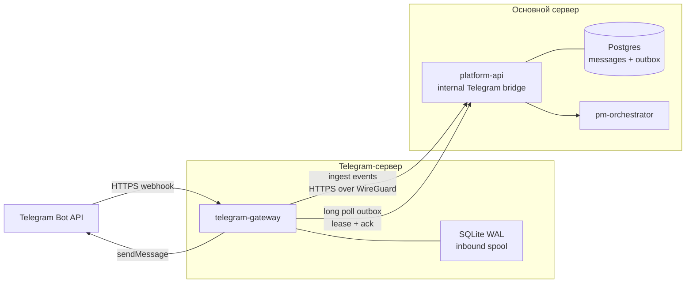

# Трек A: Telegram-контур

## 1. Цель и Definition of Done

Трек должен закрыть Telegram как полноценный транспорт платформы:

- сохранять новые сообщения из разрешённых личных чатов, групп, супергрупп,
  каналов и тем;
- предоставлять нормализованный корпус сообщений будущему
  `Correspondence Agent`;
- вызывать PM Orchestrator из личного чата, по команде, упоминанию или ответу
  на сообщение бота;
- позволять агентам задавать уточняющие вопросы в исходном чате или теме;
- вести диалог с пользователем в личных сообщениях;
- отправлять персональные уведомления, напоминания, digest и системные алерты;
- подтверждать и отклонять рискованные действия inline-кнопками;
- переживать повторы webhook, рестарты и временную недоступность любого сервера;
- работать, когда основной сервер не имеет доступа к Telegram.

Трек завершён, когда все приёмочные сценарии из раздела 16 проходят на staging,
секрет бота существует только на Telegram-сервере, а будущему агенту для анализа
переписки не требуется менять транспорт или схему хранения.

## 2. Ограничения Telegram

### 2.1 Режимы доступа к чатам

Целевое решение поддерживает три режима получения переписки.

**Workspace bot** — базовый режим для командных групп, каналов и личного чата с
ботом. Bot API доставляет новые события после подключения. Он не предоставляет
общий API для выгрузки всей истории произвольного чата до добавления бота.

Для полного чтения новых сообщений группы необходимо:

1. Отключить privacy mode в BotFather.
2. Добавить бота в группу с согласованными правами.
3. Для каналов добавить бота администратором.
4. Привязать Telegram-чат к команде платформы и включить режим сбора сообщений.

Даже при полном сборе не каждое сообщение должно запускать LLM. Все разрешённые
сообщения сохраняются, но агент вызывается только по правилам маршрутизации.

Исторические сообщения загружаются отдельным поддерживаемым способом:

- экспорт Telegram Desktop в JSON;
- загрузка экспорта через административный API или консоль;
- идемпотентный импорт в ту же нормализованную таблицу сообщений.

`Userbot` на пользовательской сессии не входит в целевое решение: он усложняет
безопасность, владение аккаунтом и соблюдение правил Telegram.

**Secretary Mode** — opt-in режим Bot API 10.0 для будущего Correspondence Agent.
Пользователь сам подключает бота к аккаунту и выбирает доступные чаты. Gateway
обрабатывает `business_connection`, `business_message`,
`edited_business_message` и `deleted_business_messages`. Ответ от имени
пользователя разрешается только при `can_reply=true` и в пределах ограничений
Telegram для активных чатов.

Secretary Mode не заменяет workspace bot:

- он требует отдельного явного согласия каждого пользователя;
- область видимости определяется настройками connection;
- отправка от имени пользователя имеет более строгую policy и audit;
- потеря или изменение connection немедленно отзывает доступ;
- базовая функциональность проекта не зависит от этого режима.

Метод `getUserPersonalChatMessages` возвращает только ограниченное число сообщений
из personal chat, добавленного пользователем в профиль. Он не является API общей
истории командных чатов.

### 2.2 Личные сообщения

Обычный workspace bot не может первым начать личный диалог с пользователем.
Пользователь должен нажать Start или открыть deep link. После этого платформа
сохраняет связь с Telegram identity и может отправлять разрешённые уведомления.
Secretary Mode рассматривается как отдельный connection и не отменяет этот
onboarding для сообщений от имени workspace bot.

### 2.3 Официальные контракты

- [Telegram Bot API](https://core.telegram.org/bots/api)
- [Какие сообщения получает бот](https://core.telegram.org/bots/faq#what-messages-will-my-bot-get)
- [Deep links](https://core.telegram.org/bots/features#deep-linking)
- [Secretary Bots](https://core.telegram.org/bots/features#secretary-bots)

## 3. Размещение на двух серверах

### 3.1 Причина разделения

Основной сервер блокирует Telegram. На нём остаются Postgres, `platform-api`,
`pm-orchestrator`, бизнес-правила и агенты. Новый `telegram-gateway` разворачивается
на втором сервере, где доступен `api.telegram.org`.



### 3.2 Принцип связи

Все межсерверные соединения инициирует `telegram-gateway`:

- `POST /internal/telegram/v1/events:ingest` передаёт входящие события;
- `POST /internal/telegram/v1/outbox:lease` забирает пачку исходящих сообщений
  длинным polling-запросом;
- `POST /internal/telegram/v1/outbox/{delivery_id}:ack` фиксирует отправку или
  ошибку;
- `POST /internal/telegram/v1/heartbeat` сообщает версию и состояние gateway.

Основной сервер не обращается к Telegram и не обязан устанавливать соединение со
вторым сервером. Это уменьшает требования к его сети и firewall.

### 3.3 Защита канала

Базовый production-вариант:

1. Между серверами поднимается WireGuard.
2. Internal bridge слушает только WireGuard-адрес.
3. Firewall основного сервера разрешает bridge-порт только адресу gateway.
4. Каждый запрос дополнительно подписывается HMAC-SHA256.
5. Подпись включает method, path, timestamp, nonce и SHA-256 тела.
6. Сервер отклоняет повтор nonce и timestamp старше пяти минут.
7. Ключи имеют `key_id`, поддерживается перекрывающаяся ротация двух ключей.

TLS остаётся включённым и внутри туннеля. Публично доступны только webhook и
`/health/live` gateway. Административные и debug-endpoint наружу не публикуются.

Не следует открывать Postgres между серверами или делать общую БД через интернет.

### 3.4 Конфигурация deploy units

На основном сервере:

- `TELEGRAM_BRIDGE_ENABLED=true`;
- `TELEGRAM_BRIDGE_HMAC_KEYS=<key_id:secret>`;
- `TELEGRAM_BRIDGE_NONCE_TTL=300`;
- `TELEGRAM_OUTBOX_LEASE_SECONDS=60`;
- bridge доступен только на WireGuard interface/firewall rule;
- `TELEGRAM_BOT_TOKEN` отсутствует.

На Telegram-сервере:

- `TELEGRAM_BOT_TOKEN`;
- `TELEGRAM_WEBHOOK_SECRET`;
- `TELEGRAM_WEBHOOK_BASE_URL=https://<gateway-domain>`;
- `MAIN_BRIDGE_URL=https://<main-wireguard-name>/internal/telegram/v1`;
- `TELEGRAM_BRIDGE_HMAC_KEY_ID` и соответствующий key;
- `GATEWAY_SPOOL_PATH=/var/lib/telegram-gateway/spool.db`;
- лимиты spool, concurrency, media size и retry policy.

GitHub environments разделяются на `telegram-staging` и `telegram-production`.
Secrets второго сервера: `TG_VPS_HOST`, `TG_VPS_USER`, `TG_VPS_SSH_KEY`,
bot/webhook secrets и bridge signing key. WireGuard private keys предпочтительно
создаются на серверах и не передаются через deployment workflow.

## 4. Границы компонентов

### `services/telegram-gateway`

Отдельный лёгкий deploy unit на Telegram-сервере:

- принимает и проверяет Telegram webhook;
- немедленно сохраняет update в локальный durable spool;
- асинхронно доставляет update в main bridge;
- забирает main outbox, вызывает Bot API и отправляет ACK;
- применяет Telegram-специфичные ограничения: rate limit, разбиение текста,
  parse mode, `retry_after`, `message_thread_id`, callback answer;
- поддерживает workspace и Secretary/Business updates без смешивания identity;
- хранит `TELEGRAM_BOT_TOKEN` и webhook secret;
- не содержит LLM, Tracker-клиент и бизнес-правила.

Рекомендуемый стек: FastAPI, aiogram 3, httpx, SQLAlchemy/aiosqlite, Prometheus.

### `services/platform-api`

Остаётся транспортной границей основного контура:

- internal bridge с аутентификацией и идемпотентностью;
- нормализация и запись Telegram-событий в Postgres;
- разрешение `installation/chat/user -> team`;
- хранение и проверка Secretary `business_connection`;
- применение routing policy;
- вызов существующего RPC `invoke/resume`;
- создание записей в Telegram outbox;
- API импорта истории и административной привязки чатов.

Telegram bridge следует вынести из `main.py` в пакет
`platform_api.telegram`, оставив в `main.py` только подключение router/lifespan.

### `pm-orchestrator`

Не знает Bot API. Он получает транспортный контекст и возвращает
`AgentResult`. Для отправки уточнений и уведомлений использует provider-neutral
notification/outbox contract.

### `packages/core`

Содержит только переиспользуемые контракты:

- ORM-модели и repository для inbox/outbox;
- `MessageEnvelope`/`Notification`;
- provider-neutral `notify(...)`;
- Telegram-специфичный код в `core` не размещается.

## 5. Потоки данных

### 5.1 Входящее сообщение

1. Telegram отправляет update на второй сервер.
2. Gateway проверяет webhook secret и лимит тела.
3. Update атомарно записывается в SQLite spool по уникальному `update_id`.
4. Webhook быстро отвечает `200`; обработка не ждёт LLM.
5. Forward worker подписывает и отправляет update на основной сервер.
6. Main bridge идемпотентно пишет raw update и нормализованные сущности.
7. Проверяются installation, chat binding, allowlist и routing policy.
8. При необходимости вызывается `pm_agent` с устойчивым `session_id` и context.
9. Ответ или confirm записывается в main outbox.
10. Gateway забирает outbox, отправляет сообщение и подтверждает delivery.

### 5.2 Уточнение в групповом чате

Инструмент агента создаёт `Notification` с:

- `team_id`;
- `target_chat_id`;
- `message_thread_id`;
- `reply_to_message_id`;
- текстом и разрешёнными кнопками;
- `dedupe_key`;
- причиной и связанной action/trace.

Autonomy Gate применяется до постановки в outbox. Произвольная отправка в новый
или непривязанный чат запрещена. По умолчанию сообщение в командный чат имеет
риск `medium`; ответ в уже активном диалоге может иметь риск `low`.

### 5.3 Личная переписка и уведомления

1. Пользователь получает deep link `/start <one_time_token>`.
2. Main bridge связывает Telegram user с командой и внутренним пользователем.
3. Входящие DM маршрутизируются в `pm_agent`.
4. Исходящие уведомления учитывают opt-in, категории, quiet hours и timezone.
5. Недоставляемый DM переводит identity в `blocked/unreachable`, но не ломает job.

Категории: `agent_reply`, `confirmation`, `assignment`, `reminder`, `digest`,
`incident`, `system`. Пользователь может отключать категории, кроме явно
обязательных системных сообщений, заданных политикой команды.

### 5.4 Secretary Mode

1. Пользователь явно подключает Secretary Bot и выбирает доступные чаты.
2. `business_connection` связывается с team/user и сохраняет текущие permissions.
3. Сообщения выбранных чатов проходят тот же normalizer и correspondence storage.
4. Ответ от имени пользователя требует отдельной policy, audit и, по умолчанию,
   confirm.
5. Gateway передаёт `business_connection_id` только для разрешённого delivery.
6. При revoke или `can_reply=false` ожидающие исходящие сообщения отменяются.

Correspondence Agent не получает прямого Bot API tool. Он создаёт предложение
ответа, а policy решает: сохранить draft, запросить confirm или отправить.

### 5.5 Confirm

Callback содержит только короткий случайный opaque token. В БД token связан с:

- `confirm_id`;
- разрешённым Telegram user/chat;
- сроком действия;
- одноразовым статусом.

Нельзя помещать tool args или внутренние ID в callback data. Повторный callback
возвращает уже зафиксированный результат. После решения кнопки редактируются и
показывают итог.

## 6. Маршрутизация сообщений

Режим задаётся для каждого chat binding:

| Режим | Сохранение | Вызов агента |
|---|---|---|
| `disabled` | нет | нет |
| `mentions` | все новые сообщения | команда, упоминание, reply боту |
| `correspondence` | все новые сообщения | правила Correspondence Agent |
| `direct` | все сообщения | каждое DM |
| `archive_only` | все сообщения | никогда |

Binding также содержит `access_mode`: `workspace_bot`, `secretary` или `import`.
Один и тот же внешний чат нельзя незаметно подключить через несколько режимов:
конфликт разрешается администратором, а source сохраняется в каждом сообщении.

Групповой чат не должен отправлять каждую реплику в LLM. До появления
Correspondence Agent сообщения в режиме `correspondence` только сохраняются и
доступны для batch-анализа.

Устойчивый session ID:

```text
telegram:{installation_id}:{chat_id}:{message_thread_id_or_0}
```

Автор, исходный message ID и team передаются отдельно в `MessageEnvelope`.
Нельзя кодировать tenant context только в строке session ID.

## 7. Изменения внутренних контрактов

RPC `invoke` расширяется назад совместимым полем `context`:

```json
{
  "agent": "pm_agent",
  "message": "Когда будет готов релиз?",
  "session_id": "telegram:main:-100123:42",
  "context": {
    "channel": "telegram",
    "team_id": "uuid",
    "installation_id": "uuid",
    "chat_id": "-100123",
    "message_id": "781",
    "thread_id": "42",
    "actor_external_id": "991",
    "actor_display_name": "Иван",
    "reply_to_message_id": "770"
  }
}
```

Контекст проходит через `platform-api -> rpc_client -> pm-orchestrator ->
ReActRunner` и доступен tools через run context. Он не добавляется в prompt
целиком и валидируется по allowlist полей.

До Telegram E2E необходимо сделать DB-backed lookup для pending confirm. Текущий
in-memory `_confirm_index` не позволяет подтвердить действие после рестарта
оркестратора.

## 8. Основная схема данных

Добавляется отдельная Alembic migration.

### `telegram_installations`

Привязка логического бота к организации/команде: `id`, `team_id`, `alias`,
`external_bot_id`, `mode`, `status`, `settings`, timestamps. Токен здесь не
хранится.

### `telegram_chats`

`installation_id`, `external_chat_id`, `type`, `title`, `username`,
`ingest_mode`, `send_policy`, `active`, `metadata`, timestamps.

Уникальность: `(installation_id, external_chat_id)`.

### `telegram_users` и `telegram_user_links`

Telegram identity и проверенная связь с пользователем/командой. Сохраняются
числовой external ID, display fields, locale, bot/blocked status. Username не
используется как устойчивый идентификатор.

### `telegram_business_connections`

Secretary connection: `installation_id`, `team_id`, owner Telegram user,
`business_connection_id`, `can_reply`, selected-chat policy, status,
connected/updated/revoked timestamps и audit metadata.

### `telegram_updates`

Raw transport inbox: `installation_id`, `update_id`, `payload`, `payload_hash`,
`received_at`, `processed_at`, `status`, `error`.

Уникальность: `(installation_id, update_id)`.

### `telegram_messages`

Нормализованный корпус:

- direction, chat, thread, message ID;
- access mode и optional business connection;
- sender, sent/edited/deleted timestamps;
- text/caption и entities;
- reply/forward references;
- message kind;
- media metadata и object-storage key;
- import source;
- raw update reference;
- retention/delete state.

Уникальность: `(installation_id, external_chat_id, external_message_id)`.
Индексы нужны по `(team_id, chat_id, sent_at)`, sender, thread и полнотекстовому
поиску. Embeddings не входят в транспортную миграцию и добавляются агентом позже.

### `telegram_outbox`

`id`, target, payload, `dedupe_key`, priority, status, attempts, `next_attempt_at`,
lease owner/expiry, provider message ID, last error, timestamps.

Статусы: `pending`, `leased`, `sent`, `retry`, `ambiguous`, `dead_letter`,
`cancelled`.
Лизинг должен поддерживать несколько gateway workers без двойной отправки.

### `telegram_callback_tokens`

Одноразовые callback tokens для confirm и других интерактивных действий.

### `telegram_notification_preferences`

Категории, timezone, quiet hours, digest policy и opt-in пользователя.

## 9. История, вложения и удаление данных

Первая production-версия обязана сохранять text/caption, entities, reply,
forward, edit, topic и служебные события. Для media сохраняются metadata и
Telegram `file_id`.

Скачивание файлов включается конфигурацией:

- gateway скачивает файл, потому что основной сервер не видит Telegram;
- загружает его по pre-signed URL в Yandex Object Storage/MinIO;
- main DB хранит только object key, MIME, size и checksum;
- применяются лимит размера, allowlist MIME, antivirus hook и TTL.

Импорт Telegram Desktop:

1. Принимает JSON, а не HTML, как основной формат.
2. Валидирует размер и структуру.
3. Создаёт import job.
4. Нормализует сообщения чанками.
5. Использует source-specific dedupe key.
6. Формирует отчёт: created/skipped/failed.

Retention настраивается per team. Удаление чата или пользователя должно
анонимизировать/удалять персональные данные и связанные объекты по политике.

## 10. Исходящий интерфейс для агентов

Provider-neutral API:

```python
await notify(
    Notification(
        team_id=team_id,
        channel="telegram",
        target=target,
        text=text,
        category="reminder",
        dedupe_key=dedupe_key,
        reply_to=reply_to,
        buttons=buttons,
    )
)
```

Для LLM регистрируются узкие инструменты вместо универсального Bot API:

- `ask_chat_clarification(question, context_message_id?)`;
- `notify_user(user_id, text, category)`;
- `send_team_digest(chat_binding_id, text)`;
- `propose_correspondence_reply(context_message_id, text)`.

Tools не принимают произвольный `chat_id` от модели. Target разрешается сервером
из run context или проверенного binding. Это предотвращает отправку данных в
чужой tenant/chat.

Alertmanager на основном сервере также не должен отправлять в Telegram напрямую.
Его webhook принимается основным API и превращается в запись общего outbox.

## 11. Надёжность и доставка

Гарантия транспорта: at-least-once с идемпотентной обработкой.

- Telegram может повторить webhook: dedupe по `update_id`.
- Gateway может повторить ingest: main dedupe по installation/update.
- Main может повторно выдать lease: dedupe key и сохранённый provider result.
- После истечения lease сообщение возвращается в `pending`.
- `429` учитывает Telegram `retry_after`.
- Timeout/5xx получают exponential backoff с jitter.
- Permanent 4xx переходят в `dead_letter`.
- Порядок сохраняется в пределах `(chat_id, thread_id)`; разные чаты
  обрабатываются параллельно.

Bot API не принимает idempotency key для `sendMessage`. Если Telegram принял
сообщение, а gateway упал до локальной фиксации результата, нельзя гарантировать
exactly-once внешнюю доставку. Gateway ведёт локальный delivery journal и сначала
фиксирует provider message ID, затем отправляет main ACK. Неопределённое состояние
переходит в `ambiguous` и не повторяется автоматически. При этом связанные
бизнес-действия и confirm остаются строго идемпотентными.

При недоступности основного сервера gateway продолжает принимать webhook в
локальный spool. При недоступности gateway основной outbox накапливается в
Postgres. После восстановления workers продолжают доставку.

## 12. Безопасность и приватность

- Bot token хранится только в secret store/окружении второго сервера.
- Webhook URL защищён `secret_token`, непредсказуемым path и rate limit.
- Chat binding создаётся только администратором или через одноразовый код.
- Secretary connection активируется только явным действием владельца аккаунта;
  selected chats и `can_reply` проверяются на каждом событии и delivery.
- Любое входящее событие проверяется против active installation/chat binding.
- Confirm может выполнить только разрешённый actor.
- В логах маскируются token, message text, callback data и персональные поля.
- Raw update имеет ограниченный retention; аналитика использует нормализованные
  записи.
- Экспорт и удаление данных доступны администратору команды.
- Вложения не исполняются, проверяются по размеру/MIME/checksum.
- В prompt не передаются скрытые transport metadata и неограниченная история.
- Метрики не содержат `chat_id`, `user_id` и текст.

## 13. Наблюдаемость

Минимальные метрики:

- webhook count/latency/rejected;
- gateway spool depth/oldest age;
- ingest success/retry/error;
- outbox pending/leased/retry/dead-letter/oldest age;
- Bot API latency и ответы по классам;
- update-to-reply latency p50/p95;
- routing outcomes;
- callback approved/rejected/expired/unauthorized;
- active chat bindings и unreachable users.

Логи содержат correlation ID: `update_id`, `delivery_id`, `trace_id`, но не текст.
Gateway heartbeat отображается в console-api.

Алерты:

- gateway heartbeat отсутствует больше двух минут;
- oldest inbound/outbox выше пяти минут;
- dead-letter растёт;
- webhook 4xx/5xx или Bot API 429 превышают порог;
- локальный spool или диск заполнен более чем на 80%;
- HMAC/replay failures превышают фоновый уровень.

Telegram не может быть единственным каналом для алерта о падении Telegram gateway:
критические алерты дублируются в Grafana/email/другой независимый канал.

## 14. План реализации

Каждый шаг оформляется отдельным PR или небольшим набором PR с миграционно
совместимыми контрактами.

### A0. Контракты и threat model

- зафиксировать OpenAPI для bridge, `MessageEnvelope` и `Notification`;
- определить chat binding, routing и notification policies;
- описать data retention, consent и роли;
- подготовить sequence diagrams и threat model.

Результат: gateway и main можно разрабатывать параллельно против contract tests.

### A1. Runtime prerequisites

- добавить `context` в invoke RPC и run context;
- обеспечить tenant-aware session resolution;
- восстановить pending confirm из Postgres после рестарта;
- сделать resume идемпотентным;
- связать trace/action с agent instance и transport metadata.

Результат: Telegram не зависит от памяти одного процесса.

### A2. Модели и миграция

- добавить таблицы из раздела 8;
- реализовать repositories inbox/outbox/bindings/preferences;
- добавить unique constraints, lease queries и retention jobs;
- проверить upgrade/downgrade на реальном Postgres.

### A3. Main Telegram bridge

- реализовать HMAC/replay middleware;
- реализовать ingest, outbox lease/ack и heartbeat;
- сделать normalizer для поддерживаемых update types;
- добавить lifecycle и permissions Secretary/Business connections;
- добавить chat/team resolver и routing policy;
- возвращать стабильные error codes для retry/permanent failure.

### A4. Gateway skeleton и входящий поток

- создать `services/telegram-gateway`;
- добавить aiogram webhook, secret validation и SQLite WAL spool;
- включить workspace и Business/Secretary update types;
- реализовать forward worker с backoff;
- поддержать graceful shutdown и повтор незавершённых записей;
- добавить health/readiness/metrics.

### A5. Диалог с агентом

- маршрутизировать DM, команды, mentions и replies;
- собирать `MessageEnvelope`;
- вызывать default `pm_agent`;
- ставить reply в outbox с правильными chat/thread/reply IDs;
- разбивать длинные ответы и безопасно обрабатывать разметку.

### A6. Confirm callbacks

- генерировать opaque callback token;
- проверять actor/chat/expiry;
- вызывать durable resume;
- отвечать на callback и редактировать исходное сообщение;
- покрыть approve/reject/duplicate/expired/restart.

### A7. Уточнения и уведомления

- реализовать provider-neutral notification service;
- добавить безопасные agent tools;
- реализовать preferences, quiet hours, digest и dead-letter;
- перевести scheduler alerts и Alertmanager webhook на outbox;
- добавить deep-link onboarding для DM.

### A8. Secretary Mode

- включить Secretary Mode для отдельного staging bot;
- реализовать `business_connection` lifecycle;
- хранить selected-chat scope и `can_reply`;
- принимать create/edit/delete business messages;
- реализовать draft/confirm/send от имени пользователя;
- отзывать доступ и отменять deliveries при disconnect;
- добавить отдельный audit view в console-api.

### A9. Корпус для Correspondence Agent

- сохранять edit/delete/reply/forward/topic;
- добавить paginated internal query API по team/chat/time/cursor;
- реализовать checkpoint/cursor для batch consumer;
- добавить redaction/retention и audit доступа;
- подготовить fixture corpus и quality dataset.

Correspondence Agent получает только query API/repository и не зависит от
aiogram/raw Telegram update.

### A10. Исторический импорт и media

- реализовать Telegram Desktop JSON importer;
- добавить import jobs и отчёты;
- подключить S3-compatible storage через pre-signed upload;
- добавить лимиты, checksum, antivirus hook и cleanup;
- протестировать большой экспорт и повторный импорт.

### A11. Двухсерверный deployment

- добавить `docker-compose.telegram-gateway.yml`;
- подготовить WireGuard-конфигурацию и firewall runbook;
- настроить отдельный DNS, HTTPS certificate и reverse proxy для webhook;
- создать `.github/workflows/deploy-telegram-gateway.yml`;
- добавить отдельные staging/prod secrets и environment approvals;
- хранить spool и delivery journal в persistent volume;
- деплоить main migration/bridge до совместимого gateway;
- поддерживать N/N-1 версию bridge contract для независимого rollback;
- автоматизировать webhook registration после health check;
- убрать bot token с основного сервера;
- добавить rollback и key rotation runbook.

### A12. Наблюдаемость и эксплуатация

- dashboards, metrics и независимые alerts;
- dead-letter replay через защищённую admin-команду;
- runbooks: Telegram outage, main outage, token compromise, key rotation,
  blocked bot, full disk, stuck lease;
- backup/restore для main DB и gateway spool.

### A13. E2E и hardening

- пройти тестовую матрицу и chaos-сценарии;
- провести security review;
- выполнить staging soak не менее 24 часов;
- измерить SLO и устранить bottleneck;
- провести приёмку по разделу 16.

## 15. Методика тестирования

### Unit

- parsing/normalization всех поддерживаемых update types;
- Secretary connection/create/edit/delete и permission changes;
- routing matrix;
- session/context generation;
- HMAC, timestamp, nonce и key rotation;
- callback authorization/expiry/idempotency;
- message splitting, entities и escaping;
- retry classification и backoff;
- preferences/quiet hours/timezone;
- importer dedupe и validation.

### Contract

- OpenAPI schema проверяется обеими сторонами;
- consumer-driven tests gateway против fake main;
- main tests против записанных Bot API fixtures;
- backward compatibility для invoke без `context`.

### DB integration

На реальном Postgres:

- параллельный insert одинакового update;
- несколько outbox workers с `SKIP LOCKED`;
- lease expiry и redelivery;
- уникальность callback consumption;
- retention cascade;
- Alembic upgrade с текущей схемы и downgrade.

### Service integration

Gateway тестируется с mock Bot API:

- duplicate/out-of-order updates;
- timeout, connection reset, 429 `retry_after`, 5xx и permanent 4xx;
- restart между local commit и main ACK;
- restart после Bot API send до ACK;
- большие сообщения, темы, captions, edit и media.

Main bridge тестируется с mock orchestrator:

- archive-only не вызывает LLM;
- mentions/direct вызывают правильного агента;
- unknown/disabled chat не проходит;
- revoked Secretary connection не читает и не отправляет сообщения;
- reply/confirm сохраняют исходный context;
- ответ всегда попадает в outbox, а не отправляется напрямую.

### E2E в CI

Поднять:

- Postgres;
- fake Telegram API;
- `telegram-gateway`;
- `platform-api`;
- fake или реальный тестовый orchestrator.

Сценарий проверяет полный путь webhook -> spool -> ingest -> invoke -> outbox ->
Bot API -> ACK. Toxiproxy или сетевые правила имитируют разрыв между серверами.

### Staging с реальным Telegram

Отдельные тестовые bot, private group, topic и два пользователя:

- privacy mode и права проверяются явно;
- DM onboarding;
- group mention/reply;
- approve/reject разными пользователями;
- proactive notification;
- restart обоих серверов;
- блокировка бота пользователем;
- импорт тестового экспорта;
- media upload;
- Secretary opt-in, draft, confirm, reply и revoke;
- накопление и восстановление очередей.

### Нагрузочные и SLO

Начальные цели:

- webhook ACK p95 < 300 ms;
- обычный ответ без LLM p95 < 2 s;
- transport overhead к agent reply p95 < 2 s;
- отсутствие потерь при 10 000 повторённых updates;
- восстановление очереди после outage без дублей бизнес-действий;
- outbox oldest age < 60 s при штатной работе.

Нагрузочный профиль должен включать burst из группового чата и одновременную
доставку уведомлений. SLO пересматриваются после staging measurements.

### Security

- forged webhook secret;
- forged/expired/replayed bridge signature;
- callback другого пользователя;
- попытка отправки в непривязанный chat;
- cross-team ID substitution;
- oversized body/file и decompression bomb;
- log/metric secret leakage;
- SSRF через file URL;
- compromised old key после ротации.

## 16. Приёмочные сценарии

1. Новое сообщение разрешённой группы сохраняется с author/thread/reply context.
2. Обычная реплика в группе не вызывает LLM.
3. Упоминание бота вызывает PM Orchestrator и ответ приходит в ту же тему.
4. DM ведёт устойчивый диалог после рестарта обоих сервисов.
5. Агент задаёт уточнение в исходном чате только после требуемого confirm.
6. Approve выполняет действие один раз; reject не выполняет его.
7. Callback другого пользователя отклоняется.
8. Scheduler отправляет персональное напоминание с учётом quiet hours.
9. Alertmanager доставляет alert через outbox, не обращаясь к Telegram.
10. При падении main входящие события остаются в gateway spool.
11. При падении gateway исходящие события остаются в main outbox.
12. После восстановления очереди дренируются без повторных бизнес-действий.
13. Повтор webhook/update не создаёт вторую запись сообщения.
14. Correspondence consumer читает сообщения по cursor без знания Bot API.
15. Telegram Desktop export повторно импортируется без дублей.
16. Bot token отсутствует на основном сервере и в логах обоих сервисов.
17. Непривязанный chat не сохраняется и не может вызвать агента.
18. Удаление/retention очищает raw payload и media согласно политике.
19. Secretary connection читает только выбранные пользователем чаты.
20. Ответ от имени пользователя создаётся с audit и не отправляется после revoke.

## 17. Зависимости и порядок работ

Критический путь:

```text
A0 -> A1 -> A2 -> A3/A4 параллельно -> A5 -> A6 -> A7 -> A11 -> A13
```

`A8` можно вести после A4, `A9` после A2/A3, `A10` после A9. Деплойный каркас
A11 следует подготовить параллельно A3/A4, но включать webhook только после E2E.

Первый demo milestone: DM + group mention + confirm через два сервера.
Production milestone: весь Definition of Done, включая durable queues,
notifications, correspondence corpus, import, security и runbooks.
