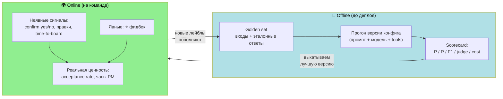
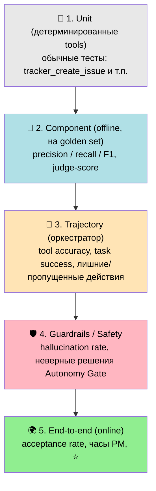
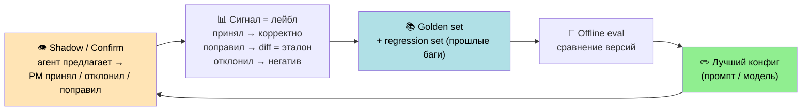
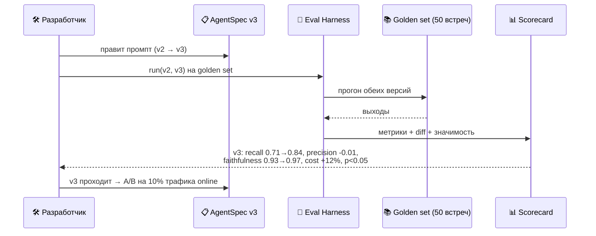

# Оценка качества агента

> Верхнеуровневый дизайн на будущее. Как получать **воспроизводимые цифры**, чтобы
> сравнивать подходы (промпт A vs B, модель X vs Y, с памятью vs без) при разработке
> и улучшении продукта. Это «движок» [цикла улучшения](README.md#тестирование-на-команде).

---

## «Штурм» — реализованный оценщик (as-built)

Offline-контур из дизайна ниже теперь живой — оценщик **«Штурм»**. Прогон: синтетика
сценариев → у каждого кейса **своя изолированная фейк-доска** → реальный прогон `pm_agent`
→ **судейская панель** → агрегат + диагноз. Запуск из UI: «Штурм» → «Новый прогон».

**Где код:** `packages/core/src/core/eval/` (`judge.py`, `fake_tracker.py`, `tracker_profile.py`,
`analysis.py`, `metrics.py`, `pipeline/batch.py`), демон `services/eval-runner/`, API
`services/console-api/src/console_api/eval_routes.py`, UI `apps/web-ui/src/pages/Eval*`.

### Судья, которому можно верить
- **6 взвешенных критериев**, и `faithfulness` — отдельная safety-ось (вес 0.25): штрафует
  выдуманные задачи/поля/исполнителей/дедлайны. Жёсткий гейт: галлюцинация валит кейс
  независимо от взвешенной оценки.
- **Самосогласование (панель):** судья прогоняется K раз (по умолчанию 3, temp 0.35), итог —
  медиана по критериям; разброс даёт **confidence** и флаг `low_confidence` для ручного разбора.
- **Trace-aware:** судья видит компактную траекторию агента (стадии, вызовы, ретраи, ошибки),
  поэтому отличает «зациклился и сдался» от «сделал чисто».
- Эвристический фолбэк помечается в метриках (видно долю LLM vs эвристика) — цифры не смешиваются.

### Фейк-трекер ≈ реальный
- Изоляция на кейс: свой `FakeTrackerStore` (ContextVar + seed) — тесты независимы.
- Латентность тулзов из **лог-нормального** распределения по реальным p50/p95 Трекера
  (`tracker_profile.py`), seed по кейсу → воспроизводимо. Опционально симуляция 429/тормозов.
  Поэтому `agent_latency_sec`, p95 и таймауты имеют смысл; в отчёте — разбивка по тулзам и
  доля времени тулзов от общего.

### Конкурентность и лимиты OpenRouter
Используемые модели платные (`gemini-3.1-flash-lite` — агент/генератор, `gemini-3.1-pro-preview`
— судья), поэтому у OpenRouter нет жёсткого RPM-кэпа (миф про 20 rpm — только `:free`); потолок —
квота Google по проекту (RPM/TPM) + кредиты, при этом OpenRouter раскидывает Gemini по 3
провайдерам с failover. Стадии разделены барьером → пик ≈ семафор активной стадии.

| Стадия | Модель | Конкурентность по умолчанию |
|---|---|---|
| Генерация сценариев | flash-lite | 16 |
| Генерация запросов | flash-lite | 16 |
| Агент | flash-lite | 10 |
| **Судья** | **pro** | **6** (дороже, ниже TPM — главный риск 429) |

`LLMClient` теперь ретраит **429/`Retry-After`** + 5xx с экспоненциальным backoff и **jitter**
(против thundering-herd) и держит ограниченный пул соединений — всплески само-залечиваются,
а не валят кейсы. Тюнинг — `OPENROUTER_*` в env.

### Диагноз «где агент тупит»
В финале — детерминированная кластеризация **режимов отказа** (`over_creation`, `missed_search`,
`hallucinated_field`, …) + слабые suite/критерии, поверх — один LLM-проход, который пишет
**root-cause и приоритизированные фиксы** (prompt/tools/model/data). Всё в отчёте на странице прогона
и в Markdown-экспорте.

---

## Задача и главная сложность

Хотим уметь сказать не «вроде стало лучше», а: *«промпт v3 поднял recall action items 0.71 → 0.84, precision не просел, стоимость +12%, на 50 встречах, p < 0.05»*.

Сложность: выход LLM **недетерминирован и субъективен**. «Правильность» саммари размыта, один и тот же вход даёт разные ответы. Значит, нужен **harness** — фиксированный эталонный набор + метрики + регресс-трекинг. Без него любые сравнения — это вкусовщина.

---

## Два контура оценки

| | Offline | Online |
|---|---|---|
| **Где** | На golden set, до деплоя | На реальной команде |
| **Цель** | Сравнить подходы воспроизводимо | Измерить настоящую ценность |
| **Плюс** | Повторяемо, дёшево, быстро | Честно, отражает реальность |
| **Минус** | Эталон может расходиться с реальностью | Шумно, медленно, не A/B «в лоб» |

**Offline даёт цифры для сравнения подходов. Online проверяет, что они не врут, и поставляет данные обратно в golden set.**

---

## Пирамида оценки

Снизу — дёшево/детерминированно/часто. Сверху — дорого/субъективно/реже.

---

## Метрики по типам агентов

Разные агенты — разные задачи, разные метрики.

| Агент | Тип задачи | Главные метрики | Чем мерить |
|---|---|---|---|
| **Meeting Summarizer** | Извлечение (action items) | **Precision / Recall / F1** по action items; точность владельца/дедлайна; **faithfulness** (нет выдуманных задач) | Семантический матчинг + LLM-judge |
| **Correspondence Analyzer** | Извлечение + классификация | P/R/F1 по найденным изменениям; FP/FN (ложные тревоги vs пропуски) | То же |
| **PM Orchestrator** | Решение + маршрутизация (траектория) | **Tool selection accuracy**, корректность аргументов, **task success** (итоговое состояние = цель), лишние/пропущенные действия | Trajectory eval по `traces` |
| **Analytics Agent** | Суждение | Валидность выводов, полезность предложений (1–5) | LLM-judge + человек |

### Как считать P/R/F1 на «размытых» выходах

Action items нельзя матчить дословно («Позвонить клиенту» ≈ «Связаться с заказчиком»). Поэтому **семантический матчинг**: эмбеддинги с порогом или LLM-judge «это про одно и то же?». Дальше:
- **Precision** = из того, что агент выдал, сколько реальных (нет галлюцинаций)
- **Recall** = из того, что должен был выдать, сколько поймал (нет пропусков)
- После матчинга — **field-level accuracy** по полям (владелец, дедлайн, приоритет)

### Faithfulness — критично для PM-агента

Агент **не должен выдумывать задачи**. Faithfulness = каждое утверждение в выходе подтверждается транскриптом. Меряется LLM-judge или NLI-entailment. Это **safety-метрика**, вес выше остальных.

### Cost / latency — всегда рядом с качеством

Токены и $ на задачу, latency. Подход на 5% лучше, но в 5× дороже — часто не нужен. Сравниваем не «качество», а **качество-на-доллар**.

---

## Где взять эталон: data flywheel

Самый дорогой ресурс — размеченные данные. Но платформа **сама их производит**: фаза Shadow и кнопки confirm/edit = фабрика лейблов.

Три источника эталона:
1. **Из продакшена (главный):** каждое confirm yes/no и правка PM — лейбл. Правка особенно ценна: diff между черновиком агента и финалом = точный сигнал, что починить.
2. **Regression set:** найденный баг → фиксируется как тест навсегда (чтобы не вернулся).
3. **Синтетика:** генерим вариации входов для покрытия редких случаев.

---

## LLM-as-judge: как сделать цифры надёжными

Часть метрик считает LLM-судья. Чтобы числам можно было верить:
- **Калибровка против людей:** на части примеров сверяем судью с ручными оценками, меряем согласие (корреляция / Cohen's kappa). Низкое согласие → правим рубрику судьи.
- **Pairwise > absolute:** «A лучше B?» надёжнее, чем «оцени A от 1 до 5». Для сравнения подходов это и нужно.
- **Чёткая рубрика:** не «оцени качество», а по осям — полнота, faithfulness, краткость, actionability.
- **Другая модель в судьи**, чтобы не оценивать саму себя.

---

## Рабочий процесс сравнения подходов

В платформе уже есть [версии AgentSpec](README.md#layered-config--pm-не-сломает-агента) — именно их и сравниваем.

### Пример scorecard (так выглядят «конкретные цифры»)

| Метрика | v2 (база) | v3 (новый промпт) | Δ |
|---|---|---|---|
| Recall action items | 0.71 | **0.84** | 🟢 +0.13 |
| Precision | 0.88 | 0.87 | ⚪ −0.01 |
| F1 | 0.78 | **0.85** | 🟢 +0.07 |
| Faithfulness (no hallucination) | 0.93 | **0.97** | 🟢 +0.04 |
| Точность владельца | 0.79 | 0.81 | 🟢 +0.02 |
| Cost / встречу | $0.04 | $0.045 | 🔴 +12% |
| Judge-score (1–5) | 3.9 | **4.3** | 🟢 +0.4 |
| n / значимость | — | 50 встреч | p < 0.05 |

**Решение:** recall и faithfulness заметно выросли, precision держится, +12% стоимости приемлемо → выкатываем v3 на A/B.

> ⚠️ Не заявляем улучшение на 5 примерах. Нужна выборка + доверительный интервал, иначе разница — это шум недетерминизма.

---

## Связь с платформой

Всё уже лежит в данных платформы — eval только читает:

| Источник платформы | Роль в оценке |
|---|---|
| `actions` + `traces` | Сырьё для trajectory-eval и воспроизведения прогонов |
| `action_feedback` (⭐) | Online-сигнал качества |
| Confirm yes/no, правки | Дешёвые лейблы → golden set |
| Версии AgentSpec | То, **что** сравниваем |
| LiteLLM usage | Cost / latency |
| Dev UI (playground) | Запустить eval по кнопке, увидеть scorecard и diff |

---

## Три уровня метрик (чтобы не утонуть)

| Уровень | Метрика | Для кого |
|---|---|---|
| 🌟 **North star** | Сэкономленные часы PM/нед, тренд acceptance rate | Бизнес / PM |
| 🔍 **Диагностические** | P/R/F1, faithfulness, task success, cost | Разработчик (что чинить) |
| 🛡️ **Guardrail (не должны падать)** | Hallucination rate, доля неверных решений Autonomy Gate (авто-сделал то, что надо было подтвердить) | Безопасность |

Guardrail-метрики — стоп-кран: даже если north-star растёт, рост галлюцинаций блокирует выкатку.

---

## Открытые вопросы

1. **Размер golden set:** с какого n доверять цифрам для каждого агента? (обычно от десятков примеров)
2. **Кто размечает на старте**, пока продакшен не накопил лейблов — PM вручную на фазе Shadow?
3. **Какой LLM в судьи** и как часто калибровать против людей?
4. **Бюджет на eval:** прогон harness тоже стоит токенов — как часто гонять (на каждый PR конфига / ночью / по кнопке)?
5. **Trajectory-эталон для оркестратора:** фиксировать «единственно верный путь» или «достиг цели + не сделал запретного»? (второе гибче)
