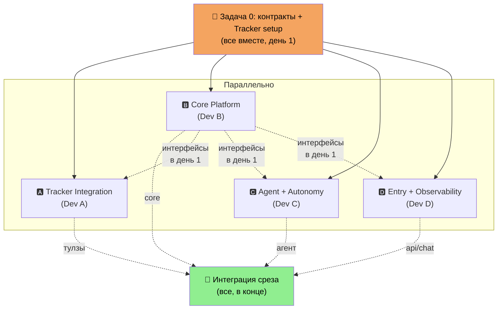
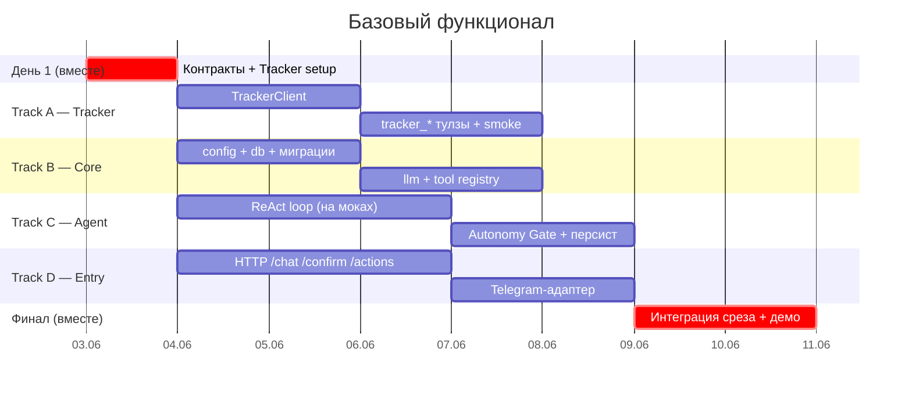

# План разработки — базовый функционал

> Только базовый функционал, без киллер-фич. Цель — рабочий **вертикальный срез**
> платформы и параллельная работа 4 разработчиков с минимумом блокировок.

---

## Где мы сейчас (Фаза 0 — готово)

- ✅ Монорепо (uv workspaces), `packages/core` + `services/*`
- ✅ Docker Compose (test) + Postgres
- ✅ CI/CD: lint + тесты + авто-деплой на тест-VPS при push в `develop`
- ✅ Скелеты: `platform-api` (health), `pm-orchestrator` (заглушка)

Сейчас сервисы пустые. Задача — наполнить их базовой логикой.

---

## Цель: вертикальный срез

Один сквозной сценарий, доказывающий что платформа работает:

```
Пользователь → "заведи задачу: починить логин, срочно"
   → Агент (LLM рассуждает)
   → вызывает tracker_create_issue
   → Autonomy Gate: medium-risk → confirm в чат
   → Пользователь подтверждает
   → задача появляется в Трекере
   → действие залогировано в actions + trace
   → ответ пользователю
```

Когда это работает end-to-end — базовый функционал готов. Всё остальное (доп. агенты, A2A-сеть, киллер-фича, дашборд) строится поверх.

**Сознательно отложено:** networked A2A (пока один агент с in-process тулзами), Meeting Capture, Correspondence/Analytics агенты, киллер-фича, полноценный UI.

---

## Разбор Яндекс Трекера

### Покрывает ли бесплатный тариф наши нужды?

**Да.** Бесплатный тариф — до 5 пользователей, вас 4. API доступен. Этого хватает для разработки и теста.

⚠️ Ограничения: при 6+ пользователях нужен платный тариф (от ~258 ₽/чел/мес); при нуле на счету или смене тарифа Трекер уходит в режим **«только чтение»** (API на запись отвалится).

### Как устроен Трекер

```
Организация (Яндекс 360 или Yandex Cloud Org)
  └── Очередь (Queue, ключ напр. "TEST")    ← аналог проекта/доски
        └── Задачи (Issues)
              ├── summary, description
              ├── type (task/bug), priority, assignee
              ├── status (workflow: Open → In Progress → Done)
              ├── tags, components, links (blocks/duplicates)
              └── комментарии
```

### API

| Операция | Запрос |
|---|---|
| База | `https://api.tracker.yandex.net/v3/` |
| Создать задачу | `POST /v3/issues/` (нужны `summary` + `queue`) |
| Получить задачу | `GET /v3/issues/{key}` |
| Обновить | `PATCH /v3/issues/{key}` |
| Сменить статус | `POST /v3/issues/{key}/transitions/{id}/_execute` |
| Поиск | `POST /v3/issues/_search` |
| Создать очередь | `POST /v3/queues/` |

Есть официальный Python-клиент `yandex_tracker_client`, но для async-стека лучше тонкая обёртка над REST через `httpx`.

### Аутентификация — что выбрать

| Схема | Заголовки | Плюс | Минус |
|---|---|---|---|
| **OAuth + Яндекс 360** ✅ | `Authorization: OAuth <token>` + `X-Org-ID` | Токен долгоживущий, просто получить | Нужна Яндекс 360 организация |
| IAM + Yandex Cloud Org | `Authorization: Bearer <token>` + `X-Cloud-Org-ID` | Родной для Cloud | IAM живёт ≤12ч; сервисный аккаунт = тикет в саппорт |

**Рекомендация для хакатона:** OAuth + Яндекс 360 (создаётся бесплатно), токен в GitHub Secrets как `TRACKER_TOKEN` + `TRACKER_ORG_ID`.

### Setup-чеклист (делается один раз, до старта треков)

1. Создать организацию (Яндекс 360 для бизнеса — бесплатно до 5 чел)
2. Подключить Трекер, пригласить 4 разрабов
3. Создать тестовую очередь (напр. ключ `TEST`) — через UI или `POST /v3/queues/`
4. Получить OAuth-токен (создать OAuth-приложение → выдать токен)
5. Скопировать `X-Org-ID` (Администрирование → Организации → ID)
6. Положить `TRACKER_TOKEN`, `TRACKER_ORG_ID` в GitHub Secrets + локальный `.env.test`

---

## Контракты (Задача 0 — делаем вместе в день старта)

Ключ к параллельной работе: **сначала договариваемся об интерфейсах**, потом каждый кодит против контракта, а не против чужой реализации. 4 трека работают независимо на моках.

```python
# 1. Tool contract (Track A пишет тулзы против этого)
@platform_tool(name="tracker_create_issue", risk="medium", scopes=["tracker:write"])
async def tracker_create_issue(queue: str, summary: str, ...) -> dict: ...

ToolRegistry.get(name) -> Tool
ToolRegistry.list() -> list[Tool]   # для передачи в LLM

# 2. LLM contract (Track C кодит ReAct против этого)
async def complete(messages: list[Msg], tools: list[ToolSpec]) -> LLMResponse
# LLMResponse.tool_calls: list[ToolCall] | LLMResponse.content: str

# 3. DB-модели (Track B владеет, остальные читают/пишут)
actions(id, team_id, tool_name, input, output, risk, status, trace_id, created_at)
traces(id, session_id, steps: jsonb, created_at)
confirms(id, action_id, prompt, status, answer, created_at)

# 4. Agent entry (Track D дёргает это)
async def invoke(message: str, session_id: str) -> AgentResult
# AgentResult.reply: str | AgentResult.pending_confirm: Confirm | None

# 5. HTTP contract (Track D реализует, демо против этого)
POST /chat        {message, session_id} -> {reply, pending_confirm?}
POST /confirm/{id} {approved: bool}     -> {reply}
GET  /actions                            -> [action, ...]
GET  /traces/{id}                        -> {steps: [...]}
```

---

## 4 параллельных трека



### 🅰️ Track A — Tracker Integration (Dev A)

Самый независимый трек, тестируется на **реальной** очереди.

- [ ] `TrackerClient` — async-обёртка над REST v3 (`httpx`): create/get/update/transition/search
- [ ] Тулзы `tracker_*` (через `@platform_tool`): `create_issue`, `get_issue`, `update_issue`, `move_issue`, `comment`, `search`
- [ ] Проставить корректные `risk`-уровни (create=medium, update/move/comment=low, get/search=read)
- [ ] Smoke-скрипт: создать/прочитать/закрыть задачу в реальной очереди `TEST`
- [ ] Обработка ошибок API (401, 404, режим «только чтение»)

**Зависит от:** контракт `@platform_tool` (день 1). До него — пишет `TrackerClient` (он самодостаточен).
**Отдаёт:** импортируемые тулзы + рабочая интеграция с Трекером.

### 🅱️ Track B — Core Platform (Dev B)

Фундамент. **Приоритет — выкатить интерфейсы-заглушки в день 1**, чтобы разблокировать остальных.

- [ ] `config.py` — pydantic-settings (DATABASE_URL, YC_API_KEY, YC_FOLDER_ID, TRACKER_TOKEN, TRACKER_ORG_ID)
- [ ] `db.py` — async engine + session (SQLAlchemy + asyncpg)
- [ ] Миграции (Alembic): `actions`, `traces`, `confirms`, `runtime_configs`
- [ ] `llm.py` — обёртка LiteLLM → Yandex AI Studio (YandexGPT), интерфейс `complete(messages, tools)`
- [ ] `tools.py` — `@platform_tool` декоратор + `ToolRegistry`
- [ ] Проверить доступ к модели в Yandex AI Studio (тестовый вызов)

**Зависит от:** ничего (фундамент).
**Отдаёт:** пакет `core`, который импортируют все. ⚠️ Узкое место — отдать контракты и стабы в первую очередь.

### 🅲 Track C — Agent + Autonomy (Dev C)

- [ ] `BaseAgent` / ReAct-цикл: LLM → tool_calls → выполнение → повтор → финальный ответ
- [ ] Интеграция с `ToolRegistry` (берёт доступные тулзы из конфига агента)
- [ ] **Autonomy Gate**: перед вызовом тула проверка risk → low=авто, medium+=confirm (interrupt)
- [ ] Персист: каждое действие → `actions`, шаги → `traces`, ожидание → `confirms`
- [ ] AgentSpec оркестратора (промпт + список тулзов) — пока в коде/конфиге, не в БД
- [ ] Возобновление после ответа на confirm

**Зависит от:** контракты LLM, ToolRegistry, DB (день 1). Кодит против них + моки тулзов.
**Отдаёт:** `invoke(message, session_id)` — рабочий агент.

### 🅳 Track D — Entry points + Observability (Dev D)

- [ ] HTTP в `platform-api`: `POST /chat`, `POST /confirm/{id}`, `GET /actions`, `GET /traces/{id}`
- [ ] Confirm-флоу: вернуть pending_confirm, принять ответ, возобновить агента
- [ ] Read-модель: листинг действий + просмотр трейса (для отладки и демо)
- [ ] **Telegram-адаптер (aiogram)** — чат + кнопки confirm (must для красивого демо)
- [ ] Простой лог/вывод трейса

**Зависит от:** `invoke()` агента (контракт), DB-модели. Кодит против стабов.
**Отдаёт:** способ поговорить с агентом + увидеть, что он сделал.

---

## Порядок и зависимости



**Критический путь:** контракты (день 1) → Track B отдаёт реальные интерфейсы → A/C/D заменяют моки на реальное → интеграция. Track B — приоритет, чтобы не стать бутылочным горлышком.

---

## Definition of Done (базовый функционал)

- [ ] Тестовая очередь в Трекере создана, токен в секретах
- [ ] `POST /chat {"message": "заведи задачу: починить логин, срочно"}` → агент создаёт issue
- [ ] Medium-risk действие ушло на confirm, после `POST /confirm/{id}` задача появилась в Трекере
- [ ] `GET /actions` показывает действие, `GET /traces/{id}` — шаги рассуждения
- [ ] Telegram: то же самое работает через бота с кнопками
- [ ] Всё деплоится на тест-VPS через push в `develop`

---

## Развилки перед стартом

1. **Организация Трекера:** Яндекс 360 (проще, OAuth) или Yandex Cloud Org (IAM, 12ч)? → рекомендую Яндекс 360.
2. **Мессенджер:** Telegram (быстрее всего, aiogram, кнопки) или Я.Мессенджер? → рекомендую Telegram для MVP.
3. **Кто владеет Яндекс-аккаунтом** (организация + токен) — назначить ответственного в день 1.
4. **Модель в Yandex AI Studio:** какая именно (YandexGPT Pro / Lite)? Проверить доступ и лимиты в день 1.

---

Sources:
- [Как выбрать тариф для Яндекс Трекера](https://yandex.ru/support/tracker/ru/pricing)
- [Yandex Tracker API — Creating an issue](https://yandex.ru/support/tracker/en/api-ref/issues/create-issue)
- [Yandex Tracker API — Creating a queue](https://yandex.ru/support/tracker/en/api-ref/queues/create-queue)
- [Yandex Tracker — API access (auth)](https://yandex.ru/support/tracker/en/concepts/access)
