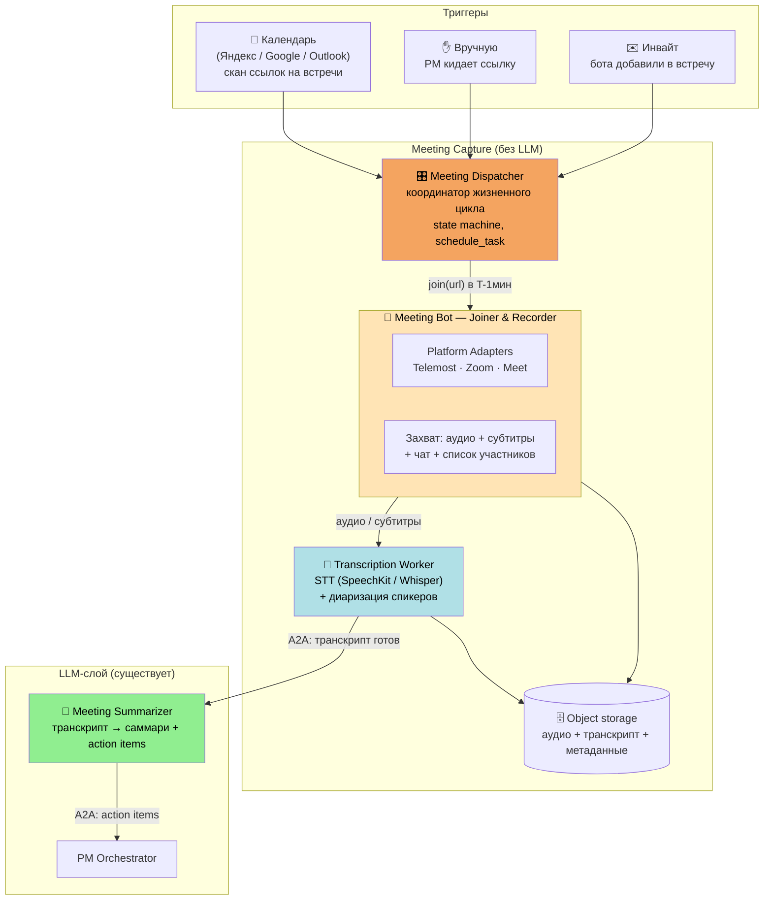
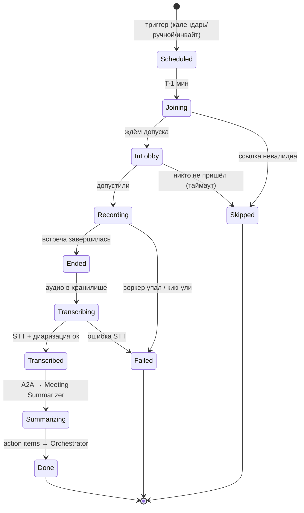
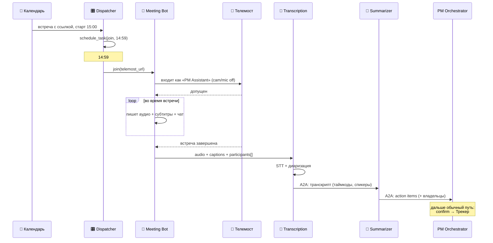

# Meeting Capture — подсистема добычи транскриптов

> Верхнеуровневый дизайн. Отвечает на открытый вопрос «Откуда транскрипты встреч?».
> Это **вход** для уже существующего агента [Meeting Summarizer](README.md#агенты-и-тулзы):
> подсистема добывает транскрипт, Summarizer превращает его в action items.

## Статус MVP

Реализация добавлена как отдельный сервис **`services/meeting-capture`**:
- HTTP API: `POST /meetings`, `POST /meetings/{id}/stop`, `GET /meetings/{id}`, `GET /meetings/{id}/transcript`.
- БД: `meetings`, `meeting_artifacts`, `transcripts` в общей схеме `core`.
- Оркестраторные тулзы: `schedule_meeting_bot` и `get_meeting_transcript`.
- Runtime: Playwright/Chromium + Xvfb + PulseAudio + FFmpeg; STT через SpeechKit v3, с безопасным no-op режимом без `SPEECHKIT_API_KEY`.
- Локальное object storage по умолчанию пишет в `/tmp/meeting-capture-objects`; при наличии `S3_*` используется S3-compatible storage.

Проверка:

```bash
uv run --group dev pytest services/meeting-capture/tests -q
```

---

## Проблема

Платформы видеовстреч (Яндекс Телемост, Zoom, Google Meet) **не отдают транскрипт через простой API**. У Телемоста официального «бот-API» вообще нет. Значит, транскрипт нужно **добывать самим**.

Индустриальный паттерн (так делают Otter, Fireflies, mymeet.ai и др.) один: **бот заходит на встречу как обычный участник**, пишет аудио, затем отдельно его транскрибирует. Это единственный по-настоящему кросс-платформенный способ — он работает везде, где есть веб-клиент.

---

## Развилка подходов

| Подход | Плюсы | Минусы | Решение |
|---|---|---|---|
| **A. Бот-участник** (браузерная автоматизация заходит на встречу) | Универсально для любой платформы, ничего не требует от организатора кроме ссылки | Тяжёлый воркер (браузер + захват аудио), хрупкость UI-автоматизации | ✅ **Базовый путь** |
| **B. Платформенный API** (Zoom Cloud Recording / Meet API) | Чисто, без браузера, качественный транскрипт от платформы | Своё для каждой платформы, часто только на платных/админских тарифах; у Телемоста нет | Использовать там, где **бесплатно и доступно**, как ускорение |
| **C. Запись на машине участника** | Просто | Кто-то должен держать машину включённой, хрупко | ❌ Не рассматриваем |

**Вывод:** строим бота-участника с интерфейсом адаптера на платформу. Телемост — первый адаптер, Zoom/Meet подключаются той же абстракцией. Где у платформы есть дешёвый источник (например, **живые субтитры Телемоста** или Zoom transcript) — берём его вместо своего STT.

---

## Состав подсистемы

Важно: в терминах платформы (агент = нужен LLM, tool/сервис = детерминированно) **вся добыча — детерминированные сервисы, без LLM**. LLM включается только на финальном шаге — в Summarizer. Поэтому «бот без LLM», как ты и предположил.



### 1. Meeting Dispatcher — координатор (без LLM)

Знает обо всех встречах и дирижирует ботом.
- **Источники встреч:** интеграция с календарём (скан ссылок вида `telemost.yandex.ru/...`), ручная подача ссылки от PM, инвайт бота на встречу.
- Ставит задачу боту зайти к началу (через платформенный `schedule_task`).
- Ведёт **state machine** встречи и обрабатывает сбои (бота не пустили, встреча не состоялась, упал воркер).
- Если за N минут никто не подключился — бот уходит.

### 2. Meeting Bot — Joiner & Recorder (без LLM)

Headless-браузер заходит на встречу как гость с узнаваемым именем (например, «PM Assistant»), камера/микрофон выключены.
- **Platform Adapters** — единый интерфейс `join / record / leave`, реализации под Телемост, Zoom, Meet.
- Захватывает **аудио-поток** (через виртуальное аудио-устройство) и побочные каналы: **живые субтитры** (если платформа их даёт — это дешёвая альтернатива своему STT), **чат**, **список участников** (нужен для привязки спикеров к людям).
- Детектит конец встречи (все вышли / бота кикнули / плановое время), складывает артефакты в хранилище.

### 3. Transcription Worker — расшифровка (без LLM, но ASR-модели)

Аудио → текст.
- **STT:** Яндекс SpeechKit (родной для нашего стека, до 4 ч, есть on-prem под 152-ФЗ) или Whisper.
- **Диаризация** — «кто что сказал», нужна для атрибуции action items владельцам.
- **Captions-first:** если бот снял живые субтитры платформы — используем их, свой STT как fallback (дороже, но точнее + диаризация).
- Выход: транскрипт с таймкодами и спикерами.

### 4. Meeting Summarizer — существующий LLM-агент

Транскрипт → саммари + action items с владельцами → отдаёт Orchestrator по A2A. Дальше — обычный путь платформы: confirm → запись в Трекер.

---

## Жизненный цикл встречи



`Failed`/`Skipped` — не тупик: Dispatcher уведомляет PM («не смог записать встречу X») и при необходимости предлагает ручную загрузку аудио.

---

## Поток данных



---

## Ключевые решения и развилки

| Решение | Выбор | Почему |
|---|---|---|
| Способ захвата | Бот-участник + адаптеры | Универсально; у Телемоста нет API |
| Источник текста | Субтитры платформы → fallback на свой STT | Субтитры дешевле; свой STT даёт диаризацию и качество |
| STT-движок | SpeechKit (родной), Whisper как альтернатива | Экосистема Яндекса, on-prem под 152-ФЗ |
| Режим | Сначала **batch** (записал → расшифровал) | Проще; стриминг (живые action items) — позже |
| Привязка спикеров | Диаризация «Speaker 1/2» + список участников | Иначе непонятно, на кого вешать задачу |
| Согласие на запись | Бот с явным именем + сообщение в чат «идёт запись» | Юридически и этически обязательно |

---

## Инфраструктурные последствия

Это **самый тяжёлый воркер** во всей платформе и он не похож на остальные агенты:
- Нужен реальный Chromium + виртуальное аудио-устройство (захват звука встречи).
- CPU/RAM-ёмкий, один инстанс = одна встреча (или несколько при параллельных встречах).
- **Не место на маленьком тест-VPS** рядом с лёгкими агентами — отдельный пул воркеров, масштабируется по числу одновременных встреч.
- STT — тоже отдельная нагрузка (или внешний SpeechKit API, или своя GPU-машина для Whisper).

Поэтому в роадмапе Meeting Capture стоит выделить в **отдельный деплой-юнит**, а на ранних фазах (Shadow) допустить **ручную загрузку аудио/транскрипта** — чтобы проверять Summarizer, не дожидаясь готового бота.

---

## Как это ложится на платформу

- В терминах [Code/Control plane](README.md#создание-агентов--code-plane-vs-control-plane): Dispatcher, Bot и Transcription — **код-сервисы (tools)**, не LLM-агенты.
- PM Orchestrator может дёргать их **тулзами**: `schedule_meeting_bot(url)`, `get_meeting_transcript(meeting_id)` — то есть оркестратор остаётся «мозгом», а захват прячется за детерминированными инструментами.
- Связь с Summarizer — по **A2A**, как и у всех агентов.

---

## Открытые вопросы

1. **Календарь:** какой основной — Яндекс Календарь? Нужен ли скан или достаточно ручной подачи ссылки на MVP?
2. **Параллельные встречи:** сколько одновременно нужно записывать? Влияет на размер пула воркеров.
3. **Субтитры Телемоста:** достаточно ли их качества и диаризации, или сразу свой SpeechKit?
4. **Хранение записей:** где и как долго хранить аудио (152-ФЗ, приватность) — нужно ли удалять аудио после транскрипта?
5. **MVP-срез:** на фазе Shadow — ручная загрузка аудио, бот появляется позже?

---

Sources:
- [Yandex Telemost + mymeet.ai: AI Recording & Transcription](https://mymeet.ai/blog/yandex-telemost-mymeet-integration)
- [Yandex SpeechKit](https://yandex.cloud/en/services/speechkit)
- [Yandex SpeechKit — AI Studio docs](https://aistudio.yandex.ru/docs/en/speechkit/overview.html)
