# PM Agent — Stage Graph (DARKHORSE)

Детерминированный граф стадий для `pm_agent`: один раз за ход выбирается стадия, внутри неё LLM ходит только по whitelist инструментов и обязательному порядку. Терминальный узел завершает ход; `max_iterations` — страховка.

**Код:** `packages/core/src/core/stage_graph.py`, `stage_router.py`, интеграция в `react.py`.

> **Диаграммы** — встроенные SVG-картинки (работают в preview Cursor без расширений). Текстовые ASCII-схемы дублируют их ниже.

---

## 1. Общая архитектура хода

### ASCII

```
  /chat, playground, RPC invoke ──┐
  cron scheduler._fire ───────────┤
                                  v
                    +---------------------------+
                    |  STAGE ROUTER (1 раз)     |
                    |  R1..R8 rules -> match    |
                    |  иначе LLM enum           |
                    |  иначе QUERY (safe)       |
                    +-------------+-------------+
                                  v
                    state["_stage"] ЗАМОРОЖЕНА
                                  v
                    +---------------------------+
                    |  STAGE GRAPH              |
                    |  whitelist + guards       |
                    |  forced_next              |
                    +-------------+-------------+
                                  v
         +--------------------------------------------------+
         |  ReAct loop                                      |
         |  LLM -> tool -> GATE (medium/high -> confirm)  |
         |       -> forced edge (без LLM) -> terminal?      |
         |       -> да: конец хода + отчёт                  |
         +--------------------------------------------------+
```

### Схема

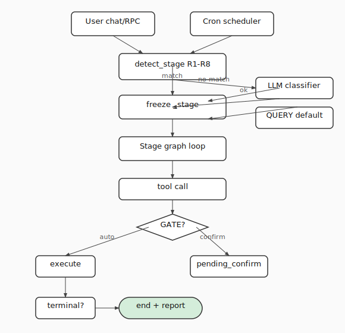

### Состояние хода (`react.py`)

| Ключ | Назначение |
|------|------------|
| `_stage` | `StageId` — выбран **один раз**, не пересчитывается на каждом tool call |
| `_stage_done` | `True` на терминале → завершение вместо `_should_auto_finalize_turn` |
| `_turn_user_message` | исходное сообщение (для resume и отчёта) |

---

## 2. Router — выбор стадии (R1–R10)

### ASCII

```
message
   |
   v
[R1] "Имя: ..." (status_update) ---------> STATUS
   | нет
   v
[R2] backlog_intent OR len>=800 ---------> BOARD
   | нет
   v
[R3] reorg markers ----------------------> REORG
   | нет
   v
[R4] close / transition markers ---------> TRANSITION
   | нет
   v
[R5] proactive markers ------------------> PROACTIVE
   | нет
   v
[R6] hygiene markers --------------------> HYGIENE
   | нет
   v
[R7] create_intent ----------------------> INTAKE
   | нет
   v
[R8] query markers ----------------------> QUERY
   | нет
   v
[R9] LLM classifier (strict enum)
   |
   v
[R10] invalid / low confidence ----------> QUERY (safe default)
```

### Схема

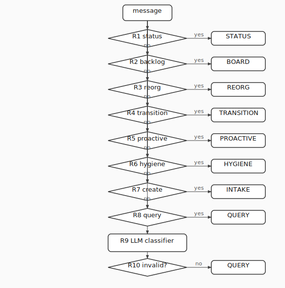

> **Безопасный дефолт:** любая неоднозначность → `QUERY` (read-only).

---

## 3. Сквозные узлы

### ASCII

```
  GATE --------> medium/high tool -> pending_confirm -> resume
  NF  --------> find/search empty -> 1 retry -> terminal not found
  INFER -------> fill gaps from context, never ask user
  ASSUME-REPORT > list assumptions in final report
```

| Узел | Где срабатывает |
|------|-----------------|
| GATE | каждый `medium` / `high` tool |
| NF | после `find_issues` / `search_issues` |
| INFER | INTAKE self-check, BOARD quality-pass, HYGIENE |
| ASSUME-REPORT | INTAKE, BOARD, HYGIENE — в `_build_action_report` |

**Risk:** read/comment/plan/call_agent = `low` · create/patch/transition/apply = `medium` · close = `high`.

---

## 4. Каталог сценариев (8 групп)

### ASCII — дерево сценариев

```
PM Agent (DARKHORSE)
|
+-- INTAKE
|     +-- 1a одна полная задача
|     +-- 1b идея -> BOARD (router R2)
|     +-- 1c триаж односложного
|
+-- STATUS
|     +-- 2a статус -> комментарий
|     +-- 2b + patch полей
|     +-- 2c детект блокера
|     +-- 2d детект готово
|
+-- BOARD
|     +-- 3a plan -> apply (forced)
|     +-- 3b quality-pass
|
+-- TRANSITION
|     +-- 4 find -> list_transitions -> transition/close
|
+-- QUERY
|     +-- 5a дайджест / стендап
|     +-- 5b по человеку
|     +-- 5c просрочено
|     +-- 5d статус эпика
|
+-- REORG
|     +-- 6a re-parent
|     +-- 6b reassign / prio / sprint
|     +-- 6c bulk rebalance
|     +-- 6d split
|     +-- 6e merge
|
+-- PROACTIVE (cron)
|     +-- 7a свип просрочки
|     +-- 7b без исполнителя
|     +-- 7c застой
|     +-- 7d end-of-day дайджест
|     +-- 7e дедлайн под угрозой
|
+-- HYGIENE
      +-- 8a флаг пропусков
      +-- 8b нормализация приоритетов
      +-- 8c дедуп near-дублей
```

### Сводная таблица

| Группа | Стадия | Триггер (примеры) | Цепочка | Терминал |
|--------|--------|-------------------|---------|----------|
| **1a** | INTAKE | «создай задачу Коле …» | resolve_assignee → self-check → `create_issue` GATE | создана / дедуп |
| **1b** | BOARD | длинный текст, «оформи доску» | router R2 | — |
| **1c** | INTAKE | «надо заняться нотификациями» | infer → create | создана |
| **2a** | STATUS | «Коля: сделал X» | find → summarizer → comment | comment ok |
| **2b** | STATUS | «… дедлайн 14.06» | find → patch → summarizer → comment | comment ok |
| **2c** | STATUS | блокер / «жду» | + patch priority + followers | comment ok |
| **2d** | STATUS | «готово» / «закрыл» | + list_transitions → transition/close | comment/transition |
| **3a** | BOARD | len≥800 | `backlog_plan` → forced `apply` | apply succeeded |
| **3b** | BOARD | после apply | self-check → patch цикл | apply + assumptions |
| **4** | TRANSITION | «закрой DARKHORSE-N» | find → list_transitions → close | transition/close |
| **5a** | QUERY | «что на доске» | `board_snapshot` → format | any read |
| **5b** | QUERY | «что у Коли» | find(assignee) | any read |
| **5c** | QUERY | «что просрочено» | snapshot / search | any read |
| **5d** | QUERY | «статус эпика X» | find epic → children → rollup | any read |
| **6a–e** | REORG | переназначь / split / merge | find → patch/link/create/close | bulk |
| **7a–e** | PROACTIVE | cron «проверь просроченные» | snapshot → comment/patch | digest |
| **8a–c** | HYGIENE | «наведи порядок» | snapshot → self-check → patch | hygiene report |

---

## 5. Подграфы стадий

### 5.1 INTAKE

```
entry
  |
  +--[имя?]--> resolve_assignee (low)
  |
  v
SELF-CHECK (summary, owner, prio, SP, deadline, epic)
  |  INFER + ASSUME-REPORT
  v
create_issue [GATE medium]
  v
(( terminal: created / dedup ))
```

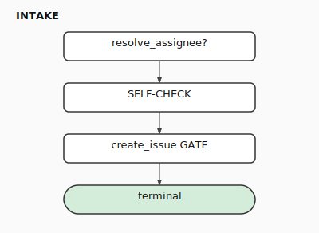

---

### 5.2 STATUS

```
entry -> find_issues -> NF
  |
  +--[patch field?]--> patch_issue [GATE]
  |
  v
call_agent meeting_summarizer
  v
comment_issue (markdown only)
  |
  +--[blocker?]--> patch priority + followers [GATE]
  |
  +--[done?]--> list_transitions -> transition/close [GATE]
  v
(( terminal ))
```

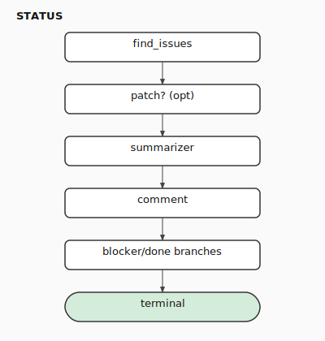

---

### 5.3 BOARD

```
entry -> backlog_plan (full text)
  |
  v
==> apply_backlog_plan (forced, plan_json empty) [GATE]
  |
  v
SELF-CHECK board completeness
  |
  +--[gaps]--> patch_issue loop [GATE]
  v
(( terminal: apply succeeded ))
```

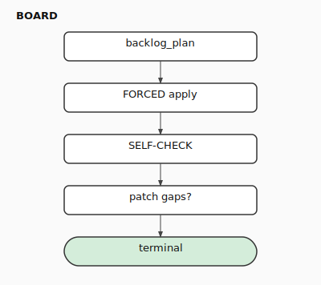

---

### 5.4 TRANSITION

```
entry -> find_issues -> NF
  v
list_transitions (required, no guessing)
  |
  +--[close?]--> close_issue [GATE high]
  +--[else]----> transition_issue [GATE medium]
  v
(( terminal ))
```

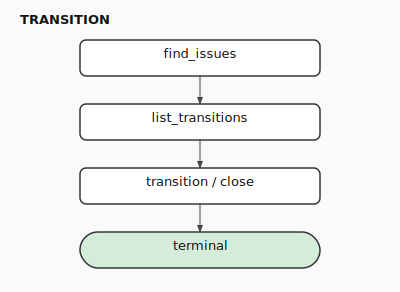

---

### 5.5 QUERY (read-only)

```
entry
  +-- digest ----> board_snapshot
  +-- by person -> find_issues
  +-- overdue ---> snapshot or search
  +-- epic ------> find + search children
  v
[optional] summarizer format
  v
(( terminal: any read answered ))
```

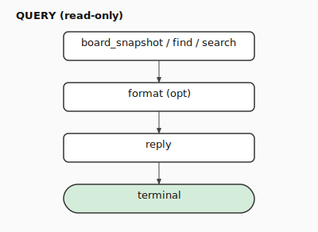

---

### 5.6 REORG

```
entry -> find or search -> NF
  v
  +-- re-parent ----> link_issues [GATE]
  +-- reassign/prio -> patch_issue [GATE]
  +-- split --------> create + link [GATE]
  +-- merge --------> comment + close dup [GATE high]
  v
[more in batch?] -> loop
  v
(( terminal: bulk done ))
```

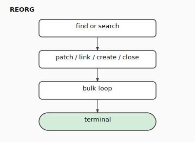

---

### 5.7 PROACTIVE (cron)

```
entry (cron message, stable session_id)
  v
board_snapshot
  v
  +-- overdue ----> comment each (low), optional patch -> park
  +-- unassigned -> infer owner -> patch -> park
  +-- at risk ----> comment warning
  +-- end of day -> summarizer digest
  v
(( terminal: digest + pending confirms ))
```

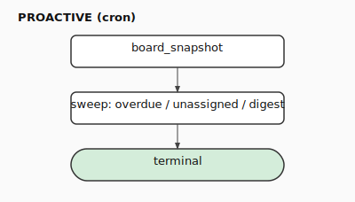

---

### 5.8 HYGIENE

```
entry -> board_snapshot
  v
SELF-CHECK whole board (INTAKE checklist + priorities + near-dupes)
  v
for each flagged: patch [GATE] or comment (low)
near-dupe -> suggest REORG merge
  v
(( terminal: hygiene report ))
```

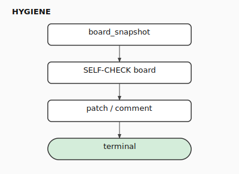

---

## 6. Карта инструментов по стадиям

### ASCII

```
STAGE       | READ tools              | WRITE tools
------------|-------------------------|---------------------------
INTAKE      | resolve, list_team      | create
STATUS      | find, list_transitions  | patch, comment, transition, close, call_agent
BOARD       | queue_meta              | backlog_plan, apply, patch
TRANSITION  | find, list_transitions  | transition, close
QUERY       | snapshot, find, search  | (none)
REORG       | snapshot, find, search  | patch, link, create, comment, close
PROACTIVE   | snapshot, find, search  | comment, patch, call_agent
HYGIENE     | snapshot, search        | patch, comment

NEW tools: tracker_board_snapshot (T1), tracker_read_comments (T2)
```

---

## 7. Завершение хода

### ASCII

```
[*] --> Running (invoke/resume)
Running --> Terminal       (stage.terminal == true)
Running --> Parked         (pending_confirm)
Parked --> Running         (approved)
Parked --> Terminal        (rejected)
Running --> SafetyStop     (max_iterations)
Terminal --> [*]           (action report)
```

| Стадия | Условие терминала (код) |
|--------|-------------------------|
| INTAKE | `created_issue_keys_in_turn` |
| STATUS | `comment_succeeded` |
| BOARD | `apply_backlog_succeeded` |
| TRANSITION | `transition_or_close_succeeded` |
| QUERY | `any_read_answer` |
| REORG / PROACTIVE / HYGIENE | нет жёсткого терминала → `max_iterations` |

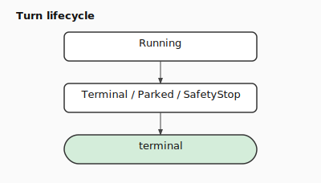

---

## 8. Что сознательно не в графе ([NT])

| Возможность | Обход сегодня |
|-------------|---------------|
| depends / blocks | эскалация через priority + followers (STATUS 2c) |
| список / текущий спринт | patch sprint строкой вслепую |
| enum кастом-полей | без валидации |
| полная история задачи | `tracker_read_comments` (T2) — частично |

---

## 9. Ручная проверка

| Сообщение | Ожидаемая стадия |
|-----------|------------------|
| `Коля: закончил API, дедлайн сдвинул` | STATUS |
| длинный текст ≥800 или `оформи доску` | BOARD |
| `создай задачу Коле: настроить CI` | INTAKE |
| `закрой DARKHORSE-42` | TRANSITION |
| `что на доске` / `что просрочено` | QUERY |
| `переназначь DARKHORSE-10 на Рому` | REORG |
| `наведи порядок на доске` | HYGIENE |
| `проверь просроченные` (cron) | PROACTIVE |

---

## 10. Связанные файлы

| Файл | Роль |
|------|------|
| `packages/core/src/core/stage_graph.py` | 8 стадий, guards, forced_next, terminal |
| `packages/core/src/core/stage_router.py` | R1..R8 + LLM classifier |
| `packages/core/src/core/react.py` | invoke/resume, forced edges, stage filter |
| `packages/core/src/core/turn_guards.py` | предикаты + shim |
| `packages/core/src/core/tracker_tools.py` | T1 board_snapshot, T2 read_comments |
